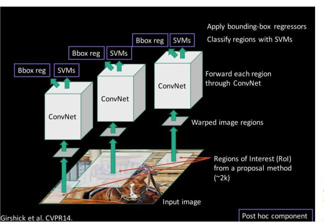
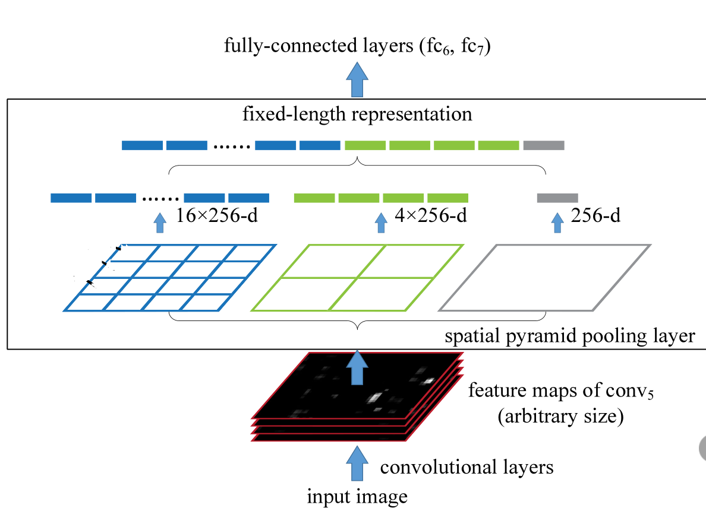
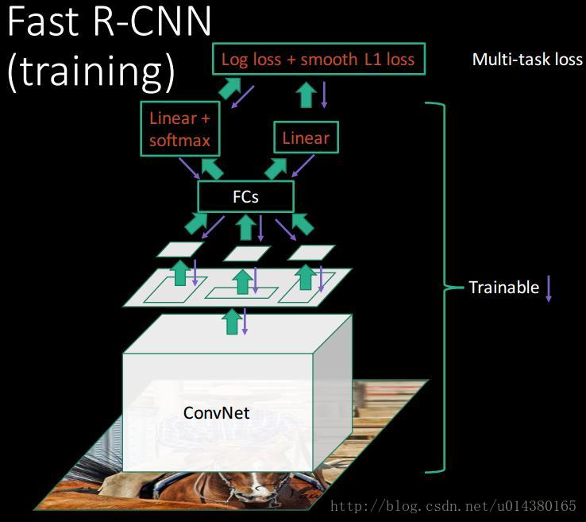
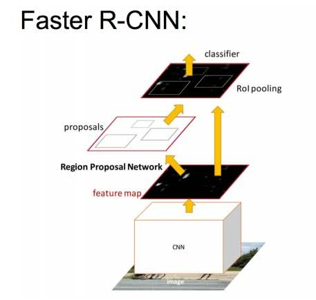
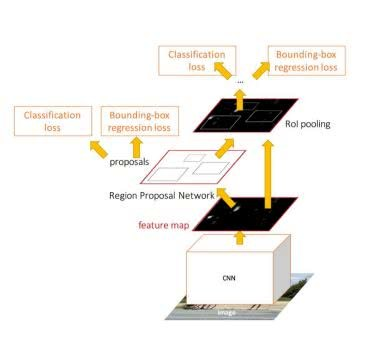

##Oct_10_R_CNN到SPP_Net到fast_rcnn再到faster-RCNN的学习

###RCNN
1. 首先RCNN时基于region的CNN，是RBG大神最先提出用于目标检测的算法。
2. RCNN不是一个端到端的网络，训练步骤如下：先用Selective Search算法提大约2000个regin proposal，因为取出的区域大小各自不同，所以需要将每个Region Proposal缩放（warp）成统一的227x227的大小，然后对每一个缩放后的region proposal利用CNN提取特征（将CNN的fc7层的输出作为特征），之后用SVM分类器进行分类，最后再做box regression。
3. RCNN的缺点
1）Selective Search算法提取region proposal特别慢。
2）对region proposal的暴力缩放（warp）特别不好。
3）对每一个region proposal都要进行CNN运算，重复计算。
4）SVM分类器和box regression都是分步进行，不是端到端的网络。
4. RCNN训练需要 85 hours，不要想着去测试。并且预测每一张图的速度大概在47s。

###SPP_Net
1. SPP：Spatial Pyramid Pooling（空间金字塔池化）网络。
2. 对于RCNN的“因为取出的区域大小各自不同，所以需要将每个Region Proposal缩放（warp）成统一的227x227的大小并输入到CNN”(CNN后面有FCN,如果不这样做，输入到全链接层的维度就不一致了)导致的拉伸变形、物体不全，限制识别精确度的问题，提出了spatial pyramid pooling(空间金字塔池化)操作。
3. 空间金字塔方法可以让带有全链接层的CNNs有多尺度的输入，带有全链接层的CNN原本只能固定输入、固定输出，加上SSP之后，便能任意输入、固定输出。
4. SPP_Net的另一个改进是：只对原图提取一次卷积特征。其在得到整张图的卷积特征feature map，然后找到每个候选框在feature map上的映射patch，将此patch作为每个候选框的卷积特征输入到SPP layer和之后的层，完成特征提取工作。(因为这点，比RCNN有大概一百倍的提速)
5. 纠正的RCNN的缺点：
1）对region proposal的暴力缩放（warp）的问题，采用了SPP(空间金字塔池化)
2）避免了对每一个region proposal都要重复进行CNN运算的问题，只对原图做一次卷积操作。

###fast-RCNN
1. fast-RCNN改进了RCNN的绝大部分缺点。fast-RCNN和RCNN主要有两处不同：一是最后一个卷积层后加了一个ROI pooling layer(借鉴了SPP NET)，二是损失函数使用了多任务损失函数(multi-task loss)，将边框回归Bounding Box Regression直接加入到CNN网络中训练。
2. ROI pooling layer实际上是SPP-NET的一个精简版，SPP-NET对每个proposal使用了不同大小的金字塔映射，而ROI pooling layer只需要下采样到一个7x7的特征图。对于VGG16网络conv5_3有512个特征图，这样所有region proposal对应了一个7*7*512维度的特征向量作为全连接层的输入。
3. Fast R-CNN直接使用softmax替代SVM分类，同时利用多任务损失函数将边框回归也加入到了网络中，这是端到端的(除去region proposal提取阶段)。
4. 纠正的RCNN的缺点：
1）对region proposal的暴力缩放（warp）的问题，使用ROI pooling layer。
2）直接使用softmax替代SVM分类，同时利用多任务损失函数将边框回归也加入到了网络中，几乎是端到端的网络。
3）也避免了对每一个region proposal进行CNN的操作。

###faster-RCNN
1. 加入一个提取边缘的神经网络，也就说找候选框的工作也交给神经网络，即是RPN网络。(由rgbd大神在Fast R-CNN 中引入Region Proposal Network(RPN)替代Selective Search，同时引入anchor box应对目标形状的变化问题)
2. anchor是位置和大小固定的box，可以理解成事先设置好的固定的proposal。
3. RPN放在最后一个卷积层的后面，且可以通过RPN直接训练得到候选区域和类别。
4. RPN网络输出后经过ROI Pooling之后,同样是变成了7*7的feature map输入到后面的分类网络,分类网络其实就是全连接层Linear层.如果RPN输出有256个特征图,则一个region proposal输入到全连接分类层是7*7*256维度.
4. 最大的贡献是提出了RPN网络。
5. faster-RCNN可以分为四个loss，RPN calssification(anchor good.bad)；RPN regression(anchor->propoasal)；Fast R-CNN classification(over classes)；Fast R-CNN regression(proposal ->box)。如下图所示：

还有一种理解是只有两个loss,cls_loss和regression_loss.

###总结
1. 现在前三个网络基本被淘汰，最后一个faster-RCNN还可以做一下实验，但是用的也不多。
2. 参考：[一文读懂目标检测：R-CNN、Fast R-CNN、Faster R-CNN、YOLO、SSD](https://cloud.tencent.com/developer/news/281788)