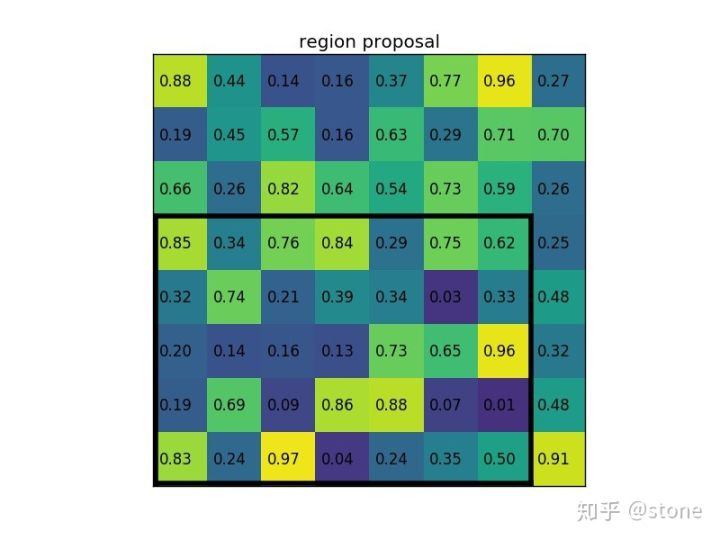
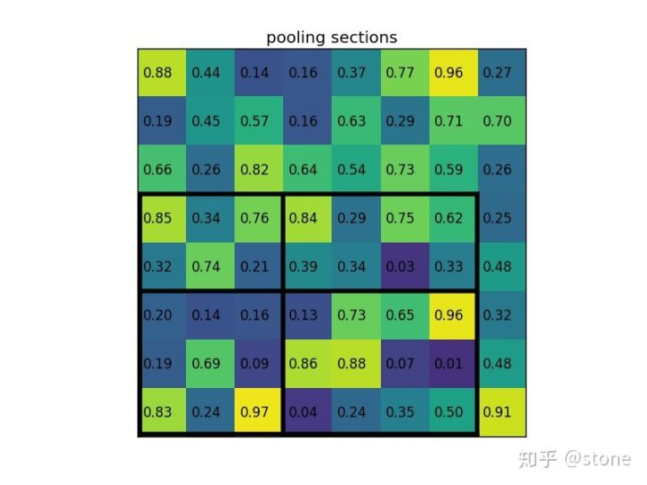
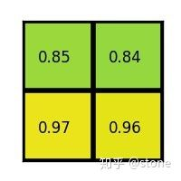
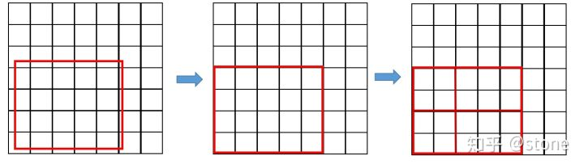
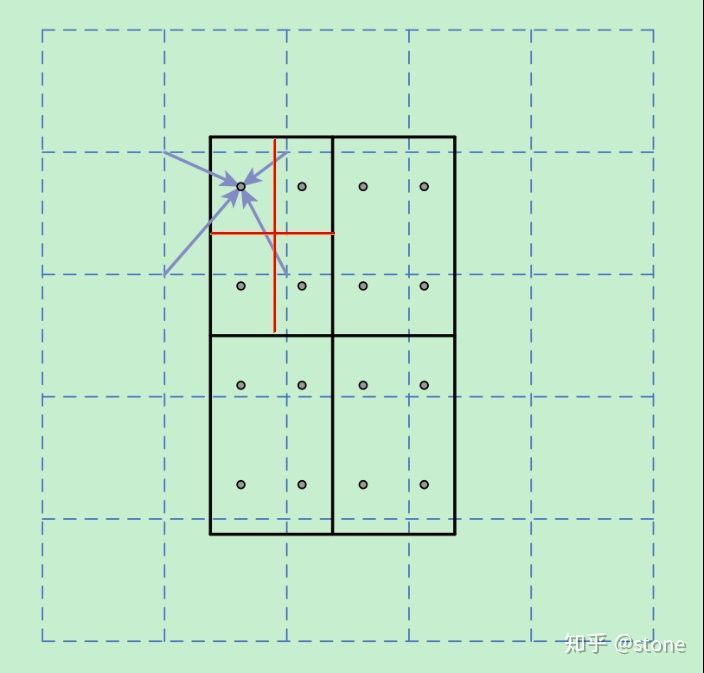

##Oct_14_ROI_pooling_layer和ROIAlign的学习

###ROI pooling layer

1. ROI pooling layer作用和SPP_layer一样，输入是不同尺寸的feature map，输出可以是固定size的feature map。首次出现在fast rcnn中，在faster rcnn也沿用了。

2. 举例子说明：假设现在有一个8x8大小的feature map，我们要在这个feature map上得到ROI，并且进行ROI pooling到2x2大小的输出。假设ROI的bounding box为 [x1,y1,x2,y2]=[0,3,7,8],如图：（由RPN网络得到的region_proposal或者在fast rcnn是直接由CNN输出的）将它划分为2x2的网格，因为ROI的长宽除以2是不能整除的，所以会出现每个格子大小不一样的情况。进行max pooling的最终2x2的输出为

3. 总结：ROI pooling layer就是一个很简单的pooling操作，没有过多的设计。

###ROI Align
1. ROI Align最先出现在MASK RCNN中，为了解决解决特征图与原始图像上的RoI不对准问题。

2. 在Faster RCNN中，有两次整数化的过程：
1)region proposal的xywh通常是小数，但是为了方便操作会把它整数化。
2)将整数化后的边界区域平均分割成 k x k 个单元，对每一个单元的边界进行整数化。
两次整数化的过程如下图所示：
经过上述两次整数化，此时的候选框已经和最开始回归出来的位置有一定的偏差，这个偏差会影响检测或者分割的准确度。在论文里，作者把它总结为“不匹配问题。

3. 为了解决这个问题，ROI Align方法取消整数化操作，保留了小数，使用以上介绍的双线性插值的方法获得坐标为浮点数的像素点上的图像数值。但在实际操作中，ROI Align并不是简单地补充出候选区域边界上的坐标点，然后进行池化，而是重新进行设计。

4. ROI Align操作步骤：虚线部分表示feature map，实线表示ROI，这里将ROI切分成2x2的单元格。如果采样点数是4，那我们首先将每个单元格子均分成四个小方格（如红色线所示），每个小方格中心就是采样点。这些采样点的坐标通常是浮点数，所以需要对采样点像素进行双线性插值（如四个箭头所示），就可以得到该像素点的值了。然后对每个单元格内的四个采样点进行maxpooling，就可以得到最终的ROIAlign的结果。ROI Align主要是解决了misalignment的问题。

参考[令人拍案称奇的Mask RCNN（文章靠后）](https://zhuanlan.zhihu.com/p/37998710)

