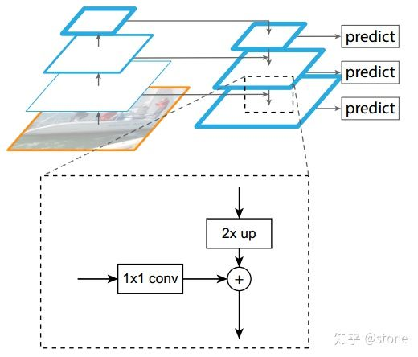
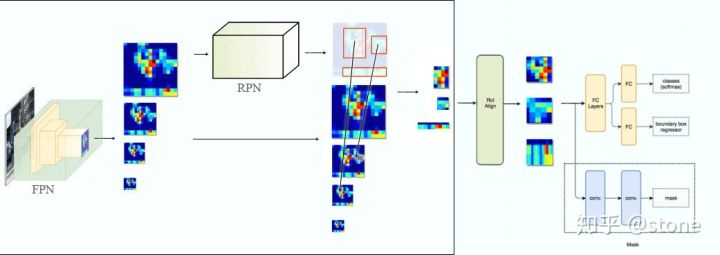
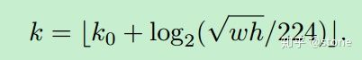
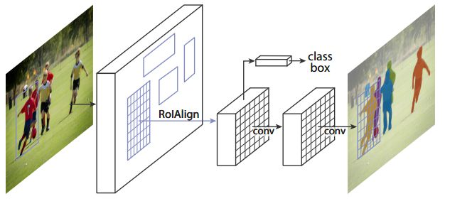
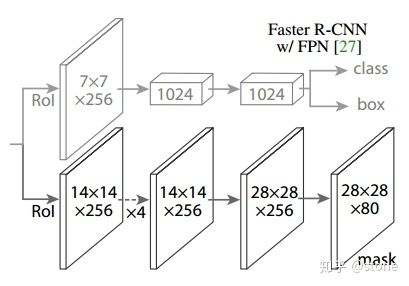
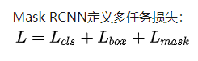
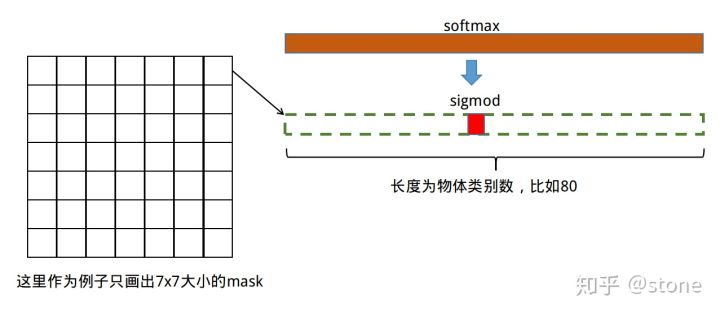

##Oct_13_mask_RCNN的学习

###之前知识回顾
1. Faster RCNN是两阶段的目标检测算法，包括阶段一的Region proposal以及阶段二的bounding box回归和分类。

2. YOLO和SSD是一阶段的目标检测算法，只用了回归的过程。

3. 多尺度目标检测：ResNet-FPN(Feature Pyramid Network),FPN结构中包括自下而上，自上而下和横向连接三个部分，。这种结构可以将各个层级的特征进行融合，使其同时具有强语义信息和强空间信息，在特征学习中是一把利器。

###改进版本的faster rcnn(ResNet-FPN)
4. ResNet-FPN + 原始Faster RCNN（采用VGG） 是改进版本的faster rcnn，与最初的Faster RCNN不同的是，FPN产生了特征金字塔 [P2,P3,P4,P5] ，而并非只是一个feature map。金字塔经过RPN之后会产生很多region proposal。这些region proposal是分别由 [P2,P3,P4,P5] 经过RPN产生的，但用于输入到Fast RCNN中的是 [P2,P3,P4,P5] ，也就是说要在 [P2,P3,P4,P5] 中根据region proposal切出ROI进行后续的分类和回归预测.

5. 我们要选择哪个feature map来切出这些ROI区域:过一个公式来决定宽w和高h的ROI到底要从哪个[pk] 来切：
这里224表示用于预训练的ImageNet图片的大小，这种做法很合理，大尺度的ROI要从低分辨率的feature map上切，有利于检测大目标，小尺度的ROI要从高分辨率的feature map上切，有利于检测小目标。

###mask RCNN
1. 将ResNet-FPN+Faster RCNN+mask，则得到了最终的Mask RCNN。

2. Mask RCNN的构建很简单，只是在ROI pooling（实际上用到的是ROIAlign）之后添加卷积层，进行mask预测的任务。（多了一个预测mask的子任务子分支）

3. 总结Mask RCNN的网络:
1)骨干网络ResNet-FPN，用于特征提取，另外，ResNet还可以是：ResNet-50,ResNet-101,ResNeXt-50,ResNeXt-101；
2)头部网络，包括边界框识别（分类和回归）+mask预测

4. 主要改进点：
1)基础网络的增强，ResNeXt-101+FPN的组合
2)RoIAlign 层的加入，说白了就是对 feature map 的插值，直接的ROIPooling的那种量化操作会使得得到的mask与实际物体位置有一个微小偏移
3)分割 loss 的改进，由原来的 FCIS 的 基于单像素softmax的多项式交叉熵变为了基于单像素sigmod二值交叉熵。

5. Mask RCNN定义多任务损失：

6. L_cls和L_box与faster rcnn的定义没有区别。需要具体说明的是L_mask，假设一共有K个类别，则mask分割分支的输出维度是K*m*m , 对于 m*m 中的每个点，都会输出K个二值Mask（每个类别使用sigmoid输出）。
需要注意的是，计算loss的时候，并不是每个类别的sigmoid输出都计算二值交叉熵损失，而是该像素属于哪个类，哪个类的sigmoid输出才要计算损失(如图红色方形所示)。并且在测试的时候，我们是通过分类分支预测的类别来选择相应的mask预测。这样，mask预测和分类预测就彻底解耦了。

7. mask预测和分类预测需要解耦合。

8. 这与FCN方法是不同，FCN是对每个像素进行多类别softmax分类，然后计算交叉熵损失，很明显，这种做法是会造成类间竞争的，而每个类别使用sigmoid输出并计算二值损失，可以避免类间竞争。实验表明，通过这种方法，可以较好地提升性能。

9. 可以通过看mask rcnn的pytorch源码学习mask rcnn.

10. keypoint RCNN 和 Mask RCNN 一样,都是在原有的 faster rcnn 的基础上添加了另外一个任务分支.通过pytorch源码学习到的,有时间要好好跑跑代码.

参考[令人拍案称奇的Mask RCNN](https://zhuanlan.zhihu.com/p/37998710)
