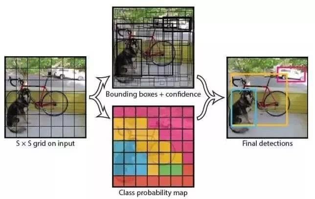
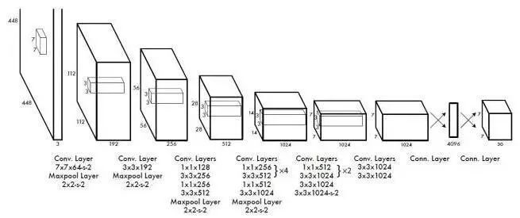
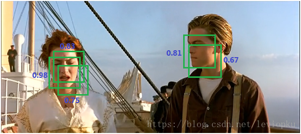
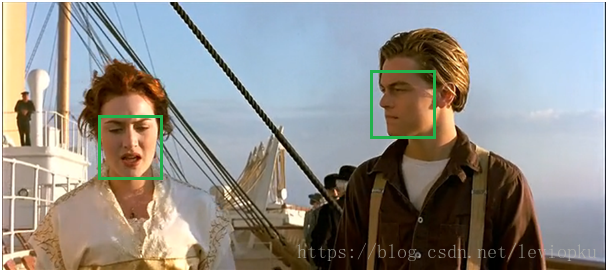
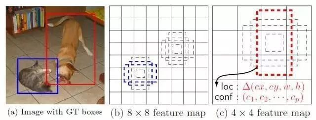

##Oct_12_基于回归的目标检测的方法_YOLO和SSD_和NMS

###YOLO系列
1. yolo:You Only Look Once,是和Faster R-CNN一个时期的网络，但是速度更快，这类方法使用了回归的思想，利用整张图作为网络的输入，直接在图像的多个位置上回归出这个位置的目标边框，以及目标所属的类别。

2. YOLO的步骤：
1) 给个一个输入图像，首先将图像划分成7*7的网格
2) 对于每个网格，我们都预测2个边框（包括每个边框是目标的置信度以及每个边框区域在多个类别上的概率）
3) 根据上一步可以预测出7*7*2个目标窗口，然后根据阈值去除可能性比较低的目标窗口，最后NMS去除冗余窗口即可（NMS为非极大值抑制）

3. YOLO的优点：YOLO将目标检测任务转换成一个回归问题，大大加快了检测的速度，使得YOLO可以每秒处理45张图像。而且由于每个网络预测目标窗口时使用的是全图信息（在SSD中，这不是优点），使得false positive比例大幅降低。

4. YOLO的缺点：没有了Region Proposal机制，只使用7*7的网格回归会使得目标不能非常精准的定位，这也导致了YOLO的检测精度并不是很高。

5. NMS：非极大值抑制(non maximum suppression),可以去掉detection任务重复的检测框。

6. NMS原理：基于前面的网络(如RPN或者YOLO)能为每个框给出一个score，score越大证明框越接近期待值。如上图，两个目标分别有多个选择框，现在要去掉多余的选择框。分别在局部选出最大框，然后去掉和这个框IOU＞0.7的框。

7. NMS的代码很简单，就是一个先计算IOU,之后找到局部最大比较的过程。

8. 介绍一下NMS:即通过RPN或者yolo等前面网络,为每一个bbox给出一个score,这个score代表bad or good bbox的分数.在局部区域(IOU＞0.7的所有框)如果有多个bbox,首先选出最大的一个score的bbox,接着算和它iou大于0.7的众多框,如果这个bbox的score不大于它,则去掉选择框.

9. 非极大值抑制不是抑制非最大值,是抑制极大值.

###SSD系列
1. SSD: Single Shot MultiBox Detector

2. YOLO存在的问题，使用整图特征在7*7的粗糙网格内回归对目标的定位并不是很精准，则SSD结合YOLO的回归思想以及Faster R-CNN的anchor机制改进。

3. SSD获取目标位置和类别的方法跟YOLO一样，都是使用回归，但是YOLO预测某个位置使用的是全图的特征，SSD预测某个位置使用的是这个位置周围的特征。

4. SSD是如何建立某个位置和其特征的对应关系：使用Faster R-CNN的anchor机制。如SSD的框架图所示，假如某一层特征图(图b)大小是[8×8]，那么就使用3*3的滑窗提取每个位置的特征，然后这个特征回归得到目标的坐标信息和类别信息。

5. SSD利用了anchor机制，但是不同于Faster R-CNN，这个anchor是在多个feature map上，这样可以利用多层的特征并且自然的达到多尺度。

6. SSD可以理解为multi-scale版本的RPN，它和RPN最大的不同在于RPN只是在最后的feature map上预测检测的结果，而最后一层的feature map往往都比较抽象，对于小物体不能很好地表达特征，而SSD允许从CNN各个level的feature map预测检测结果。

###总结
1. 参考：[一文读懂目标检测：R-CNN、Fast R-CNN、Faster R-CNN、YOLO、SSD](https://cloud.tencent.com/developer/news/281788)
2. SSD和YOLO都有必要去实验一下。