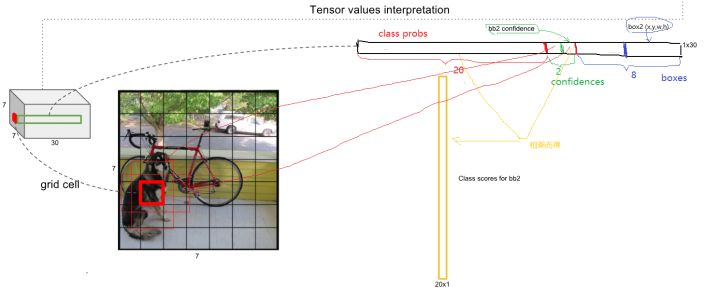

##Oct_15_YOLO系列总结

###有关目标检测的two-stage和one-stage

1. two-stage:基于Region Proposal的R-CNN系算法（R-CNN，Fast R-CNN, Faster R-CNN），它们是two-stage的，需要先使用启发式方法（selective search）或者CNN网络（RPN）产生Region Proposal，然后再在Region Proposal上做分类与回归.

2. one-stage:基于Region Proposal的R-CNN系算法（R-CNN，Fast R-CNN, Faster R-CNN），它们是two-stage的，需要先使用启发式方法（selective search）或者CNN网络（RPN）产生Region Proposal，然后再在Region Proposal上做分类与回归.

3. two-stage是准确度高一些，但是速度慢，但是one-stage速度快，但是准确性要低一些。

###yolo
1.yolo网络结构参考GooLeNet模型，包含24个卷积层和2个全连接层,网络流程图如下：对于卷积层，主要使用1x1卷积来做channle reduction，然后紧跟3x3卷积。对于卷积层和全连接层，采用Leaky ReLU激活函数,最后一层采用线性激活函数。

2.主要关注yolo的输入和输出：输入是[448*448*3]，yolo首先将图像划分成7*7的网格,对于每个网格，我们都预测2个边框，输出是[7*7*30]大小的张量,这个张量所代表的具体含义如下图所示：
对于每一个单元格，前20个元素是类别概率值，然后2个元素是边界框置信度，两者相乘可以得到类别置信度，最后8个元素是边界框的 [x,y,w,h] 。可能会感到奇怪，对于边界框为什么把置信度 c 和 [x,y,w,h] 都分开排列，而不是按照 [x,y,w,h,c] 这样排列，其实纯粹是为了计算方便，因为实际上这30个元素都是对应一个单元格，其排列是可以任意的。但是分离排布，可以方便地提取每一个部分。

3.主要探讨yolo损失函数的分析：

4.基本所有检测算法中都会用到非极大值抑制NMS。

5.yolo算法的预测过程：

参考[YOLO原理与实现](https://zhuanlan.zhihu.com/p/32525231)

##yoloV2

1.YOLOv2相比于YOLOV1而言，提出了几种改进策略，大部分是参考其他论文的Trick。

2.添加了Batch Normalization。在YOLOv2中，每个卷积层后面都添加了Batch Normalization层，并且不再使用droput。使用Batch Normalization后，YOLOv2的mAP提升了2.4%。

3.采用了High Resolution Classifier：

4.YOLOv1的缺点：YOLOv1最后采用的是全连接层直接对边界框进行预测，其中边界框的宽与高是相对整张图片大小的，而由于各个图片中存在不同尺度和长宽比（scales and ratios）的物体，YOLOv1在训练过程中学习适应不同物体的形状是比较困难的，这也导致YOLOv1在精确定位方面表现较差。

5.YOLOV2采用了Convolutional With Anchor Boxes：YOLOv2移除了YOLOv1中的全连接层而采用了卷积和anchor boxes来预测边界框。借鉴了Faster R-CNN中RPN网络的先验框（anchor boxes，prior boxes，SSD也采用了先验框）策略。RPN对CNN特征提取器得到的特征图（feature map）进行卷积来预测每个位置的边界框以及置信度（是否含有物体），并且各个位置设置不同尺度和比例的先验框，所以RPN预测的是边界框相对于先验框的offsets值，采用先验框使得模型更容易学习。

6.YOLOv2设计中要保证最终的特征图有奇数个位置。YOLOv2不是采用 [448x448] 图片作为输入，而是采用 [416x416] 大小。因为YOLOv2模型下采样的总步长为 [32] ，对于 [416*416] 大小的图片，最终得到的特征图大小为 [13x13] ，维度是奇数，这样特征图恰好只有一个中心位置。YOLOv1只能预测98个边界框（ 7x7x2 ），而YOLOv2使用anchor boxes之后可以预测上千个边界框（ 13x13xnum_class ）。所以使用anchor boxes之后，YOLOv2的召回率大大提升，由原来的81%升至88%。

7.Dimension Clusters：在Faster R-CNN和SSD中，先验框的维度（长和宽）都是手动设定的，带有一定的主观性。如果选取的先验框维度比较合适，那么模型更容易学习，从而做出更好的预测。因此，YOLOv2采用k-means聚类方法对训练集中的边界框做了聚类分析。

8.New Network，Darknet-19：Darknet-19，包括19个卷积层和5个maxpooling层。Darknet-19与VGG16模型设计原则是一致的，主要采用 [3x3] 卷积，采用 [2x2] 的maxpooling层之后，特征图维度降低2倍，而同时将特征图的channles增加两倍。使用Darknet-19之后，YOLOv2的mAP值没有显著提升，但是计算量却可以减少约33%。

9.约束边界框的位置预测值（Direct location prediction）：约束了边界框的位置预测值使得模型更容易稳定训练，结合聚类分析得到先验框与这种预测方法，YOLOv2的mAP值提升了约5%。

10.Fine-Grained Features:[13x13] 大小的特征图对检测大物体是足够了，但是对于小物体还需要更精细的特征图（Fine-Grained Features）。YOLOv2所利用的Fine-Grained Features是 [26x26] 大小的特征图（最后一个maxpooling层的输入），对于Darknet-19模型来说就是大小为 [26x26x512] 的特征图,前面的特征图维度是后面的特征图的2倍，经passthrough层处理之后就变成了 [13x13x2048] 的新特征图,pass through层如图所示。
这样就可以与后面的 [13x13x1024] 特征图连接在一起形成 [13x13x3072] 大小的特征图，然后在此特征图基础上卷积做预测。

11.Multi-Scale Training：YOLOv2采用了多尺度输入训练策略，具体来说就是在训练过程中每间隔一定的iterations之后改变模型的输入图片大小。由于YOLOv2的下采样总步长为32，输入图片大小选择一系列为32倍数的值，例如[608x608]等，在训练过程，每隔10个iterations随机选择一种输入图片大小，然后只需要修改对最后检测层的处理就可以重新训练。采用Multi-Scale Training策略，YOLOv2可以适应不同大小的图片，并且预测出很好的结果。注意，这只是测试时输入图片大小不同，而实际上用的是同一个模型（采用Multi-Scale Training训练）

12.YOLOv2的训练：

13.YOLOv2和YOLOv1的损失函数一样，为均方差函数，loss计算公式如下：

14.最终的YOLOv2模型在速度上比YOLOv1还快（采用了计算量更少的Darknet-19模型），而且模型的准确度比YOLOv1有显著提升。

15.YOLOv2的论文全名为YOLO9000: Better, Faster, Stronger,YOLO9000是在YOLOv2的基础上提出的一种可以检测超过9000个类别的模型，其主要贡献点在于提出了一种分类和检测的联合训练策略。在YOLO中，边界框的预测其实并不依赖于物体的标签，所以YOLO可以实现在分类和检测数据集上的联合训练。对于检测数据集，可以用来学习预测物体的边界框、置信度以及为物体分类，而对于分类数据集可以仅用来学习分类，但是其可以大大扩充模型所能检测的物体种类。(如果以后要是用到了再看)

16.注意一点，yoloV2中没有全连接层，可看darknet_19的网络结构：,上图是在做第一阶段训练时的数据，在第三阶段时，会移除最后一个卷积层、global avgpooling层以及softmax层，并且新增了三个 [3x3x2014]卷积层，同时增加了一个passthrough层，最后使用 [1x1] 卷积层输出预测结果，最后也不会有全连接层，这是实时目标检测的一种趋势。

参考[YOLOv2原理与实现](https://zhuanlan.zhihu.com/p/35325884)

###yoloV3
1.YOLOv3最大的变化包括两点：使用残差模型和采用FPN架构。YOLOv3的特征提取器是一个残差模型，因为包含53个卷积层，所以称为Darknet-53，从网络结构上看，相比Darknet-19网络使用了残差单元，所以可以构建得更深。另外一个点是采用FPN架构（Feature Pyramid Networks for Object Detection）来实现多尺度检测。YOLOv3采用了3个尺度的特征图（当输入为 [416*416] 时）： [13x13] ， [26x26] ， [52x52].(FPN采用的是在多个尺度特征图上进行预测,而不是在多层卷积后进行预测,对象是多个尺度特征图)

2.注意这里采用的是FPN，特征金字塔网络，yolo2采用的是Multi-Scale Training，两者差别很大。

3.YOLOv3每个位置使用3个先验框，所以使用k-means得到9个先验框，并将其划分到3个尺度特征图上，尺度更大的特征图使用更小的先验框，和SSD类似。

4.YOLOv3与其它检测模型的对比如下图所示，可以看到在速度上YOLOv3完胜其它方法，虽然AP值并不是最好的。

参考[YOLOv2原理与实现(附yoloV3)](https://zhuanlan.zhihu.com/p/35325884)

###总结
从YOLO的三代变革中可以看到，在目标检测领域比较好的策略包含：设置先验框(yoloV2)，采用全卷积做预测(yoloV2)，采用残差网络(yoloV3)，采用多尺度特征图做预测(yoloV3)。
