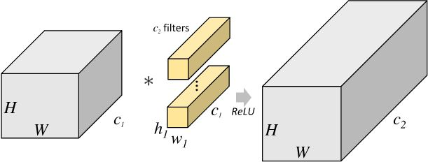
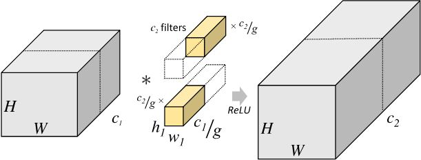
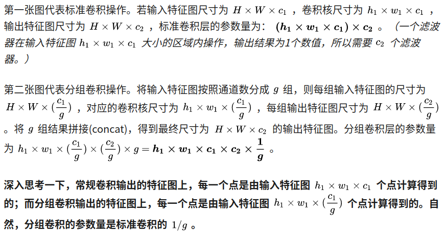

Oct_25_group convolution组卷积的解析
===

1. 知乎上的回答:group 是相对于上一层的 channel 来说的。假如 group_size = N， 上一层的channel 的数目为M 简单的讲就是把 channel 做N等分，然后每一份（一个group）分别与上一层的输出的 (M/N) 个channel独立连接，之后将每个group的输出叠在一起（concatenate），作为这一层的输出.
参考知乎上的回答[什么是group convolution](https://www.zhihu.com/question/60484190/answer/308079202)

2. channelgroup conv最早出现在 AlexNet 中，因为显卡显存不够，只好把网络分在两块卡里，于是产生了这种结构；Alex认为group conv的方式能够增加 filter之间的对角相关性，而且能够减少训练参数，不容易过拟合，这类似于正则的效果。

3. 看图介绍group convolution

4. 总结:运用group convolution,参数量变成原来的(1/g).(且不容易过拟合，这类似于正则)

5. 但是group convolution之后经常要使用 1x1卷积 来增加channel之间的信息流通(例如xception 和 resnext)或者 channel shuffle 来增加channel之间的信息流通(例如shuffleNetV1)

6. MobileNetV1中的 深度可分离卷积 其实也可看做是 组卷积 + 1x1卷积 的混合,这个组卷积的 group数 刚好是等于输入的 channel数目.