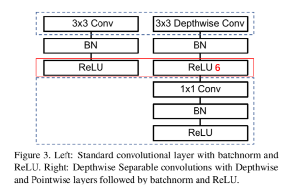
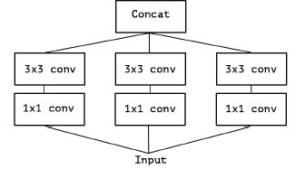
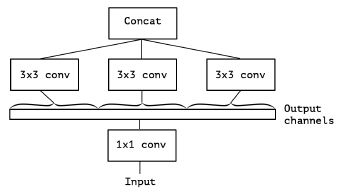
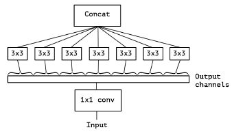
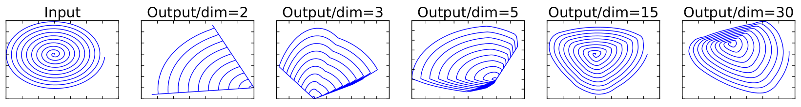
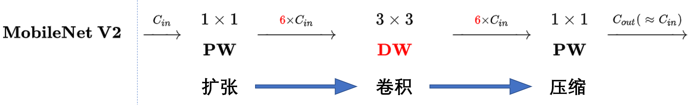
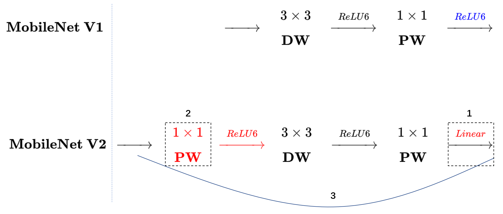
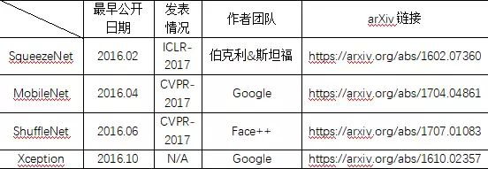
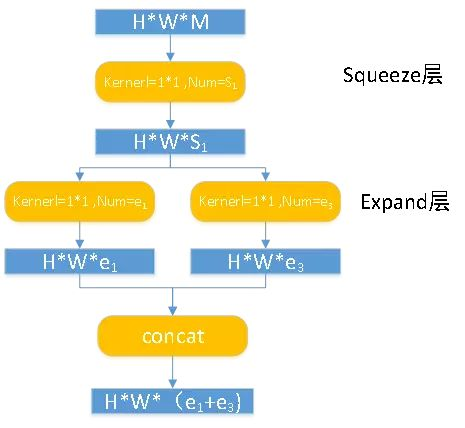

Sep_27_轻量化网络解析1_mobilenet系列,xception和SqueezeNet
===

mobilenetV1
----

1. 2016年6月(2017年4月发布),首先提出mobilenetV1,最大亮点是使用 深度可分离卷积(depthwise separable convolution).
2. mobilenetV1 的卷积,首先采用了Relu6当输入的值大于6的时候,返回6,relu6“具有一个边界”。作者认为ReLU6作为非线性激活函数,在低精度计算下具有更强的鲁棒性.

Xception
---
2. Xception于2017年4月被google发布,将Inception模块简化，仅保留包含3x3的卷积的分支:
再将所有1x1的卷积进行拼接

进一步增多3x3的卷积的分支的数量，使它与1x1的卷积的输出通道数相等：
此时每个3x3的卷积即作用于仅包含一个通道的特征图上，作者称之为“极致的Inception（Extream Inception）”模块，这就是Xception的基本模块。事实上，调节每个3x3的卷积作用的特征图的通道数，即调节3*3的卷积的分支的数量与1x1的卷积的输出通道数的比例，可以实现一系列处于传统Inception模块和“极致的Inception”模块之间的状态.

3. Xception网络结构和resnext网络结构很像,利用gropu convolution 和 1x1 convolution 两个结构重新设计Inception model block，就是Xception；重新设计Resnet，就是ResNeXt架构。

4. ResNeXt 和 Xception网络一样同样是使用了 组卷积.(ResNeXt感觉好于Xception)

5. Xception网络是先1x1卷积,之后组卷积,而mobilenetV1是先 3x3的depthwise 卷积,之后1x1卷积.

6. 发现Xception和ResNext网络很像,只是没有残差结构.

mobilenetV2(CVPR2018)
----
1. relu函数应该尽可能在高维运算:对一个n维空间中的一个“东西”做ReLU运算,然后(利用T的逆矩阵T-1恢复)对比ReLU之后的结果与Input的结果相差有多大
结果表明:对低维度做ReLU运算,很容易造成信息的丢失。而在高维度进行ReLU运算的话,信息的丢失则会很少。(所以会将部分relu6替换成linear激活函数)

2. 首先介绍expansion layer操作:,其实就是多了一个1x1卷积用于扩张,压缩的1x1卷积是本身sparable convolution 自带的卷积.(这样可以让relu在高维度上运算)

3. mobilenetV2 采用 inverted residuals(反残差结构),,和residuals不同的是,它采用的是先升高维度,在高纬度depthwise convolution之后,再降低维度.

SqueezeNet(最早的轻量级网络,现在落后了,但可以学习思想)
----
1. 以下是四个模型的作者团队及发表时间其中 ShuffleNet 论文中引用了 SqueezeNet；Xception 论文中引用了 MobileNet.

2. SqueezeNet不断的堆叠module,这里的额module不是传统卷积,而是 fire module:
H*W*M 的 feature map 经过 Squeeze 层，得到 S1 个 feature map，这里的 S1 均是小于 M 的，以达到「压缩」的目的，H*W*S1 的特征图输入到 Expand 层，分别经过 1*1 卷积层和 3*3 卷积层进行卷积，再将结果进行 concat，得到 Fire module 的输出，为 H*M*(e1+e3) 的 feature map,文中提出的 SqueezeNet 结构中，e1=e3=4s1.

3. squeezenet 与 GoogLeNet(inception V1类似) 和 VGG 的关系很大！

moblienetV3[2019/05]
---
1. moblienetV3是通过AutoML搜索出来的.

