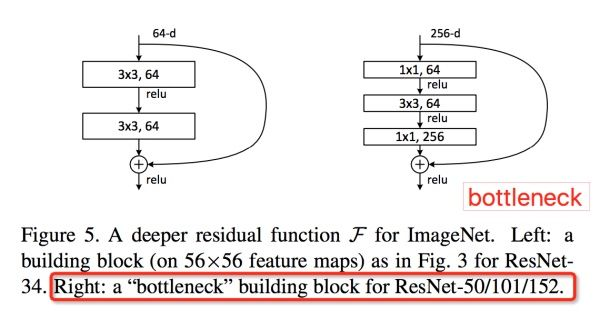
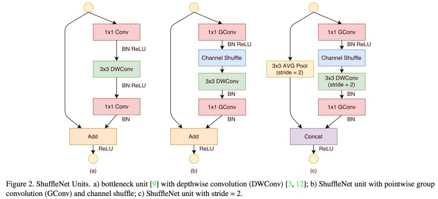
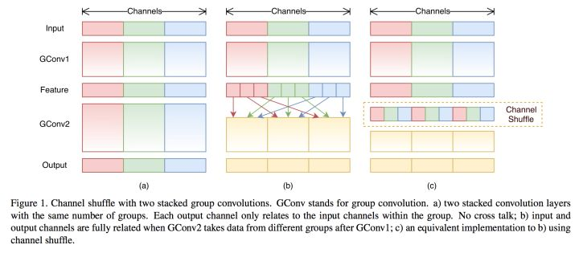
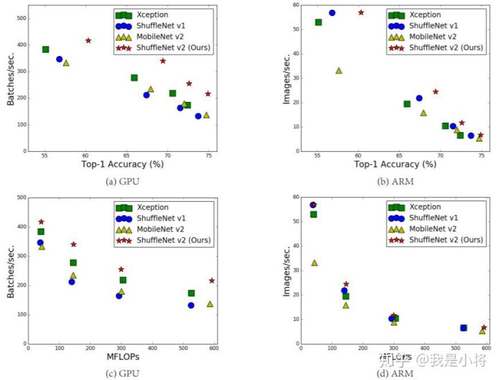
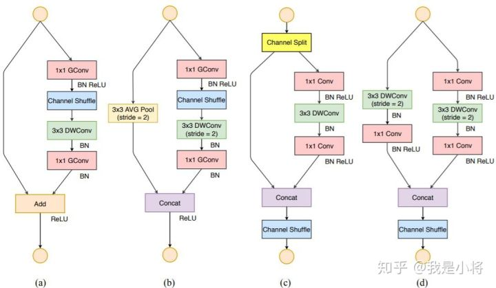
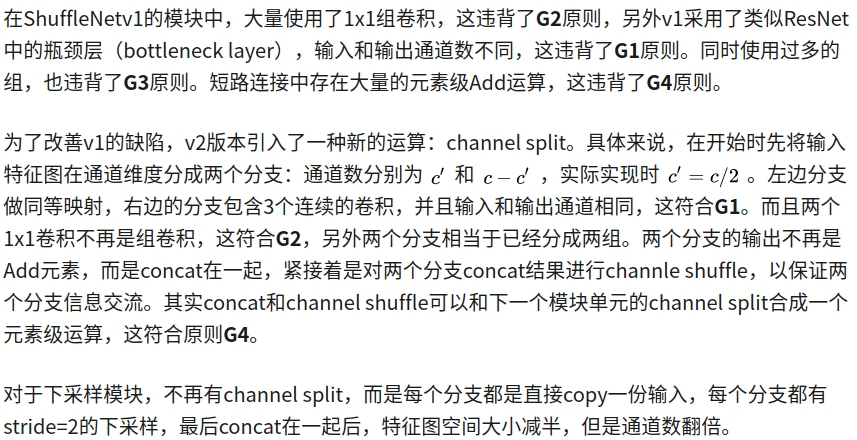
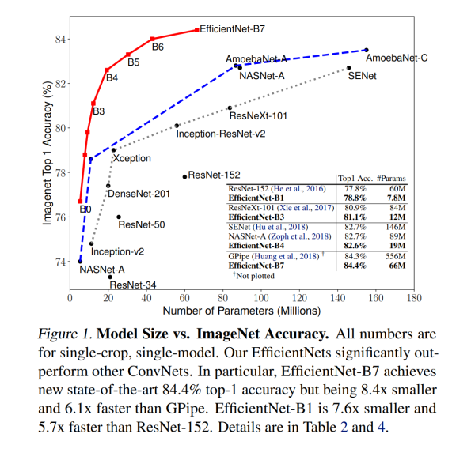

Oct_27_轻量化网络解析2_ShuffleNet系列和EfficientNet
====

ShuffleNetV1
-----
1. ShuffleNet是 旷世 提出的一种轻量化网络结构，主要思路是使用 Group convolution和 Channel shuffle 改进ResNet，可以看作是ResNet的压缩版本(ShuffleNet是基于resnet改进)

2. 首先看原始resnet结构下图展示的是ShuffleNet的结构:其中(a)就是加入 Depthwise的ResNet bottleneck 结构，而(b)和(c)是加入 Group convolution 和 Channel Shuffle 的ShuffleNet的结构 (b是输入输出不变的module,c是输出变成输入一半的module) 。

3. 上图中的(a)就已经对resnet做了改进,因为传统resnet的bollteneck是没有DWConv的,传统的是普通卷积.

3. Shuffle channel : ShuffleNet的本质是将卷积运算限制在每个Group内，这样模型的计算量取得了显著的下降。然而导致模型的信息流限制在各个Group内，组与组之间没有信息交换，如图15，这会影响模型的表示能力。因此，需要引入组间信息交换的机制，即Channel Shuffle操作。同时Channel Shuffle是可导的，可以实现end-to-end一次性训练网络.

4. ShuffleNet有2个重要缺点:
	- Shuffle channel 在实现的时候需要大量的 指针跳转 和 Memory set，这本身就是极其耗时的；同时又特别依赖实现细节，导致实际运行速度不会那么理想.
	- Shuffle channel 规则是人工设计出来的，不是网络自己学出来的。这不符合网络通过负反馈自动学习特征的基本原则，又陷入人工设计特征的老路.
	- Shuffle channel 需要时间,成为 Shuffle cost.

ShuffleNetV2(ECCV2018)
-----
1. 在同等复杂度下，ShuffleNetv2比ShuffleNet和MobileNetv2更准确.

2. ShuffleNetV2参考:[ShuffleNetV2：轻量级CNN网络中的桂冠](https://zhuanlan.zhihu.com/p/48261931)

3. 目前衡量模型复杂度的一个通用指标是FLOPs,但是ShuffleNetV2认为影响速度的不仅仅是FLOPS,还有 内存使用量(MAC) 和 模型的并行程度 和 在不同平台上(GPU,ARM,eg).

4. 讨论出四条指导原则
	- 同等通道大小最小化内存访问量(MAC)
	- 过量使用组卷积会增加MAC
	- 网络碎片化会降低并行度
	- 不能忽略元素级操作

5. 四条指导原则对应的总结:
	- 1x1卷积进行平衡输入和输出的通道大小
	- 组卷积要谨慎使用，注意分组数
	- 避免网络的碎片化
	- 减少元素级运算

6. 根据前面的4条准则，分析了ShuffleNetv1设计的不足，并在此基础上改进得到了ShuffleNetv2，两者模块上的对比如图所示

7. ShuffleNetV2引入了新的运算:channel split.

EfficientNet(ICML 2019)(来自google)(目前最强?)
-------

1. 首先看EfficientNet的性能论文展示了谷歌各种吊炸天的调参能力，在各个参数量级上精度都超过了之前的SOTA，但是并没有告诉我们尝试的准则，仅仅展示了结果而已。

2. EfficientNet-B0是用MnasNet的方法搜出来的,利用这个作为baseline来联合调整深度、宽度以及分辨率(提出B1,B2,B3,B4...)的效果明显要比ResNet或者MobileNetV2要好，由此可见强化学习搜出来的网络架构上限可能更高！

3. MnasNet:在《MnasNet: Platform-Aware Neural Architecture Search for Mobile》一文中，作者探索了一种使用强化学习设计移动端模型的自动化神经架构搜索方法。