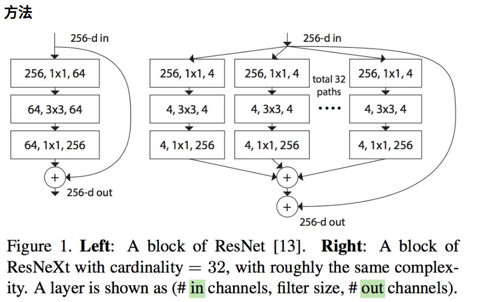
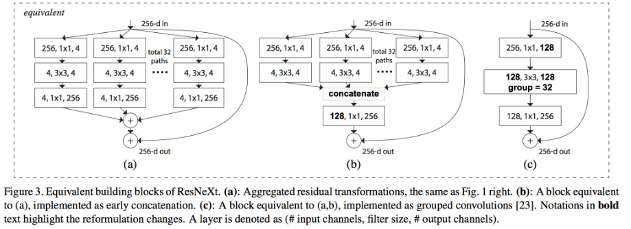
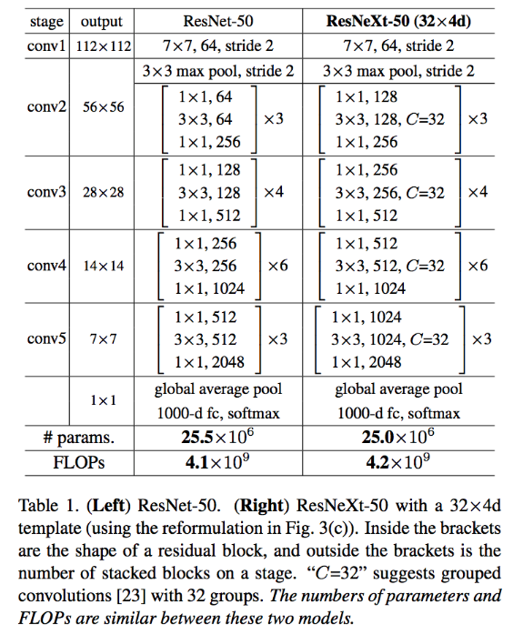

#Oct_28_Resnet的下一代网络,ResNext(与resnet相比,相同参数下结果更好)

1. 以下为构成ResNeXt网络的基本block单元:它与Inception Resnet中所有的基本单元极为相似，可实际上它block当中的每个sub branch都是相同的，这是它与Inception Resnet网络结构的本质区别，而正是基于这区别，我们可以使用Group convolution来对其进行良好实现.

2. 提出 cardinality(基数) 的概念，在上图左右有相同的参数个数，其中左边是 ResNet 的一个区块，右边的 ResNeXt 中每个分支一模一样，分支的个数就是 cardinality.

3. resnext的等价模式:(它们在数学计算上是完全等价的，而第三种包含有Group convolution操作的正是最终ResNeXt网络所采用的操作)

4. ResNeXt网络的整体结构:正如ResNet是由基本的Residual模块一个个累积起来的一样，ResNeXt网络也是由上图中所描述的模块一个个累积起来的。下面表格当中，我们能看到ResNeXt与ResNet网络的整体结构:

5. 两个准则:
	- 一是如果一个block的输入和输出同样大小的channel size，那么blocks输入、输出有着相同的hyper-parameters（即width和filter sizes）
	- 二是若其输出与输入有着不同的大小（如downsampling操作），那么就需要相应地扩大filters的数目。

6. 亦能看出ResNeXt与ResNet一样都follow以上两条准则以保证每个block的计算量类似，所传递的信息也不会因层数递增而有太多丢失.

7. 结论:
	- ResNeXt 与 ResNet 在相同参数个数情况下，训练时前者错误率更低，但下降速度差不多
	- 相同参数情况下，增加 cardinality 比增加卷积个数更加有效
	- 101 层的 ResNeXt 比 200 层的 ResNet 更好
	- 多了一个超参数:cardinality(基数) car di na li ty

8. ResNeXt可以说是基于Resnet与Inception的'Split(1x1卷积) + Transfrom + Concat(级联)'而搞出的产物，结构简单、易懂又足够强大.

9. 一般增强一个CNN的表达能力有三种手段：一是增加网络层次即加深网络（目前CNN已经由最初Alexnet的不到十层增加到了成百上千层，而实际实验结果表明由层次提升而带来的边际准确率增加已是越来越少）；二是增加网络模块宽度（可见我们之前有介绍过的Wide residual network，可宽度的增加必然会带来指数级的参数规模提升，因此它并非为主流CNN设计所认可。）；三是改善CNN网络结构设计.ResNeXt的做法可归为上面三种方法的第三种.

10. resnet50 和 resnext50 的参数量和FLOPs基本是相同的.

11. 参考: [ResNext,与resnet相比,相同参数下结果更好](https://www.cnblogs.com/bonelee/p/9031639.html)
[经典分类CNN模型系列其八：ResNeXt](https://www.jianshu.com/p/7478ce41e46b)

12. resnext和xception的区别在于残差结构!两者都是使用组卷积和1x1卷积，但是xception网络中没有残差结构；

