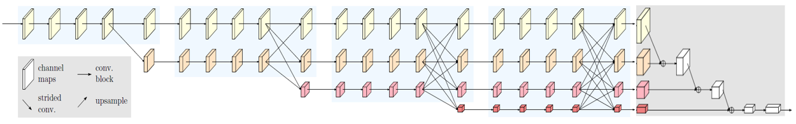

Sep_29_HRNet,高分辨率表征网络
===

1. 首先介绍分类网络类别:
	- 图像级分类
	- 区域级分类(目标检测)
	- 像素级分类(语义分割)

2. 由高到低卷积串联而成的分类网络(大部分的分类网络)并不是区域级和像素级分类的好选择，因为它只会得到丰富的低分辨率表示或通过上采样过程得到低分辨率表示.

3. 现有的(Hrnet之前)高分辨率表征方法:这些网络的特点：
	- 两个过程:High-to-Low过程(产生低分辨率高级特征表示)和Low-to-High(恢复高分辨率)过程，并且这两个过程是串行的。
	- 有的网络会将高级特征图和低级特征图做特征融合。

3. 高分辨率表征网络(HRNet)的核心思想 : HRNet通过并行连接高分辨率到低分辨率卷积来保持高分辨率表示，并通过重复跨并行卷积执行多尺度融合来增强高分辨率表示。在关键点检测、姿态估计、多人姿态估计等都表现很好.

4. HRNet是做人体姿态估计发的文章:Deep High-Resolution Representation Learning for Human Pose Estimation.二维人体姿态估计 2D human pose 是计算机视觉中一个基本而又具有挑战性的问题:而single-person pose estimation，这是其他相关问题的基础，如multiperson pose estimation，video pose estimation and tracking等。

5. 从高分辨率子网作为第一阶段始，1)逐步增加高分辨率到低分辨率的子网(gradually add high-to-low resolution subnetworks)，形成更多的阶段，2)并将多分辨率子网并行连接。3)在整个过程中，我们通过在并行的多分辨率子网络上反复交换信息来进行多尺度的重复融合。

6. 总结HRNnet的两个优点:
	- 在整个过程中保持高分辨率的特征表示，逐步增加High-to-Low的子网，并将多分辨率的子网并行连接
	- 在并行的多分辨率子网之间反复交换信息，进行多尺度融合，高分辨率特征与低分辨率特征之间相互增强

7. 参考[HRNet详解](https://blog.csdn.net/weixin_37993251/article/details/88043650)

8. HRNet还提供两个轻量级的版本:HRNet-W18-C-Small-v1 和 HRNet-W18-C-Small-v2,介绍说#parameters and GFLOPs are similar to ResNet18.

10. 描述HRNET的关键词：高分辨率，并行的多分辨率子网反复交换信息；
