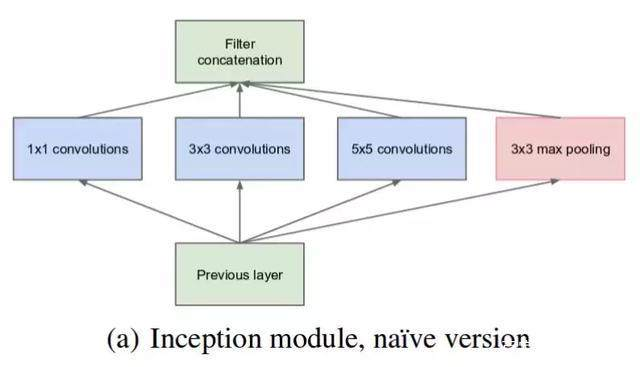
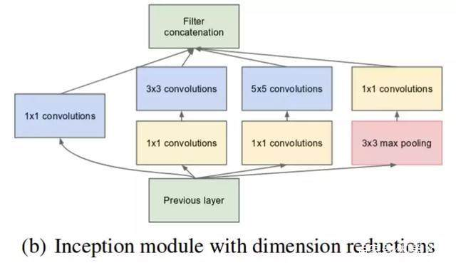
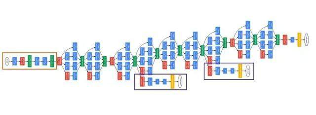
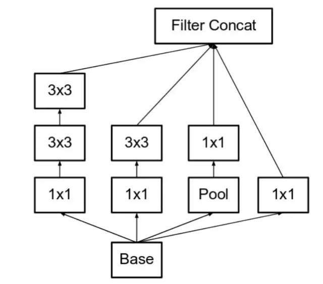
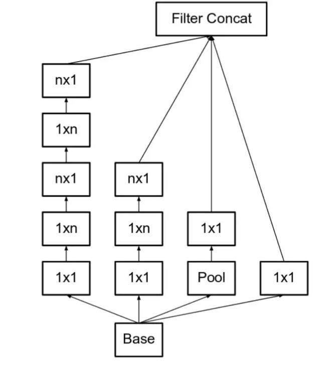
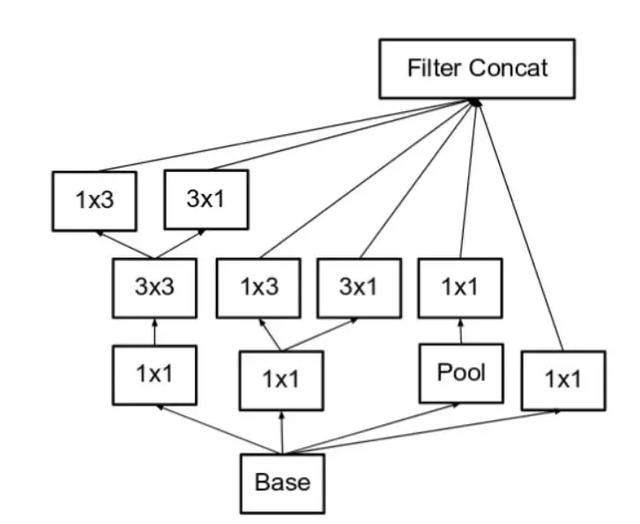
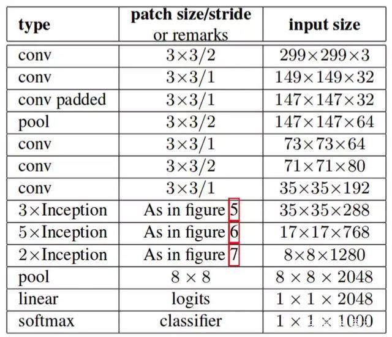
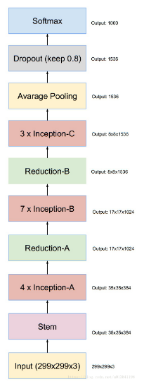

Sep_29_Inception系列和Inception-Resnet系列网络
====

1. 现在已经发展到了Inception v4/Inception Resnet v2版本了.

2. 常见的Inception 网络版本有:
	- Inception v1,
    - Inception v2 和 Inception v3,
    - Inception v4 和 Inception-ResNet
    - Inception-ResNet v2
    - 每个版本都是前一个版本的迭代进化

3. Inception 网络是 CNN 分类器发展史上一个重要的里程碑。在 Inception 出现之前，流行的CNN仅是把卷积层堆叠得越来越多(例如VGG16,VGG19,另外,VGG-19 基本上是参数量最多的卷积网络架构,因为有大量的全连接层).

4. Inception 和 VGG-Net 是同年提出的.

Inception v1(GoogLeNet)
----

1. 在同一层级上运行具备多个尺寸的滤波器,让网络本质上会变得稍微「宽一些」，而不是「更深」。

2. 下图是「原始」Inception 模块。它使用 3 个不同大小的滤波器（1x1、3x3、5x5）对输入执行卷积操作，此外它还会执行最大池化。所有子层的输出最后会被级联起来，并传送至下一个 Inception 模块.

3. 说一下 filter concatenation(级连,和cascade一样的意思)操作:

4. 为了降低算力成本，作者在 3x3 和 5x5 卷积层之前添加额外的 1x1 卷积层，来限制输入信道的数量,下图是实现「降维」的 Inception 模块

5. 利用实现降维的 Inception 模块可以构建 GoogLeNet（Inception v1），其架构如下图所示：GoogLeNet 有 9 个线性堆叠的 Inception 模块。它有 22 层（包括池化层的话是 27 层）。该模型在最后一个 inception 模块处使用全局平均池化。这是一个深层分类器。

6. 和所有深层网络一样，googLeNet也会遇到梯度消失问题.为了阻止该网络中间部分梯度的「消失」过程，作者引入了两个辅助分类器（上图紫色框）。它们对其中两个 Inception 模块的输出执行 softmax 操作，然后在同样的标签上计算辅助损失。总损失即辅助损失和真实损失的加权和。该论文中对每个辅助损失使用的权重值是 0.3.# The total loss used by the inception net during training.total_loss = real_loss + 0.3 * aux_loss_1 + 0.3 * aux_loss_2.辅助损失只是用于训练，在推断过程中并不使用。

7. inception的核心就是把google net的某一些大的卷积层换成1*1, 3*3, 5*5的小卷积，这样能够大大的减小权值参数数量.比方说google net某一层本来是一个28*28大小的卷积核，一共输出224层，换成inception以后就是64层1*1， 128层3*3， 32层5*5。这样算到最后依然是224层，但是参数个数明显减少了，从28*28*224 = 9834496 变成了1*1*64+3*3*128+5*5*32 = 2089，减小了几个数量级.
————————————————
版权声明：本文为CSDN博主「蒙特卡洛家的树」的原创文章，遵循 CC 4.0 BY-SA 版权协议，转载请附上原文出处链接及本声明。
原文链接：https://blog.csdn.net/u011021773/article/details/80791650

Inception v2 和 Inception v3
----
1. Inception v2 和 Inception v3 来自同一篇论文《Rethinking the Inception Architecture for Computer Vision》

2. inception v2解决这样的问题:(最重要的是改变了表征性瓶颈)
	- 减少特征的「表征性瓶颈」。直观上来说，当卷积不会大幅度改变输入维度时，神经网络可能会执行地更好。过多地减少维度可能会造成信息的损失，这也称为「表征性瓶颈」(这也和resnet和resnext遵循的规则是一样的)
	- 使用更优秀的因子分解方法，卷积才能在计算复杂度上更加高效

3. 解决方案一:将 5×5 的卷积分解为两个 3×3 的卷积运算以提升计算速度。一个 5×5 的卷积在计算成本上是一个 3×3 卷积的 2.78 倍。所以叠加两个 3×3 卷积实际上在性能上会有所提升

4. 解决方案二:作者将 n*n 的卷积核尺寸分解为 1×n 和 n×1 两个卷积。例如，一个 3×3 的卷积等价于首先执行一个 1×3 的卷积再执行一个 3×1 的卷积。他们还发现这种方法在成本上要比单个 3×3 的卷积降低 33%，

5. 解决方案三:模块中的滤波器组被扩展（即变得更宽而不是更深），以解决表征性瓶颈。如果该模块没有被拓展宽度，而是变得更深，那么维度会过多减少，造成信息损失.所以我们应该尽可能拓宽宽度而不是深度:使 Inception 模块变得更宽。这种类型等同于前面展示的模块(数学上).

6. 三个原则用来构建三种不同类型的 Inception 模块(记作ABC).模型中使用Inception A B C 模块来构建inception v2:「figure 5」是模块 A，「figure 6」是模块 B，「figure 7」是模块 C

7. Inception Net v3 整合了前面 Inception v2 中提到的所有升级，还使用了:
	- RMSProp 优化器
	- Factorized 7x7 卷积(因子分解7x7卷积)
	- 辅助分类器使用了 BatchNorm
	- 标签平滑（添加到损失公式的一种正则化项，旨在阻止网络对某一类别过分自信，即阻止过拟合）(类似L1/L2正则化)

8. Inception 架构可以用很低的计算成本达到很高的性能,其是轻量化网络的原因:
	- 在 3x3 和 5x5 卷积层之前添加额外的 1x1 卷积层，来限制输入信道的数量
	- 对 3x3 和 5x5 卷积层进行分解操作

Inception v4
----
1. Inception v4 和 Inception -ResNet 在同一篇论文《Inception-v4, Inception-ResNet and the Impact of Residual Connections on Learning》中介绍.

2. 论文介绍了将Inception架构和残差连接结合起来会是什么效果.

3. Inception-v4网络，对于Inception块的每个网格大小进行了统一,如下是inception V4的主干网络:

4. Inception-v4网络中主要有:Stem,Inception-A,Inception-B,Inception-C,Reduction-A,Reduction-B模块.具体的模块可以看:[Inception V4](https://blog.csdn.net/u013841196/article/details/80673688),或者直接看论文.

Inception-ResNet
----
1. 受 ResNet 的优越性能启发，研究者提出了一种混合 inception 模块。Inception ResNet 有两个子版本：v1 和 v2.分析其显著特征之前，先看看这两个子版本之间的微小差异。
	- Inception-ResNet v1 的计算成本和 Inception v3 的接近
	- Inception-ResNetv2 的计算成本和 Inception v4 的接近
	- 它们有不同的 stem，正如 Inception v4 部分所展示的
	- 两个子版本都有相同的模块 A、B、C 和缩减块结构。唯一的不同在于超参数设置。

2. Inception-ResNet主要解决了一个问题:引入残差连接，它将 inception 模块的卷积运算输出添加到输入上.

全文参考[一文概览Inception家族的「奋斗史」](http://baijiahao.baidu.com/s?id=1601882944953788623&wfr=spider&for=pc)