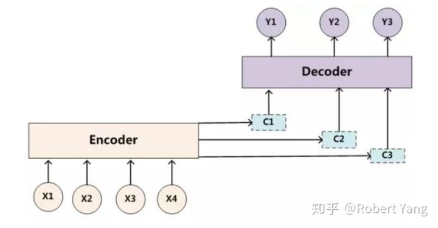
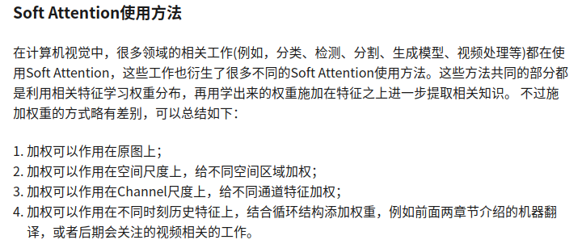

Oct_8_attention机制浅要了解
===

机器翻译中的传统Attention
-----------

1. attention最早起源于机器翻译，由变长的输入X映射到一个变长输出Y的问题。其中最明显的问题是：X到Z，Z到Y的过程中，Z的维度是固定的，且X的输入中每个词的权重是相同的。所以才提出了attention机制。

2. 机器翻译中的soft attention:从概念上理解，可以把Attention理解为从大量信息中有选择地筛选出少量重要信息并聚焦到这些重要信息上，忽略大多不重要的信息。其主要聚焦的过程体现在权重系数的计算上，权重越大越聚焦于其对应的特征值上，即权重代表了信息的重要性，而对应特征是其需要重点学习的知识。(attention其实是一个权重向量，需要时刻计算)

3. 机器翻译中attention的对齐：Attention模型的关键就是这里，即由固定的中间语义表示Z换成了受到注意力因子影响后的动态隐变量C，从而达到对齐翻译的效果。

4. 以上参考[机器翻译中的传统Attention](https://zhuanlan.zhihu.com/p/52786464).

机器翻译中的Self Attention
-----------
1. 传统Attention机制(上面介绍的)本质上是在对比学习模型的输入空间和输出空间的特征计算attention，并且依赖于Encoder-Decoder架构和RNN循环结构。模型训练的速度也受到了一定的影响。而Self Attention只依赖一个特征空间上的知识提取，所以也被称为intra(内部) Attention。

2. 出自《Attention is all you need》这篇论文，发表在NIPS2017上。

3. 具体公式和内容参考论文或者[机器翻译中的Self Attention](https://zhuanlan.zhihu.com/p/52861193)

视觉应用中的attention
-----------
1. 视觉中的Atttention其实也是学出一个权重分布，再拿这个权重分布施加在原来特征之上。不过施加权重的方式略有差别，视觉应用中一般有以下几种施加方式：
	- 加权可以保留所有分量做加权(hard attention)
	- 可以在分布中以某种采样策略选取部分分量做加权(soft attention)
		1)加权作用在原图上
		2)加权作用在空间尺度上，给不同空间区域加权
		3)加权作用在Channel尺度上，给不同通道特征加权
		4)加权作用在不同时刻历史特征上，结合循环结构添加权重，例如视频工作。

2. 所以从特征采样方式来划分，attention可以分为Soft Attention和Hard Attention。但对soft Attention进行分类，可分为四种应用方式。

3. 机器翻译中的传统Attention和Self Attention，都属于Soft Attention的类型。

4. 以上内容参考[Attention算法调研_视觉应用概况](https://zhuanlan.zhihu.com/p/52925608)

人眼视觉的attention
-----------
1. 根据生物神经科学研究发现，人眼在看东西时潜意识中一般有三个过程：
	- 眼睛接受像素信息，根据具体的像素信息成像。这个过程属于bottom-up过程，即人眼根据某一个像素极其周围的像素信息形成图像区域并进一步抽象为某一个物体形状；
	- 眼睛扫描整个场景元素，并且寻找感兴趣的影像区域。这个过程属于top-down过程，即获得第一步物体形状之后，人眼会快速扫描整个视野场景，然后快速定位到感兴趣的地方；
	- 眼睛聚焦感兴趣的区域，仔细观察获得外部信息。

2. 根据这一过程，在早期的传统机器学习中，Attention的学习方法就被分类成了bottom-up和top-down两个过程。其基本的motivation就是根据人眼观察世界的原理去除图像中那些不重要、冗余的像素信息。具体方法一般也主要分为两个过程，bottom-up和top-down两个过程。 在bottom-up过程中，主要应用像素聚类等方法将某一物体的像素聚类到一起形成很多小区域，top-down过程一般根据聚类的结果进行过滤处理，将背景区域排除，从而获得感兴趣的图像区域。

视觉应用中的hard attention
-----------
1. 参考[Attention算法调研(三)_视觉应用中的Hard Attention](https://zhuanlan.zhihu.com/p/52958865)

2. hard attention 和 soft attention的一些对比：
	- Soft Attention是依赖特征之间的关系学习权重，Hard Attention主要在局部特征区域进行随机crop的过程；
	- Soft Attention可以嵌入到网络中应用Loss收敛学习权重，Hard Attention主要依赖强化学习训练权重(自然语言中有依赖蒙特卡罗方法)，无法嵌入到网络中收敛学习；
	- Soft Attention的特征采样权重经过Softmax处理以后，所有的权重大小在0~1之间，大部分是小数形式，特征关系的采集是特征值和权重的累积和；Hard Attention的特征采集权重一般是局部区域作为一个整体(权重可以理解为只有0, 1两个情况)，局部特征之间的关系需要经过神经网络进一步学习。

视觉应用中的soft attention
-----------
1. 参考[Attention算法调研(四)_视觉应用中的Soft Attention](https://zhuanlan.zhihu.com/p/53026371)

2. Hard Attention的学习有一些弊端： Hard Attention学习局部特征区域是一个随机crop图像的过程，crop的图像在局部区域是连续的整体，相关知识需要网络进一步提取和学习； Hard Attention主要依赖强化学习训练(自然语言中有依赖蒙特卡罗)，在深度学习中无法嵌入到网络中收敛学习。因此，在近期火热的深度学习网络中，很多工作更多在使用Soft Attention。

3. soft attention 的使用方式：

视觉应用中的self attention
-----------
1. 参考[Attention算法调研(五)_视觉应用中的Self Attention](https://zhuanlan.zhihu.com/p/53155423)