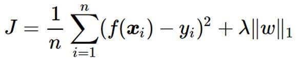
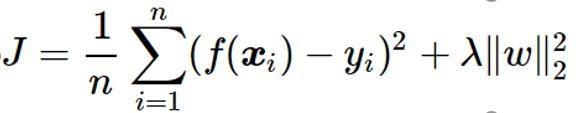
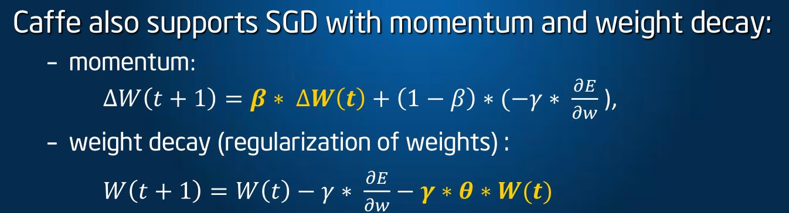
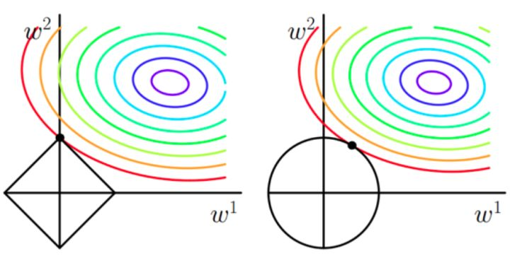
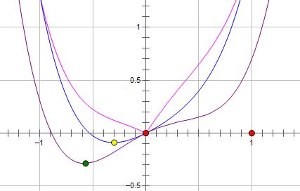
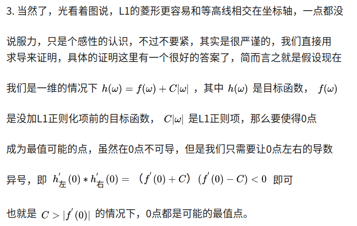

Nov_14_L1正则化和L2正则化的解读
====

1. Regularization(正则化) 不是 normalization(规范化),正则化解决的问题是防止过拟合.

2. 目标函数的正则化项分为L1正则和L2正则，两者都能达到防止过拟合的作用。正则化背后的思路：这些参数的值越小，通常对应于越光滑的函数，也就是更加简单的函数。因此 就不易发生过拟合的问题。
	- L1正则化
	- L2正则化
	L1正则化不仅可以防止过拟合，还可以稀疏矩阵。正则化的思路符合常理：实际所有变量对结果都有一定贡献，只是有些变量对结果的影响很小。加入正则化可以达到这个结果，使得函数更加平滑。

3. 但是在pytorch中，正则化不体现在loss中，而是具体现在optim优化器的weight_deacy中。
	例如，可以给不同的层设置不同的weight_deacy,说明L2正则化在代码中应该是体现在每一层上的，本身L2只约束层。
```
    params = [
    {"params": logits_params, "lr": config.lr},
    {"params": net.backbone.parameters(), "lr": config.backbone_lr},
]
	optimizer = torch.optim.SGD(params, momentum=config.momentum, weight_decay=config.weight_decay)
```

4. 加了weight_deacy参数之后(例如weight_deacy经常为0.01)，可以发现loss最初的值是不变的，但是loss下降的速度会变慢，观看accuracy曲线和loss曲线，发现会变得平滑稳定。

结构风险最小化角度：
-------------
1. 结构风险最小化： 在经验风险最小化的基础上（也就是训练误差最小化），尽可能采用简单的模型，以此提高泛化预测精度。

为什么l1正则相比于l2正则更容易获得稀疏解
-----

1. 首先从二维w画图的角度来看:  参考  [L1正则化与L2正则化](https://zhuanlan.zhihu.com/p/35356992)

2. 从一维w画图的角度来看:参考[l1 相比于 l2 为什么容易获得稀疏解？](https://www.zhihu.com/question/37096933/answer/70426653)

3. 从导数的角度考虑:

4. L2范数 与 L1范数 相比，从二维w画图上来看，不容易交在坐标轴上，但是仍然比较靠近坐标轴。因此这也就是我们老说的，L2范数能让解比较小（靠近0），但是比较平滑（不等于0）.