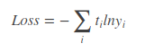
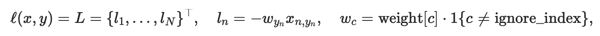

Nov_19_CrossEntropy分类问题中的label是否必须从0开始?

1. 首先给出答案:是,label必须从0开始.

2. 必须从0开始的话,当我有不是从0的label,例如[1,2,3,4,6].有没有好的办法解决?
	- 解决方法是:在dataset的时创建一个字典,例如{1:0,2:1,3:2,4:3,6:4},通过字典映射成从0开始的label.

3. 为什么要从0开始:假设这是一个分类问题,首先从crossentropyloss的输入开始,loss = criterion(outputs, labels),其中outputs是一个[batch,num_cls]的tensor,labels则是一个[batch]的tensor.再看crossentropyloss的结构,对于outputs的输入,首先会进行log_softmax操作,操作完(可以分为softmax和log两步理解)后的size依旧是[batch,num_cls],之后进行计算nllloss,也就是nllloss的输入outputs依旧是[batch,num_cls]的tensor,labels依旧是[batch]的tensor.
看交叉熵的公式和nllloss的公式就知道,这个时候pytorch会对大小为[batch]的label自动进行转换成one-hot编码,这个时候转换的one-hot编码就是依靠label中的数字转换的,如果不是从0开始则会出错.

4. 主要原因:pytorch会对大小为[batch]的label自动进行转换成one-hot编码.