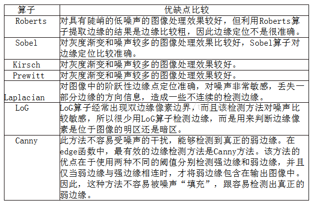

Nov_24_传统图像中的边缘检测算子

1. 边缘检测步骤:
	- 首先对图像转灰度图
	- 首先对图像去噪(模糊)，低频信息是变化缓慢的地方，高频信息是变化剧烈的地方对图像采用5*5的高斯模糊平滑图像.
	- 计算像素梯度的幅度值和方向常用rober，sobel算子，计算水平和竖直方向的差分，梯度较大的部分边缘信息较明显。(这里其实用到了微分边缘检测算子来计算梯度幅值方向)
	- 非极大抑制(NMS)，将图像边缘细化，因为可能边缘有很大一块，那么需要将非局部最大值给抑制掉，细化边缘.
	- 双阈值检测(双阈值边缘连接处理),大于大的阈值为强边缘，介于大的和小的就为弱边缘，更小的直接抑制.
	- 抑制孤立低阈值点
	- 二值化图像输出结果

2.  一阶微分算子(微分边缘检测算子)：Roberts 、Sobel 、Prewitt

3.  二阶微分算子(微分边缘检测算子)：Laplacian、Log/Marr

4.  非微分边缘检测算子：Canny算子

5. 各边缘检测算子对比:

6. 总结:canny算子最好也考的最多.