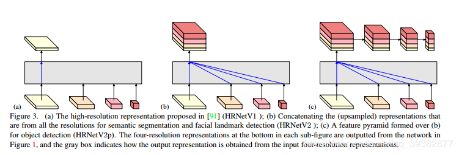
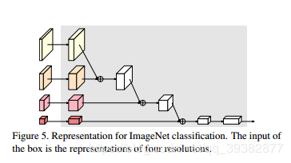

Nov_28_HRNetV1和HRNetV2的区别

1. HRNetV1和HRNetV2其实不是版本迭代的过程,只是同一个网络用在不同任务上:
	- 人体姿态估计 : 对应的图（a）,也就是HRNetv1，只输出最高分辨率
	- 语义分割、人脸关键点检测 : 对于的图（b），所有的低分辨率特征图上采样后concat，也就是HRNetV2，最后1x1卷积后softmax
	- 目标检测 : 对应的图（c）,将语义分割也就是HRNetV2的特征图下采样构成新的特征金字塔，也就是HRNetV2p，类似于FPN，每一个尺度分别预测。
	- 图像分类 : ;如图所示,就是结合多个尺度，高分辨率下采样后与低分辨率add，最后全局均匀池化后进行分类(这里是add,不是concat)