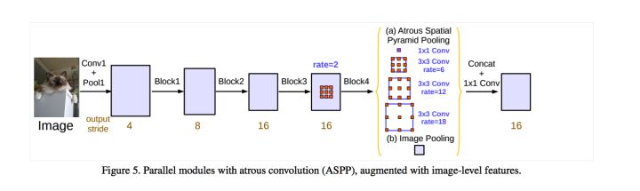

Nov_2_两个不同版本的deeplabV3中ASPP和resnet50不同的困惑?

1. 问题描述: 在接触到pytorch的torchvision之前,一直在用的教研室传的deeplabV3的代码,很好奇为什么会去掉resnet50的后三层,之后通过make_layer来增加layer4?

2. 解答:不同人实现的deeplabv3可能会有点小差别,但是backbone基本都是一样的,而且很多用的都是同样的预训练模型(教研室传的deeplabV3也使用了pytorch中resnet50预训练模型和代码).但是上述deeplabV3的代码和torchvision中deeplabV3的代码:
	- 1)在backbone中的layer4(后面添加的layer5和layer4没有本质区别)中,只是是否要在卷积和BN之后去掉relu这一层.(纠正,这一点没有区别,只是教研室的代码的relu放在了forward中,直接打印看不出来)
	- 1)在backbone中的layer4(torchvision中添加的layer5和layer4区别在于layer5是采用的dilation卷积,而layer4没有采用,在deeplabv3中的原生实现中,是应该采用的)
	- 2)在ASPP的区别在于使用的空洞卷积的尺寸,官方使用的是[12,24,36],自己之前一直看的使用的是[6,12,18],也就是dilation的大小和padding的大小.
	- 3)另外在ASPP还有的就是在conv之后要不要加bn和relu,在aspp有细微的差别.(纠正,这一点没有区别,只是教研室的代码的relu放在了forward中,直接打印看不出来)
总结:教研室传的deeplabV3的代码质量好于torchvision,细节实现的更多.

3. 此处补充ASPP的知识:ASPP其实是一个类似inception的结构,在同一层中有多个卷积核,之后的结果通过torch.cat进行级联.ASPP一般是由1)三个DCNN(空洞卷积),dilation是[6,12,18]输出都是256通道数 2)普通的1X1卷积输出256通道数 3)经过池化avgpool之后之后再卷积再bn再relu再interpolate得到256通道数 三个部分组成.

4. deeplabv3中上采样用的是upsampling,即是双线性插值.而unet用的是ConvTranspose.还知道一种上采样方式,在超分辨率重建中看到的是[通道重新组合].

5. deeplabV3的三个改进:
	- 使用了Multi-Grid 策略,将 ResNet 的 Block 4中使用空洞卷积避免下采样太多,也就是教研室传的代码中的重新写layer4的操作.
	- 将 batch normalization 加入到 ASPP模块.
	- 具有不同 atrous rates 的 ASPP 能够有效的捕获多尺度信息,但是额外添加了 全局池化层+conv1x1+双线性插值上采样 的模块,为了解决 保留较大视野的空洞卷积的同时 避免filter特征权重失效.参考[deeplabV3的ASPP部分](https://zhuanlan.zhihu.com/p/75415302)

6. Aspp和psp的区别:
	- ASPP的目的是使用dilation卷积,即DCNN,来增大感受野,同时本身是inception结构,可以同时获得多尺度信息.
	- ASPP:Atrous Spacial(空域) Pyramid Pooling
	- ASPP 本质是一种 pooling 操作?---可能是因为有全局平均池化操作,因为这个操作,使得感受野变成了全局.但同时融合了其他几个DCNN的信息,以至于不会失去空间关系而变得模糊.
	- pspnet部分见下一篇[Nov_3_PSPnet理解以及与deeplabV3的区别和联系](Nov_3_PSPnet理解以及与deeplabV3的区别和联系)