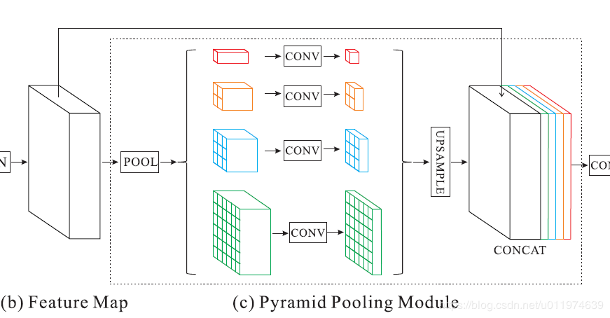

Nov_3_PSPnet理解以及与deeplabV3的区别和联系
====

1. pspnet : Pyramid Scene Parsing Network(金字塔场景解析网络)

2. 最大贡献:提出的金字塔池化模块( pyramid pooling module)能够聚合不同区域的上下文信息,从而提高获取全局信息的能力.(请对比ASPP,atrous 空域金字塔池化)

3. 大多数语义分割模型的工作基于两个方面：
	- 一方面：具有多尺度的特征融合，高层特征具有强的语义信息，底层特征包含更多的细节。
	- 另一方面：基于结构预测。例如使用CRF(条件随机场)做后端细化分割结果。

4. 首先介绍:pyramid pooling module
	- 之所以叫金字塔池化,是因为feature map进入pyramid pooling module之后,首先会进行池化操作.该模块融合了4种不同金字塔尺度的特征，第一行红色是最粗糙的特征–全局池化生成单个bin输出，后面三行是不同尺度的池化特征,分别是2,3,6,也就是对应的1*1和2*2和3*3和6*6的输出.
    - 在每个级别后使用1×1的卷积将对于级别通道降为原本的1/N。再通过双线性插值获得未池化前的大小，最终concat到一起.注意的是contact的对象包括输入到pyramid pooling module之前的feature map.

5. 介绍pspnet的整体结构:
	- 基础层经过预训练的模型(ResNet101)和空洞卷积策略提取feature map(在特征提取中就加入了DCNN,以增加感受野),提取后的feature map是输入的1/8大小.
	- feature map经过Pyramid Pooling Module得到融合的带有整体信息的feature，上采样后再与池化前的feature map相concat
	- 最后过一个卷积层得到最终输出

6. Aspp和psp的区别:
	- Aspp 的 DCNN 主要集中在 ASPP 层,其 backbone 除了 layer4 之外没有使用空洞卷积.
	- pspnet的DCNN集中在backbone中,也就是resnet和DCNN相结合的情况.
	- pspnet和Aspp都有一个全局的池化操作,即全局平均池化处理
	- pspnet是使用池化来实现金字塔操作,即1,2,3,6的池化尺度特征,不同池化特征得到的feature map尺寸不同,需要通过conv1x1+双线性插值上采样得到和原feature map一样的size,之后才可以contact;而ASPP是通过不同dilation的空洞卷积来实现金字塔操作(aspp中也有一个全局平均池化),不同的dilation操作得到的feature map的尺寸是一样的,可以直接contact.
