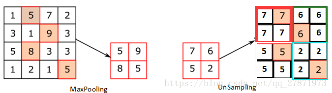
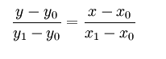
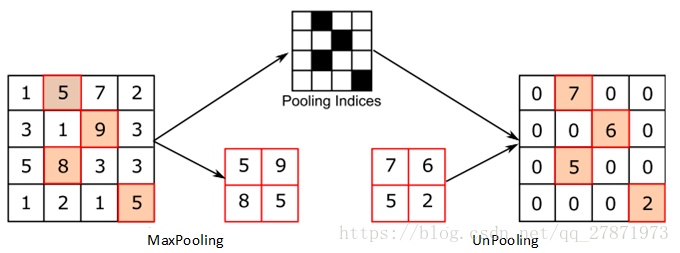

Nov_4_Transposed convolution和upsampling和unpooling的解读与区别
====

Upsampling（上采样）
------
1. 最简单的方式是重采样和插值：将输入图片进行rescale到一个想要的尺寸，而且计算每个点的像素点，使用如双线性插值等插值方法对其余点进行插值来完成上采样过程。
上图是最简单的直接复制若干次得到结果

2. 在pytorch中upsampling函数被替换成了torch.nn.functional.interpolate函数,mode (str) – algorithm used for upsampling: 'nearest' | 'linear' | 'bilinear' | 'bicubic' | 'trilinear' | 'area'. Default: 'nearest'

3. nearest插值:最简单的插值方式,在待求像素四邻域中,将距离最近的像素的灰度赋值给待求像素,上述图片展示的就是最近临差值.(计算量小,但是你生成的插值图像会不均匀不连续,会有明显锯齿状).
同时,在ROI pooling使用

4. linear插值:使用连接两个已知量的直线来确定在这两个已知量之间的一个未知量的值的方法,公式:

5. bilinear(双线性)插值:在两个方向分别进行一次线性插值,例如要求f（1.2, 3.4）,这个像素点是虚拟存在的，先找到与它临近的四个实际存在的像素点.
（1，3） （2，3）
（1，4） （2，4）
再写成 f(i+u,j+v) 的形式，则 u=0.2,v=0.4, i=1, j=3
f(i+u,j+v) = (1-u)(1-v)f(i,j) + (1-u)vf(i,j+1) + u(1-v)f(i+1,j) + uvf(i+1,j+1)
同时,在ROIAlign使用,保证了空间对称性(Alignment).

上池化
------
1. Unpooling是在CNN中常用的来表示max pooling的逆操作,这是论文《Visualizing and Understanding Convolutional Networks》中产生的思想，下图示意:

2. UnSampling阶段没有使用MaxPooling时的位置信息，而是直接将内容复制来扩充Feature Map.

3. unpooling过程中在Maxpooling的时候保留最大值的位置信息，之后在unPooling阶段使用该信息扩充Feature Map，除最大值位置以外，其余补0.

反卷积Transposed convolution
----
1. 实际上，转置卷积就是现在特征图中补0（zero padded，并且padding=kernel size-1），然后再做一次正向卷积(实际使用中能否补其他的数值?)

2. 最后，转置卷积kernel的参数是可以学习的，会训练过程不断被优化，不需要人为设定，也并不是正向卷积kernel的转置！

3. no_padding_no_strides_transposed:

4. padding_no_strides_transposed:

5. padding_strides_transposed:

6. FCN中的反卷积操作不是原则意义上transposed convolution，是因为作者设置其中的学习率lr_mult为0，没有让该层学习。即卷积核是固定不变的.