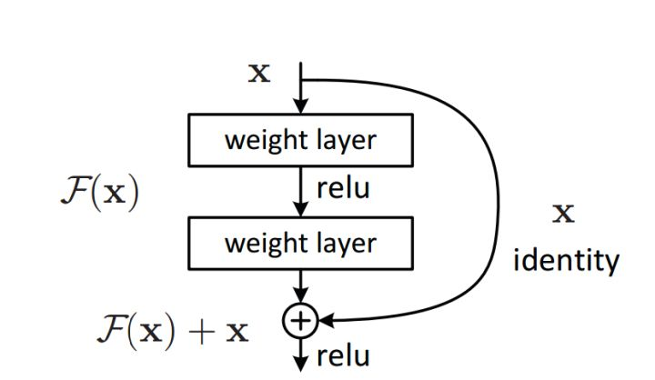
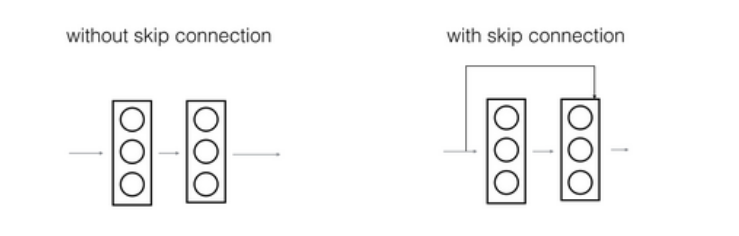

Nov_5_resnet网络好在哪里?
=====

1. 网络的深度为什么重要？:CNN能够提取low/mid/high-level的特征，网络的层数越多，意味着能够提取到不同level的特征越丰富。并且，越深的网络提取的特征越抽象，越具有语义信息。

2. 为什么不能简单地增加网络层数:如果简单地增加深度，会导致梯度弥散或梯度爆炸.

3. resnet不是梯度弥散或爆炸问题，kaiming的论文中也说了:臭名昭著的梯度弥散/爆炸问题已经很大程度上被normalized initialization and intermediate normalization layers解决了;

4. 也不是过拟合问题: 由于直接增加网络深度的(plain)网络在训练集上会有更高的错误率，所以更深的网络并没有过拟合，也就是说更深的网络效果不好，是因为网络没有被训练好，这种没有被训练好称作退化问题,这不是过拟合overfitting问题.

5. resnet解决的是----退化问题,使网络更好训练更容易优化.

6. resnet的残差结构:

7.  resnet之所以更好,是因为原本前向推理结果是F(x),加入残差之后,F(x)=H(x)-x,此时的F(x)已经代表了残差,不代表主体部分,x代表主体部分(x不是残差,x是skip connection的主体部分),这个时候的F(x)可以理解为是微小变化,当反向传播的时候,突出微小变化,能够使得网络更加容易训练.(看到残差网络我第一反应就是差分放大器)[常用网络结构：Resnet解决了什么问题](https://www.zhihu.com/question/64494691/answer/271335912)

8. 残差网络起作用的主要原因就是这些残差块学习恒等函数非常容易,你能确定网络性能不会受到影响,很多时候甚至可以提高效率.残差模块指的是F(x).

9. 给大型神经网络增加两层,不论是把残差块添加到神经网络的中间还是末端位置,都不会影响网络的表现.

10. 总结： resnet解决的问题是退化问题；（想到学习残差和差分放大器）