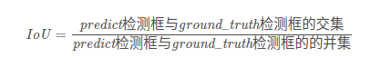

Nov_6_手撕代码之IOU计算和MAP计算和混淆矩阵计算
====

1. 首先目标检测iou的计算公式:

2. caffee源码计算目标检测bbox的iou的公式:（手写nms包含了求miou）

```C++
template <typename Dtype>
Dtype JaccardOverlap(const Dtype* bbox1, const Dtype* bbox2) {
// 若不重叠，返回0
  if (bbox2[0] > bbox1[2] || bbox2[2] < bbox1[0] ||
      bbox2[1] > bbox1[3] || bbox2[3] < bbox1[1]) {
    return Dtype(0.);
  } else {
    const Dtype inter_xmin = std::max(bbox1[0], bbox2[0]);
    const Dtype inter_ymin = std::max(bbox1[1], bbox2[1]);
    const Dtype inter_xmax = std::min(bbox1[2], bbox2[2]);
    const Dtype inter_ymax = std::min(bbox1[3], bbox2[3]);

    const Dtype inter_width = inter_xmax - inter_xmin;
    const Dtype inter_height = inter_ymax - inter_ymin;
    const Dtype inter_size = inter_width * inter_height;
	
	// 求bbox的面积
    const Dtype bbox1_size = BBoxSize(bbox1);
    const Dtype bbox2_size = BBoxSize(bbox2);

    return inter_size / (bbox1_size + bbox2_size - inter_size);
  }
}

```
求bbox面积:

```C
template <typename Dtype>
Dtype BBoxSize(const Dtype* bbox, const bool normalized = true);

template <typename Dtype>
Dtype BBoxSize(const Dtype* bbox, const bool normalized) {
  if (bbox[2] < bbox[0] || bbox[3] < bbox[1]) {
    // If bbox is invalid (e.g. xmax < xmin or ymax < ymin), return 0.
    return Dtype(0.);
  } else {
    const Dtype width = bbox[2] - bbox[0];
    const Dtype height = bbox[3] - bbox[1];
    if (normalized) {
      return width * height;
    } else {
      // If bbox is not within range [0, 1].
      return (width + 1) * (height + 1);
    }
  }
}

```

语义分割iou
----
3. 计算语义分割label的iou的步骤:先计算混淆矩阵,通过混淆矩阵计算IOU.假设混淆矩阵为confusion_matrix,则IOU为:iu = np.diag(confusion_matrix) / (confusion_matrix.sum(axis=1) + confusion_matrix.sum(axis=0) - np.diag(confusion_matrix)),然后 mean_iu = np.nanmean(iu)；（每一个类别有自己的iou，miou是所有类别的平均）

4. 混淆矩阵计算代码:
```
hist = np.zeros((train_args["num_class"], train_args["num_class"]))
def _fast_hist(label_pred, label_true, num_classes):
    mask = (label_true >= 0) & (label_true < num_classes)
    hist = np.bincount(
        num_classes * label_true[mask].astype(int) +
        label_pred[mask], minlength=num_classes ** 2).reshape(num_classes, num_classes)
    return hist
```

MAP(mean Average Precision)
---
1. 目标检测计算map之前要先计算precision和recall的值,map计算还是比较复杂的.
2. 具体怎样计算MAP可以看[最完整的检测模型评估指标mAP计算指南(附代码)在这里！](https://www.imooc.com/article/44040)
3. 总结： 首先固定不同recall下的precision值，常常recall取11个点，如[0.1, 0.2, 0.3, ...]；

-----------

目前掌握的评价指标的计算：miou(检测和分割),MAP,precision,recall,F-score;