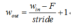
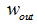
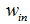
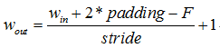
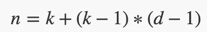
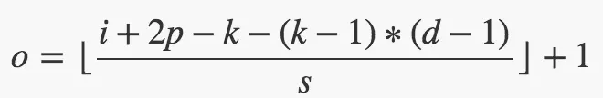

Nov_8_普通卷积,空洞卷积和转置卷积的输出大小尺寸计算
====

普通卷积
----

1. 卷积中的特征图大小计算方式有两种，分别是‘VALID’和‘SAME’(tensorflow中)

2. 先定义几个参数
	- 输入图片大小 W×W
	- Filter大小 F×F
	- 步长 S
	- padding的像素数 P

3. 如果计算方式采用'VALID'，则：

其中为输出特征图的大小，为输入特征图的大小，F为卷积核大小，stride为卷积步长

4. 如果计算方式采用'SAME'，输出特征图的大小与输入特征图的大小保持不变，其中padding为特征图填充的圈数
若采用'SAME'方式，kernel_size=1时，padding=0；kernel_size=3时，padding=1；kernel_size=5时，padding=2，以此类推(前提是stride必须为1，否则‘SAME’方式之后W也会变化)

5. same这种情况下，padding = （F-1）/2

6. 特征图大小计算如果除不尽是 向下取整。

空洞卷积
----

7. 空洞卷积在卷积的时候，会在卷积核元素之间塞入空格,引入了一个新的超参数 d(dilation,dilation默认的时候为1,不是为0)，(d - 1) 的值则为塞入的空格数，假定原来的卷积核大小为 k，那么塞入了 (d - 1) 个空格后的卷积核大小 n 为:

8. 再将上述公式代入普通卷积中,可以得到,输入空洞卷积的大小为 i，步长 为 s ,卷积核size为k,dilation的值为d,空洞卷积后特征图大小 o 的计算公式为:

转置卷积
----
7. 转置卷积就是先在特征图中补0（zero padded，并且padding=kernel size - 1），然后再做一次正向卷积.

8. 转置卷积 transposed conv 的输出size:out = (n−1)×stride−2×p+k,它的输出size和输入size刚好与普通卷积的输出size和输入size想反.(感觉计算公式有点问题)