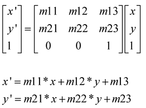
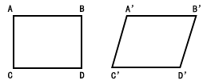
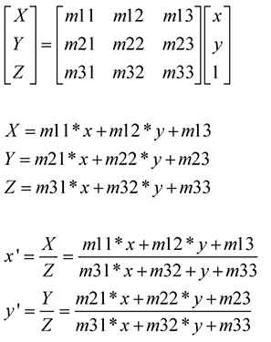
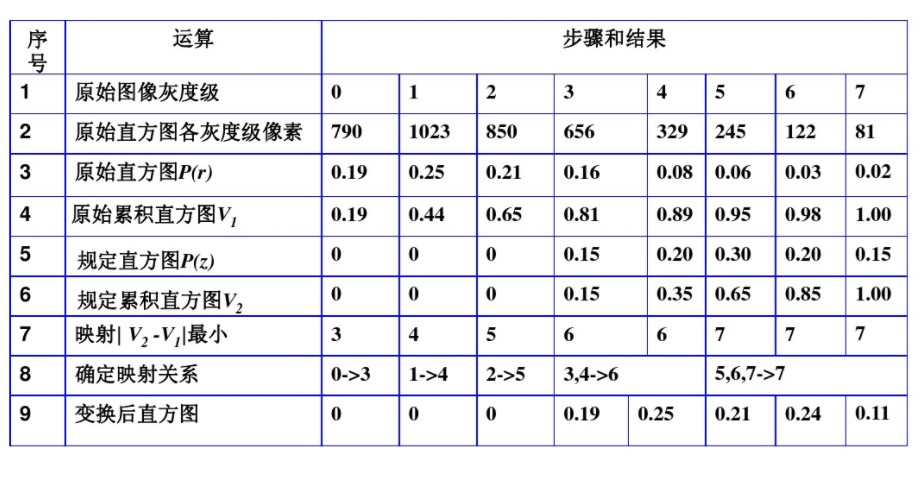
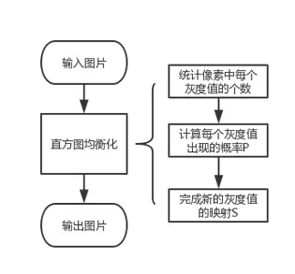
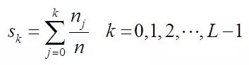
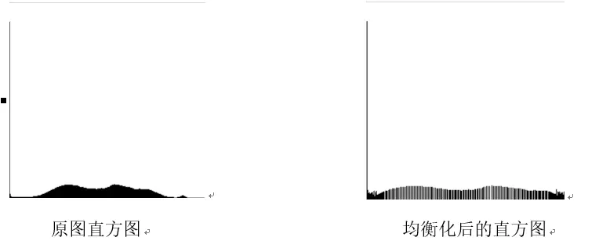

Dec_1_仿射变换和透视变换,直方图规定化和均衡化,形态学操作
====

仿射变换(affine)
----
1. 仿射变换用途:旋转 (线性变换)，平移 (向量加)．缩放(线性变换)，错切，反转
2. 仿射变换是一种二维坐标到二维坐标之间的线性变换，它保持了二维图形的“平直性”,任意的仿射变换都能表示为乘以一个矩阵(线性变换)，再加上一个向量 (平移) 的形式
3. 放射变换乘的是一个2x3的矩阵,m11,m12,m21,m22为线性变化参数，m13,m23为平移参数，其最后一行固定为0,0,1，因此，将3x3矩阵简化为2x3.
4. 例子:

透视变化(perspective)
----
1. 透视变换用途:将2D矩阵图像变换成3D的空间显示效果
2. 透视变换是将图片投影到一个新的视平面，也称作投影映射．它是二维（x,y）到三维(X,Y,Z)，再到另一个二维(x’,y’)空间的映射;
3. 透视变换不止是线性变换．但也是通过矩阵乘法实现的，使用的是一个3x3的矩阵，矩阵的前两行与仿射矩阵相同(m11,m12,m13,m21,m22,m23)，也实现了线性变换和平移，第三行用于实现透视变换.

4. 仿射变换是透视变换的一种特殊情况．它把二维转到三维，变换后，再转映射回之前的二维空间(而不是另一个二维空间）
5. 例子:透视变换之前有平行关系的直线透视变换之后就可能失去平行关系.

直方图规定化
-----
1. 步骤:
	- 计算原图像的累积直方图
	- 计算规定直方图的累积直方图
	- 根据累积直方图差值建立灰度级的映射
2. 数学计算步骤:

直方图均衡化
------
1. 直方图均衡化的处理流程:
2. 注意到都需要求一个 累积概率分布的问题.
3. 映射方法的函数如下所示：其中n表示所有像素点的个数，nj表示灰度值为j的 累积像素 的个数。Sk为得到的新的灰度级。
4. 结果对比:

形态学操作
----
1. 膨胀
2. 腐蚀
3. 开操作:先膨胀后腐蚀
4. 闭操作:先腐蚀后膨胀
5. 形态学梯度:膨胀和腐蚀的差值
6. 顶帽,黑帽运算