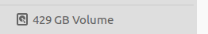

## ubuntu中实用的磁盘指令_给ubuntu扩容

1. fdisk -l   查看有哪些磁盘
2. fdisk /dev/vdb  强大的磁盘工具
3. fdisk
4. df -h      查看磁盘挂载情况
5. df -hl     同上
6. du -sh *	  查看磁盘空间,以G为单位
7. df -a 	  查看磁盘空间,以k为单位
8. mkfs.ext4  格式化磁盘
9. 

10. 对自己电脑进行增加一块主分区到ubuntu时,还出现了:Partition table entries are not in disk order,这是因为分区表中分区的顺序的硬盘物理顺序不一致:,可以通过fdisk的磁盘修复解决,参考[Partition table entries are not in disk order 解决办法](https://blog.csdn.net/rainday0310/article/details/6347377),修复完成之后,恢复正常,/dev/sda4和/dev/sda5调换了顺序,并且挂载也会相应发生变化

11. 我在增加分区时,谨慎起见,特意两边各留了2048扇区,防止影响到原来的分区.

12. 之后还要进行mkfs.ext4 /dev/sda5,后进行挂载才能使用新增加的空间.进行格式化之后,原来400G的空间,变成ext4之后,有了429G:.之后挂载:`sudo mkdir /data`,
`sudo mount /dev/sda4 /data`,就发现这个硬盘标识消失了,因为挂载到了/data中.

13. 之后还要执行:chmod -R 777 /data,来给所有用户赋予可读可写可执行的权限.

14. 重启之后,发现挂载失效,每次重启需要重新挂载,接下来配置开机自动挂载:参考[Ubuntu 开机自动挂载硬盘](https://www.cnblogs.com/fieldtianye/p/9295986.html),这是原始fstab的内容,这是修改后的内容:

15. vim中粘贴的快捷键是:shift+insert