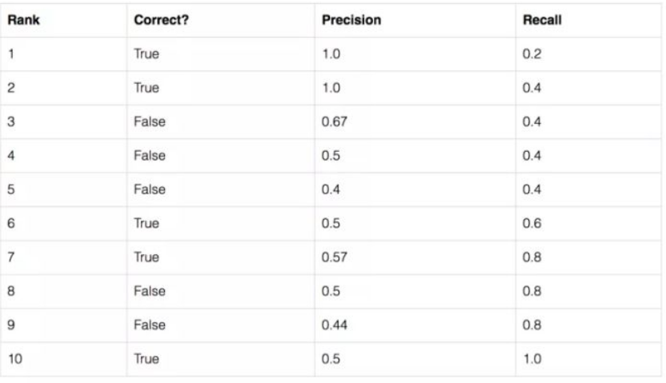
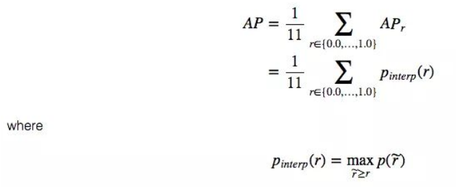
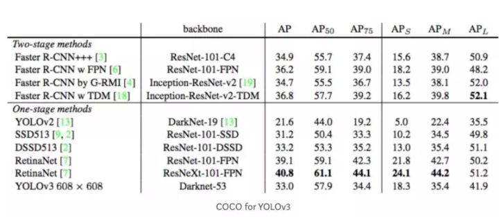
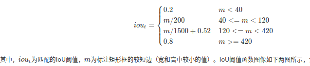

# Dec_31_目标检测中的AP理解

1. json: JavaScript Object Notation,轻量级的数据交换格式,里面以字典格式存放数据.是COCO数据集的标注格式.

2. xml: eXtensible Markup Language(可扩展标记性语言),VOC数据集的标注格式.

3. AP: mean Average Precision.

4. AP计算过程：
	- 首先固定一个IoU阈值(0.3或0.5或0.75)，计算每个预测框和真实标签的IoU大小，根据阈值判断预测框是否正确。
	- 然后在对预测框根据置信度排序(即模型输出的P置信度)，设定不同的置信度阈值得到一系列召回率和精确率值，在不同的召回率下对准确率求平均，即为AP。
	- 如下例子排序:
	- 即计算在不同 recall 值下的 precision 的平均值,计算公式如下:
	- 其中的p(r)指的就是上面的表格,recall为自变量,precision为因变量的一个映射函数.

5. 计算过程参考[知乎](https://zhuanlan.zhihu.com/p/81098435)

6. 计算代码参考VOC2010之后的方法[https://github.com/rbgirshick/py-faster-rcnn/blob/master/lib/datasets/voc_eval.py](https://github.com/rbgirshick/py-faster-rcnn/blob/master/lib/datasets/voc_eval.py),虽然我现在还没看懂．

## PASCAL VOC中的AP

1. PASCAL VOC是一个非常流行的物体检测的数据集。对于PASCAL VOC竞赛，如果 IoU > 0.5，预测认为是正样本。然而，如果对相同的物体有多个预测框，那么把第一个认为是正样本，其余的是负样本。PASCAL VOC的mAP和我们说的AP是一样的。IOU固定为0.5.

## COCO mAP

1. 对于 COCO ，AP是多个IoU（最小的IoU认为是匹配上的正样本）上的平均值。AP@[.5:.95]对应的是，IoU从 0.5 到 0.95 时的AP的平均值，步长是0.05，对于COCO竞赛，总的AP是10个IoU在80个类别上的平均。但是单独有AP0.5和AP0.75两个固定IOU的评价指标.

2. 下图是YOLOv3的AP结果：

3. APs和APm和APl是针对不同大小物体使用不同IoU阈值的评价指标，例如

4. 这里的IoU和语义分割中的mIoU的概念不太一样．语义分割中的mIoU是通过混淆矩阵计算的．

## MAP计算代码

1. voc版本的map计算参考[https://github.com/rbgirshick/py-faster-rcnn/blob/master/lib/datasets/voc_eval.py](https://github.com/rbgirshick/py-faster-rcnn/blob/master/lib/datasets/voc_eval.py),这是rbg大神的代码.

2. coco map计算代码参考[https://github.com/cocodataset/cocoapi/blob/master/PythonAPI/pycocotools/cocoeval.py](https://github.com/cocodataset/cocoapi/blob/master/PythonAPI/pycocotools/cocoeval.py),这是cocoapi中的官方代码.

3. MAP的影响因素:
	- IOU（例如IOU取接近0，recall会趋近于1，precision会趋紧于0）
	- bbox的score阈值
	对于voc版本的map而言,考虑到了'bbox的score阈值',IOU取固定值,而coco的map计算方法是两个因素都考虑到了,但是计算更为复杂.

4. 理解voc版本和coco版本map时,参考这个链接:[目标检测mAP计算详解](https://blog.csdn.net/l297969586/article/details/89918672)