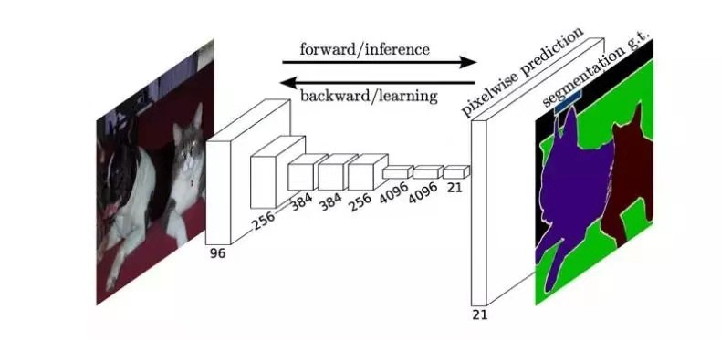

Dec_3_语义分割网络发展,到deeplabV3

FCN
----
1. 第一个全卷积网络,采用分类网络,例如Alexnet,作为编码器(特征提取器)
2. 采用反卷积进行上采样.
3. 基于交叉熵损失训练
4. 最后会从浅层添加skip connection,使得prediction稍微有轮廓,所以有FCN8s,FCN16s,FCN32s.

Unet
----
1. 使用encoder-decoder结构来做分割,现在也非常流行这种做法.
2. unet中会在encoder和decoder中同等level有直连,直连到的和当时本层的进行concat之后卷积,可以得到更好的信息.

SegNet
----
1. 传递maxpooling 的 indices 至解码器,提高分割的分辨率.
2. 同样是着编码解码的结构.
3. segnet相比于FCN而言,引入更多的shortcut connection,但是这些connection不是feature map本身,而是max pooling 的indices.

deeplab系列
----
1. 提出扩张卷积,既能增大感受野,又能保持空间分辨率.
2. 提出ASPP,多尺度预测(多尺度的两种方式:1)传递图像的不同尺度2)使用不同的采样率)
3. deeplabV1使用了CRF结构预测,更好的处理边缘.
4. deeplabV1:提出空洞卷积+CRF
5. deeplabV2:提出ASPP(6,12,18,24)+CRF
6. deeplabV3:改进ASPP(1x1,6,12,18,pooling),去掉CRF
7. deeplabV3+:1)设计基于v3的decode module 2)用modify xception作为backbone
(在deeplab v3中说到了需要8×/16×的upsample 最终的feature map，很明显这是一个很粗糙的做法)

pspnet
-----
1. 提出 金字塔池化结构.
2. 引入了辅助损失.

refinenet
----

BiseNet
----

CCNet
----

总结:
1. FCN: skip connection
2. Unet: encoder-decoder中含有level级别的直连；
3. segnet： 传递的是maxpooling中的indices；
4. deeplab： ASPP中使用不同dilation的空洞卷积
5. PSPnet： 金字塔池化模块中先采用不同池化尺度的池化操作，之后卷积，再上采样，再进行concat操作；其中池化尺度为2,3,6；

空洞卷积的缺点：
1. 会有grid的效应，即特征图可视化之后会有网格视觉效果
2. 空间存储和计算量会大，本质上是采样，而且一个ASPP里面有好几个卷积操作，计算量大；