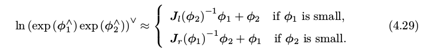

##Slam学习笔记_Slam中李群和李代数基础入门

1. slam仿真需要车辆仿真平台和自动驾驶软件，车辆仿真平台可以用LGSVL，自动驾驶软件可以用Autoware。
2. 自动驾驶的等级有L0、L1、L2、L3、L4、L5，总共六个等级，具体分法如下：
	- L0：代表没有任何自动驾驶加入的传统人类驾驶，汽车仅仅提出部分警告，如时速、与前车距离、盲区等方面的预警。
	- L1：方向盘和加减速提供一项自动操作，如自适应巡航或者车道保持等。
	- L2：方向盘和加减速提供两项自动操作，如自适应巡航+车道保持等。
	- 以上三个级别都需要驾驶者监测环境，并且迅速作出决策，汽车本身仅仅拥有类似于“条件反射”的动作，不带有任何“思考”。
	- L3：系统自动作出所有驾驶操作，并且可以观察路况（如交通信号灯、行人、路边状况等），并能作出正确决策，但是系统的请求需要驾驶者提供应答。L3级别意味着系统已经有了初步的“思考能力”，大部分时间可以完全自动驾驶，只是需要人类来“保驾护航”，就好比驾校里的学员，已经可以开车上路，但是旁边需要坐着教练。
	- L4：系统自动作出所有驾驶操作，自主决策，并且驾驶者无需提供应答，但是一般限定其行驶区域，比如公交、物流、出租车等。L4级别意味着车俩可以完全自主上路，无需人类陪同，那么诸如方向盘、油门、刹车之类的装置也就可以取消了。
	- L5：全域自动驾驶。L5级的自动驾驶车就像我们人类的老司机一样，可以全地域、全天候的自动驾驶，熟练的应对地理、气候等环境的变化。
3. 这个需要再次强调：不要在环境配置和插件上浪费时间，应该把更多的时间用在算法开发和学习上。
4. 群的定义：群(Group)是一种集合加上一种运算的代数结构；而线性空间是一个对加减乘除运算都封闭的代数结构。群只对某一个运算封闭，例如乘法封闭；而李群是指具有连续(光滑)性质的群，如SO(n)和SE(n),它们在实数空间上是连续的。我们能够直观地想象一个刚体能够连续地在空间中运动,所以它们都是李群。
5. 每个李群都有对应的李代数。李代数描述了李群的局部性质，例如给定某时刻的R,我们就能求得一个φ,它描述了R在局部的导数关系，φ正是对应到SO(3)上的李代数。
6. 李群SO(3)的李代数：我们已清楚了 so(3)的李代数的内容，它们是一个由三维向量组成的集合,每个向量对应到一个反对称矩阵,可以表达旋转矩阵的导数。它与 SO(3) 的关系由指数映射给定：R = exp(φ ∧ ).
7. 李群Se(3)的李代数：每个 se(3) 元素的李代数记作 ξ,它是一个六维向量。前三维为平移,记作 ρ;后三维为旋转,记作 φ,实质上是 so(3) 元素。可以简单地把 se(3) 理解成“由一个平移加上一个 so(3) 元素构成的向量”(尽管这里的 ρ 还不直接是平移)。
8. exp(φ∧) 是一个矩阵的指数,在李群和李代数中,称为指数映射(Exponential Map)。它的计算要了解，可以写成一个泰勒展开
9. 李群so(3)的李代数是φ 实际上就是由所谓的 旋转向量 组成的空间,而 指数映射 即 罗德里格斯公式 。通过它们,我们把 so(3)的李代数 中任意一个向量对应到了一个位于 SO(3)李群 中的旋转矩阵。
10. 如果我们把旋转角度固定在 ±π 之间,那么李群和李代数元素是一一对应的。
11. SO(3) 与 so(3)的李代数 的结论似乎在我们意料之中。它和我们前面讲的旋转向量与旋转矩阵的结论很相似,而指数映射即是罗德里格斯公式。旋转矩阵的导数可以由旋转向量指定,指导着如何在旋转矩阵中进行微积分运算。
12. 罗德里格斯公式：exp(θa ∧ ) = cos θI + (1 − cos θ)aa T + sin θa ∧ 
13. 李群se(3)的李代数是ξ 见下图：
14. 使用李代数的一大动机是为了进行优化,而在优化过程中导数是非常必要的信息。旋转矩阵自身是带有约束的(正交且行列式为 1)。它们作为优化变量时,会引入额外的约束,使优化变得困难。通过李群——李代数间的转换关系,我们希望把位姿估计变成无约束的优化问题,简化求解方式。
15. 两个李代数φ 指数映射 乘积(例如旋转两次)的完整形式,由 Baker-Campbell-Hausdorff 公式(BCH 公式) 给出。BCH 公式告诉我们,当处理 两个矩阵指数之积 时,它们会产生一些由 李括号 组成的余项。但当 φ 1 或φ 2 为小量时,小量二次以上的项都可以被忽略掉，也就是近似表示。
16. 李代数在 BCH近似下,分成了左乘近似和右乘近似两种,在使用时我们须加注意,使用的是左乘模型还是右乘模型。
17. 这样,我们就可以谈论 李群乘法exp (φ1 ∧ ) exp (φ 2 ∧) 与 李代数加法exp (φ 1 + φ 2 )∧) 的关系了:**假定对某个旋转 R,对应的李代数为 φ。我们给它左乘一个微小旋转,记作 ∆R,对应的李代数为 ∆φ。那么,在李群上,得到的结果就是 ∆R · R,而在李代数上,根据 BCH近似,为:J l −1 (φ)∆φ + φ。合并起来,可以简单地写成**:
18. **如果我们在李代数上进行加法,让一个 φ 加上 ∆φ,那么可以近似为 李群 上带左右雅可比的乘法:**
19. 同样的,对于 SE(3),亦有类似的BCH 近似公式。
20. 对李群求导的意义：在 SLAM 中,我们要估计一个相机的位置和姿态,该位姿是由 SO(3) 上的旋转矩阵或 SE(3) 上的变换矩阵描述的。**我们经常会构建与位姿有关的函数,然后讨论该函数关于位姿的导数,以调整当前的估计值。**所以需要求导，求导需要对SO(3), SE(3)进行求加法？然而,SO(3), SE(3) 上并没有良好定义的加法,它们只是群。但是可以用它们对应的李代数作加法运算。
21. 使用李代数φ 解决求导问题的思路分为两种:
	- 用李代数表示姿态,然后对根据李代数加法来对李代数求导。
	- 对李群左乘或右乘微小扰动,然后对该扰动求导,称为左扰动和右扰动模型。
	**第一种方式对应到李代数的求导模型,而第二种则对应到扰动模型。**
22. 第一种方式：旋转后的点相对于李代数的导数： 
23. 第二种方式：扰动模型(左乘): 
24. 可见,扰动模型相比于直接对李代数求导,省去了一个雅可比 Jl 的计算。这使得扰动模型更为实用。
25. SE(3) 上的李代数求导：直接给出 SE(3) 上的扰动模型，因为更高效： 
26. Eigen 提供了几何模块,但没有提供李代数的支持。一个较好的李代数库是 Strasdat 维护的 Sophus 库。Sophus库分为 模板 和 非模板（早期的） 两种，非模板 只提供了双精度的李群/李代数类，模板类 可以使用不同精度的李群/李代数，但是使用起来更加复杂。
27. 如果是单目相机，要注意在单目视觉中使用的相似变换群 Sim(3),以及对应的李代数sim(3)。但是只对双目 SLAM 或 RGBD SLAM 感兴趣,可以跳过这一部分。（个人感觉vslam已经够不精确了，所以近期还是用双目比较好，单目对于我这种需要快速入门的先不管吧）
28. 总结：**以上引入了李群 SO(3) 和 SE(3),以及它们对应的李代数 so(3) 和 se(3)。我们介绍了位姿在它们上面的表达和转换,然后通过 BCH 的线性近似,我们可以对位姿进行求导和扰动了。这给之后讲解位姿的优化打下了理论基础,因为我们需要经常的对某一个位姿的估计值进行调整,使它对应的误差减小。只有在弄清楚如何对位姿进行调整和更新之后,我们才能继续下一步的内容。**