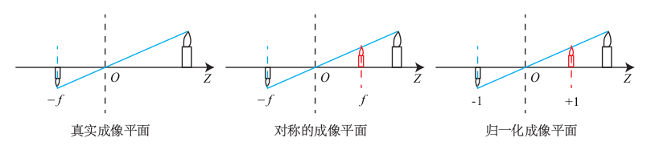

##slam学习笔记_相机模型与图像

1. slam比较关注的是**运动方程**和**观测方程**。运动方程是姿态估计更新和表示部分，而观测方程是这一天要学习的，在以相机为主的视觉 SLAM 中,观测主要是指相机成像的过程。
2. 相机是将三维世界中的坐标点(单位为米)，通过模型，映射到二维图像平面(单位为像素)。这个模型例如**针孔模型和畸变模型**。

3. 针孔模型示意：

4. 畸变模型分为径向畸变和切向畸变：  
5. 上述为单目相机的成像过程，对单目针孔相机成像做总结：

	1. 首先,世界坐标系下有一个固定的点 P ,世界坐标为 Pw ;
	2. 由于相机在运动,它的运动由 R, t 或变换矩阵 T ∈ SE(3) 描述。P 的相机坐标为: P̃c = R*Pw + t
	3. 这时的 P̃c 仍有 X, Y, Z 三个量,把它们投影到归一化平面 Z = 1 上,得到 P 的归一化相机坐标: Pc = [X/Z, Y /Z, 1] 。
	4. 最后,P 的归一化坐标经过内参后,对应到它的像素坐标Puv : Puv = K*Pc 。

   综上所述,我们一共谈到了四种坐标:世界Pw、相机P̃c、归一化相机Pc和像素坐标Puv,它反映了**单目针孔相机整个成像**的过程。

6. 双目相机模型需要主动计算像素点的深度信息，示意图： 
7. 双目相机一般由左眼和右眼两个水平放置的相机组成。当然也可以做成上下两个目,但我们见到的主流双目都是做成左右的。
8. 双目相机的基线(Baseline, 记作 b),是双目的重要参数，当基线越长时,双目最大能测到的距离就会变远;反之,小型双目器件则只能测量很近的距离。
9. 双目相机中为一个像素点在左右相机的横坐标之差,称为视差(Disparity)，视差与距离成反比:视差越大,距离越近。  但是尽管视差计算深度的公式很简洁,但视差 d 本身的计算却比较困难，这件事亦属于“人类觉得容易而计算机觉得困难”的事务。由于计算量的原因,双目深度估计仍需要使用 GPU 或 FPGA 来计算。

10. RGBD相机是主动测量每个像素的深度。如果你把一个 RGB-D 相机拆开,通常会发现除了普通的摄像头之外,至少会有一个发射器和一个接收器。目前的 RGB-D 相机按原理可分为两大类：
	- 通过红外结构光 (Structured Light)来测量像素距离的。例子有 Kinect 1代、 ProjectTango 1 代、Intel RealSense 等;
	- 通过飞行时间法(Time-of-flight, ToF)原理测量像素距离的，即发射脉冲波看返回的时间差。例子有 Kinect 2 代和一些现有的 ToF 传感器等。
11. 我们可以在同一个图像位置,读取到色彩信息和深度信息,计算像素的  **3D相机坐标**,生成点云(Point Cloud)。对 RGB-D 数据,既可以在 **图像层面** 进行处理,亦可在 **点云层面** 处理。
12. c++访问图像坐标：一张宽度为 640,高度为 480 分辨率的灰图度就可以这样表示:
~~~c
unsigned char image[480][640];
unsigned char pixel = image[y][x];
~~~
请注意这里的 x 和 y 的顺序,访问图像坐标的时候，用在前面是因为（0，0）为坐标原点，横坐标为宽度，纵坐标为高度，所以访问（x,y）像素的时候用image[y][x]。
13. 在 RGB-D 相机的深度图中,记录了各个像素离相机的距离。这个距离通常是**毫米**为单位,而 RGB-D 相机的量程通常在十几米范围左右,超过了 255 的最大值范围。这时,人们会采用十六位整数来记录一个深度图的信息。也就是两个字节。
14. 在 OpenCV 的彩色图像中,通道的默认顺序是 B,G,R。
15. opencv的C++版本有两种安装方式：选择从**源代码安装**和**只安装库文件**两种方式：
    1. 从源代码安装,是指从 OpenCV 网站下载所有的 OpenCV 源代码。并在你的机器上编译安装,以便使用。好处是可以选择的版本比较丰富,而且能看到源代码,不过需要花费一些编译时间。
    2. 只安装库文件,是指通过 Ubuntu 来安装由 Ubuntu 社区人员已经编译好的库文件,这样你就无需重新编译一遍。

16. 总结一下目前接触到的文件：源文件(.cpp/cmakelist.txt)，库文件（.so\.a），头文件（eigen）。
17. C++版本的opencv也可以使用GPU加速，如果你的电脑上有 GPU 并且安装了相关依赖项,OpenCV 也会把 GPU 加速打开。
18. 安装opencv版本的C++：
~~~c
mkdir release
cd release
cmake -D CMAKE_BUILD_TYPE=RELEASE -D CMAKE_INSTALL_PREFIX=/usr/local ..
make
sudo make install # optional
~~~
其中sudo make install是把库文件安装到系统中，主要是把库文件移到/usr/local/bin中方便调用，否则只在release文件夹中。

19. 其实使用源码编译的时候，也可以同时让opencv支持C++和python，只需要配置一下就可以：
~~~c
$ cd build
cmake -D BUILD_opencv_python3=yes -D BUILD_opencv_python2=no -D PYTHON3_EXECUTABLE=/home/qy/software/anaconda3/envs/machineLearning/bin/python3.6m -D PYTHON3_INCLUDE_DIR=/home/qy/software/anaconda3/envs/machineLearning/include/python3.6m -D PYTHON3_LIBRARY=/home/qy/software/anaconda3/envs/machineLearning/lib/libpython3.6m.so -D PYTHON3_NUMPY_INCLUDE_DIRS=/home/qy/software/anaconda3/envs/machineLearning/lib/python3.6/site-packages/numpy/core/include -D PYTHON3_PACKAGES_PATH=/home/qy/software/anaconda3/envs/machineLearning/lib/python3.6/site-packages -D PYTHON_DEFAULT_EXECUTABLE=/home/qy/software/anaconda3/envs/machineLearning/bin/python3.6m ..
~~~
另外还需要安装一些依赖项。由于我这个电脑是准备用来学习C++,不打算跑太多python的图像处理程序，所以没有选择安装python版本的c++。
19. OpenCV 并不是唯一的图像库,它是许多图像库里,使用范围较广泛之一。不过,多数图像库对图像的表达是大同小异的。 希望从OpenCV中理解其他库中图像的表达,从而在需要数据格式时,能够自己处理。
20. 由于 cv::Mat 亦是矩阵类,除了表示图像之外,我们也可以用它来存储位姿等矩阵数据。只是一般认为 Eigen 对于固定大小的矩阵,使用起来效率更高一些。

21. ① 根据 RGB-D 图像和相机内参(相机出厂给定或者自己标定),我们可以计算任何一个像素在相机坐标系下的位置。② 根据相机位姿,又能计算这些像素在世界坐标系下的位置。③ 如果把所有像素的空间坐标都求出来,相当于构建一张类似于地图的东西。
22. 在 color/下有 1.png 到 5.png五张 RGB 图,而在 depth/下有五张对应的深度图。同时,pose.txt 文件给出了五张图像的相机位姿(以 Twc 形式)。位姿记录的形式是平移向量加旋转四元数： ,可以通过转换，变成旋转矩阵或者变换矩阵的形式。
23. 点云库使用 PCL(Point Cloud Library)。PCL 的安装比较容易,输入以下命令即可：
~~~c
sudo add-apt-repository ppa:v-launchpad-jochen-sprickerhof-de/pcl
sudo apt-get update
sudo apt-get install libpcl-dev
~~~
（slam十四讲上面是libpcl-all，一直提示unable to lock，后来发现libpcl-all是针对14.04的，而libpcl-dev是针对16.04）
安装完成后, PCL 的头文件将安装在/usr/include/pcl-1.7 中,库文件位于/usr/lib/中。
这种安装方式是安装了官网的预编译版本，当然也可以使用源码进行编译。

24. PCL（Point Cloud Library）是在吸收了前人点云相关研究基础上建立起来的大型跨平台开源C++编程库，它实现了大量点云相关的通用算法和高效数据结构，涉及到点云获取、滤波、分割、配准、检索、特征提取、识别、追踪、曲面重建、可视化等。
25. 在安装pcl的时候遇到了一些问题：
	1. 首先需要额外加一条命令：sudo apt-get install pcl-tools
	2. 需要再额外加一条：sudo apt-get install libproj-dev
	3. 尽管这样，还是会报错:[/usr/bin/ld: cannot find -lvtkproj4](),方案是在cmakelist.txt中加一条指令修复，即在add_executable语句前面加上[list(REMOVE_ITEM PCL_LIBRARIES "vtkproj4")]()
	4. 上面三条转载自：[Ubuntu16.04安装pcl出现cannot find -lvtkproj4解决办法](https://blog.csdn.net/danmeng8068/article/details/77341532)
