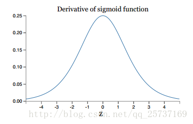

Sep_14_激活函数及常用激活函数理解与总结

------

1. 为什么要使用激活函数：如果不用激活函数（其实相当于激活函数是f(x) = x），在这种情况下每一层节点的输入都是上层输出的线性函数，很容易验证，无论神经网络有多少层，输出都是输入的线性组合，与没有隐藏层效果相当，这种情况就是最原始的感知机（Perceptron）了，那么网络的逼近能力就相当有限，对一些非线性效果会很差。

2. 若引入非线性函数作为激活函数，这样深层神经网络表达能力就更加强大（不再是输入的线性组合，而是几乎可以逼近任意函数）。

3. sigmoid:
	
    它的导数：
    
    sigmoid的特点：它能够把输入的连续实值变换为0和1之间的输出,输出范围有限，所以数据在传递的过程中不容易发散.
    sigmoid的缺点：
    - 1.在深度神经网络中梯度反向传递时容易导致梯度爆炸和梯度消失，其中梯度爆炸发生的概率比较小，梯度消失发生的概率比较大。
    - 2.Sigmoid 的 output 不是0均值（即不是zero-centered）。不是0均值，会导致后一层的神经元将得到上一层输出的非0均值的信号作为输入，这样在BN出现之前，是非常不好，会使的模型很难收敛。
    - 3.解析式中含有幂运算，计算机求解时相对来讲比较耗时。对于规模比较大的深度网络，这会较大地增加训练时间。

4. tanh:
	
    它解决了Sigmoid函数的不是zero-centered输出问题，然而，梯度消失（gradient vanishing）的问题和幂运算的问题仍然存在。所以用的也不会很多。
5. relu(Rectified(整流) Linear Unit):
	
    它的导数：
    
    要注意的点：relu不是全区间可导，例如在(0,0)不可导，但是可以取sub-gradient。
	优点：
    - 1.解决了gradient vanishing(梯度消失)问题 (在正区间)。
	- 2.ReLU函数其实是一个取最大值函数，计算速度非常快，只需要判断输入是否大于0。
	- 3.收敛速度远快于sigmoid和tanh。

6. relu不足之处：
    - 1.ReLU的输出不是zero-centered
	- 2.Dead ReLU Problem，指的是某些神经元可能永远不会被激活，导致相应的参数永远不能被更新。有两个主要原因可能导致这种情况产生: (1) 非常不幸的参数初始化(较少见) (2) learning rate太高导致在训练过程中参数更新太大，使网络进入这种状态。
	- 3.ReLU会很容易改变数据的分布，因此ReLU后加Batch Normalization也是常用的改进的方法
	- 4.relu不会对数据做幅度压缩，所以如果数据的幅度不断扩张，那么模型的层数越深，幅度的扩张也会越厉害，最终会影响模型的表现

7. relu的反向传播：
	

8. Dead ReLU Problem的解决方法：
    采用Xavier权重初始化方法避免情况1，以及避免将learning rate设置太大或使用adagrad等自动调节learning rate的算法。

9. Leaky ReLU(LRELU):
	
    (注意左图的左半边，并不是0，而是有小的幅度)上述表达式还可以写成：f(x)=max(ax,x)
    为了解决Dead ReLU Problem，提出了将ReLU的前半段设为αx,而不单纯是 0，但是好像leaky relu的结果比relu没有显著提升(有实验表面了)。

10. leaky relu的反向传播：
	

11. PReLU(Parametric Rectified Linear Unit),即使带参数的relu。
	
    如果ai=0，那么PReLU退化为ReLU；如果ai是一个很小的固定值(如ai=0.01)，则PReLU退化为Leaky ReLU(LReLU)。

12. Prelu的说明：
	- PReLU只增加了极少量的参数，也就意味着网络的计算量以及过拟合的危险性都只增加了一点点。特别的，当不同channels使用相同的ai时，参数就更少了。
	- BP更新ai时，采用的是带动量的更新方式。
	- 更新ai时不施加权重衰减(L2正则化),因为这会把ai很大程度上push到0。

13. Prelu的反向传播：
	

14. ELU (Exponential(指数) Linear Units)：
	
    函数形式：
    
    ELU有ReLU的所有优点，以及解决了relu的很多问题：
    - 不会有Dead ReLU问题
    - 输出的均值接近0，zero-centered

15. ELU的不足：它的一个小问题在于计算量稍大。类似于Leaky ReLU，理论上虽然好于ReLU，但在实际使用中目前并没有好的证据ELU总是优于ReLU。

16. ELU的反向传播：
	

17. SELU：缩放指数型线性单元, 就是对ELU加上一个缩放因子λ.

18. SELU的反向传播：
	

19. MaxOut：Maxout是深度学习网络中的一层网络，就像池化层、卷积层一样等，我们可以把maxout 看成是网络的激活函数层。可以这么理解，本来传统的MLP算法在第i层到第i+1层，参数只有一组，然而现在我们不这么干了，我们在这一层同时训练n组的w、b参数，然后选择激活值Z最大的作为下一层神经元的激活值，这个max（z）函数即充当了激活函数。参考论文 《maxout network》

20. maxout层有自己的参数，由我们人为设定大小，就像dropout一样，也有自己的参数p(每个神经元dropout概率)。

21. 为什么RNN选择Tanh函数:可以将数据进行压缩，而且可以保留数据的正负性。

22. 如何选择合适的激活函数：
	1）深度学习往往需要大量时间来处理大量数据，模型的收敛速度是尤为重要的。所以，总体上来讲，训练深度学习网络尽量使用zero-centered数据作为输入 (可以经过数据预处理实现)，也最好是需要一个zero-centered输出。所以要尽量选择输出具有zero-centered特点的激活函数以加快模型的收敛速度。
	2）如果使用 ReLU，那么一定要小心设置 learning rate，而且要注意不要让网络出现很多 “dead” 神经元，如果这个问题不好解决，那么可以试试 Leaky ReLU、PReLU 或者 Maxout。
	3）最好不要用 sigmoid作为激活函数，可以试 tanh，不过可以预期它的效果会比不上 ReLU 和 Maxout。

23. sigmoid和relu的选择：

	1. sigmoid在压缩数据幅度方面有优势，对于深度网络，使用sigmoid可以保证数据幅度不会有问题，这样数据幅度稳住了就不会出现太大的失误。
	2. sigmoid存在梯度消失的问题，在反向传播上有劣势。
	3. relu不会对数据做幅度压缩，所以如果数据的幅度不断扩张，那么模型的层数越深，幅度的扩张也会越厉害，最终会影响模型的表现。
	4. 但是relu在反向传导方面可以很好地将“原汁原味”的梯度传到后面。

