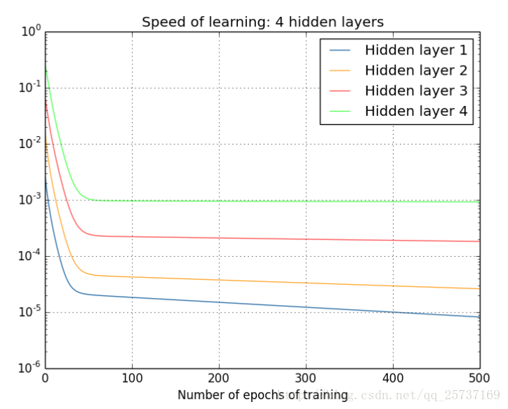
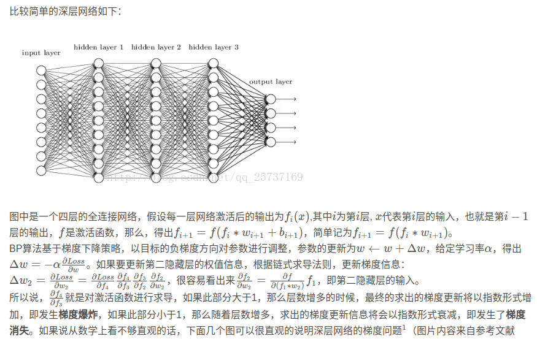
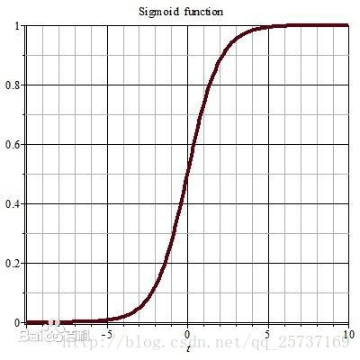
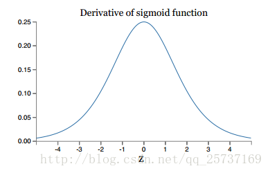
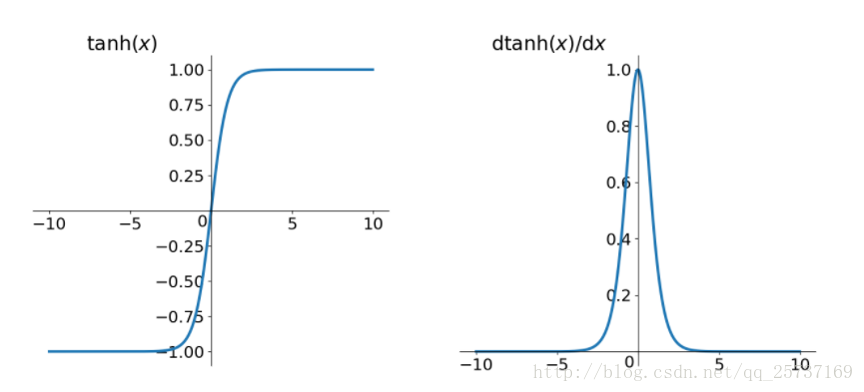
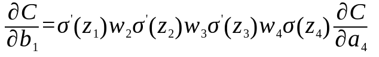

Sep_15_关于梯度消失和梯度爆炸_深度神经网络为何很难训练

------

1. 原文见文章：http://neuralnetworksanddeeplearning.com/chap5.html 中文译文：[深度神经网络为何很难训练](https://www.jianshu.com/p/917f71b06499)

2. 首先文章开头从理论上给出：深度网络在本质上比浅层网络更加强大，也就是更多的隐藏层能更好拟合函数关系。

3. 但是通过单纯加深网络(增加隐藏层)，不会带来性能的提升，甚至性能有下降。这是因为，在深度网络中，不同的层学习的速度差异很大。

4. 经常会出现在网络中后面的层学习的情况很好的时候，先前的层次常常会在训练时停滞不变。有时有相反的情况：先前的层可能学习的比较好，但是后面的层却停滞不变。这些都是在训练一开始就会出现的情况。

5. 神经网络中梯度的作用：梯度的数值不仅仅是在学习过程中是 bias 改变的速度，而且也控制了 weight 的变化速度。

6. 梯度消失：由于神经网络的训练基于反向传播，求梯度时的连乘(激活函数的导数、权重)可能会导致离输出层较远的(浅层)梯度值很小，使此处的权重无法正常更新，即模型无法学习到远程关联（CNN的浅层网络无法起到正常的作用），这类情况就是梯度消失。

7. 梯度的另一个理解是：神经网络中参数的变化(学习)速度：speed of learning.

8. 从两个角度理解梯度消失：
  
  - 1.如上图，在深层网络中，浅层比深层的梯度更小(归功于梯度的反向传播)，浅层的梯度值会很小，也就是浅层的weight和bias会变化的很慢。
  - 2.网络整体权重的梯度最终都保持在了一个很小的水平，很可能因为采用了不合适的激活函数。例如sigmoid和tanh。这两类激活函数的导数都是值不大于1的梯度值，也就是整体的梯度(包括深层和浅层)值，都会越来越小。这就造成了梯度消失。

9. 当梯度爆炸发生时，网络层之间反复乘以大于1.0的梯度值使得梯度值成倍增长。当模型处在一个很陡的陡坡上，那在求梯度的时，在网络层上出现了指数型的递增，这也就是梯度爆炸。

10. 这张图好好参考一下，很对：[来自https://blog.csdn.net/qq_25737169/article/details/78847691](https://blog.csdn.net/qq_25737169/article/details/78847691)
	 

11. sigmoid：
	
    
    tanh:
    

12. 如何解决梯度消失和梯度爆炸：
	- Hinton为了解决梯度的问题，提出采取逐层训练方法，在预训练完成后，再对整个网络进行“微调”（fine-tunning）。(现在很少采用)
	- [梯度剪切]()：这个方案主要是针对梯度爆炸提出，其思想是设置一个梯度剪切阈值，然后更新梯度的时候，如果梯度超过这个阈值，那么就将其强制限制在这个范围之内。这可以防止梯度爆炸。
	- 权重正则化（weithts regularization）：比较常见的是l1正则和l2正则。正则化是通过对网络权重做正则限制过拟合，通过惩罚项来防止梯度爆炸。仔细看正则项在损失函数的形式：Loss=略。其中，α是指正则项系数，因此，如果发生梯度爆炸，权值的范数就会变的非常大，通过正则化项，可以部分限制梯度爆炸的发生。
	- [用relu、leakrelu、elu等激活函数]()，而不用tanh和sigmoid，防止梯度消失。
	- batch normalization，具有加速网络收敛速度，提升训练稳定性的效果，Batchnorm本质上是解决反向传播过程中的梯度问题。通过规范化操作将输出信号x规范化保证网络的稳定性。BN将输出从饱和区拉倒了非饱和区。
	- 使用残差结构，shortcut机制可以无损地传播梯度。
	- 使用LSTM，在解决RNN中梯度消失中很有帮助。
	- [正确的权重初始化]()。参考[深度神经网络为何很难训练英文](http://neuralnetworksanddeeplearning.com/chap5.html)，在反向传播的梯度表达式中，梯度是和权重w有关。.所以初始化权重，当权重初始化为(0,1),并且还是用了sigmoid或者tanh激活函数，则会出现梯度消失。如果权重都被初始化很大，例如100，由于反向传播的机制，则浅层的梯度会出现爆炸的现像，深层因为靠近输出反而不会，这时候会有浅层的学习速度快于深层。
	- Xavier[ˈzeɪvjər]

13. 以上方法来源[如何防止梯度消失和梯度爆炸](https://blog.csdn.net/qq_25737169/article/details/78847691)。

