#Sep_16_常用损失函数的理解与总结以及pytorch中的损失函数

-------------

1. 损失函数、代价函数与目标函数的定义：
	- 损失函数（Loss Function）：是定义在单个样本上的，是指一个样本的误差。
	- 代价函数（Cost Function）：是定义在整个训练集上的，是所有样本误差的平均，也就是所有损失函数值的平均。
	- 目标函数（Object Function）：是指最终需要优化的函数，一般来说是经验风险+结构风险，也就是（代价函数+正则化项）。

2. 目标函数的正则化项分为L1正则和L2正则，两者都能达到防止过拟合的作用。正则化背后的思路：这些参数的值越小，通常对应于越光滑的函数，也就是更加简单的函数。因此 就不易发生过拟合的问题。
	- L1正则化
	- L2正则化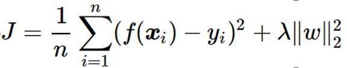
	L1正则化不仅可以防止过拟合，还可以稀疏矩阵。正则化的思路符合常理：实际所有变量对结果都有一定贡献，只是有些变量对结果的影响很小。加入正则化可以达到这个结果，使得函数更加平滑。

3. 但是在pytorch中，正则化不体现在loss中，而是具体现在optim优化器的weight_deacy中。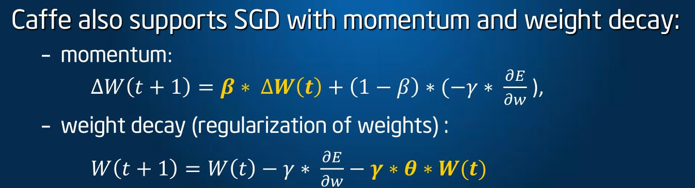
	例如，可以给不同的层设置不同的weight_deacy,说明L2正则化在代码中应该是体现在每一层上的，本身L2只约束层。
```
    params = [
    {"params": logits_params, "lr": config.lr},
    {"params": net.backbone.parameters(), "lr": config.backbone_lr},
]
	optimizer = torch.optim.SGD(params, momentum=config.momentum, weight_decay=config.weight_decay)
```
	加了weight_deacy参数之后(例如weight_deacy经常为0.01)，可以发现loss最初的值是不变的，但是loss下降的速度会变慢，观看accuracy曲线和loss曲线，发现会变得平滑稳定一点。

4. 常用的损失函数：
	- 0-1损失函数（0-1 loss function）：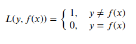,当预测错误时，损失函数为1，当预测正确时，损失函数值为0。该损失函数不考虑预测值和真实值的误差程度。
	- 平方损失函数（quadratic loss function）
	- 绝对值损失函数（absolute loss function）
	- 对数损失函数（logarithmic loss function）
	- Hinge loss: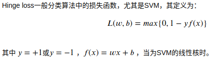
	此部分内容具体参考[https://www.cnblogs.com/lliuye/p/9549881.html](https://www.cnblogs.com/lliuye/p/9549881.html)

5. 逻辑回归，为什么用最大似然估计(MLE)，为什么不用最小二乘法？    
	参考[https://blog.csdn.net/u012421852/article/details/79620810](https://blog.csdn.net/u012421852/article/details/79620810)    
	答案：因为逻辑回归不是一种回归，而是一种分类算法。而逻辑回归的假设函数是属于指数分布族，且逻辑回归的样本给予满足伯努利分布而进行训练的。最大似然估计的出发点就是使得当前样本发生的可能性最大化，反向支持逻辑回归样本满足伯努利分布。而最小二乘法只是让预测值和观测值更拟合，而最大似然估计是保证计算出的特征值发生的概率正确率最大化，最大似然更满足逻辑回归是一种分类器。

6. 常用的代价函数:
	- 均方误差（Mean Squared Error）,通常用来做回归问题的代价函数，即是MSE
	- 均方根误差,通常用来做回归问题的评价指标，即是RMSE
	- 平均绝对误差（Mean Absolute Error），即是MAE，通常用来做回归问题的评价指标。
	- 交叉熵代价函数（Cross Entry），通常用做分类问题的代价函数
	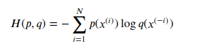
    交叉熵是用来评估当前训练得到的概率分布与真实分布的差异情况，减少交叉熵损失就是在提高模型的预测准确率。其中p(x)是指真实分布的概率， q(x) 是模型通过数据计算出来的概率估计。
    比如对于二分类模型的交叉熵代价函数：
    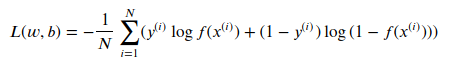
    其中 𝑓(𝑥) 可以是sigmoid函数。或深度学习中的其它激活函数。而 𝑦(𝑖)∈0,1 。
    此部分内容具体参考[https://www.cnblogs.com/lliuye/p/9549881.html](https://www.cnblogs.com/lliuye/p/9549881.html)

7. pytorch中常用的损失函数：
	- BCELoss(二分类)，交叉熵系列：
	- BCEWithLogitsLoss，交叉熵系列：将sigmoid函数和BCELoss方法结合到一个类中。
	- NLLLoss(多分类)，交叉熵系列：
	- CrossEntropyLoss(多分类），交叉熵系列：将nn.LogSoftmax()和nn.NLLLoss()方法结合到一个类中。推倒之后的损失函数为：
	- 
	- L1Loss(L1 norm)，回归系列：
	- MSELoss(L2 norm)，回归系列：
	- SmoothL1Loss(special L1 norm)，回归系列：

8. nn.LogSoftmax(dim=1)即先进行Softmax计算(得0-1的值)，再取Log，所以得到的都是负数。

9. input：tensor([0.2947, 0.5898, 0.4863])(已经经历过sigmoid)  target：tensor([1., 0., 0.]。这是一个二分类操作，只是有三个像素点。output = (1 * ln 0.2947+(1-1)*ln(1-0.2947) + 0*ln0.5898 + (1-0)*ln(1-0.5898) + 0*ln0.4863 + (1-0)*ln(1-0.4863)) / 3 = 0.9264。

10. nlllloss的损失函数：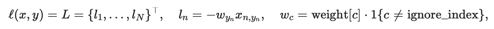,(这是推导之后的损失函数)所以这里可以看出，label的大小(是0，1，2,3,4,5还是0,50,100,150,200)和loss没关系。但是尽可能是用从0开始，因为下标从0开始。

11. CrossEntropyLoss的损失函数： 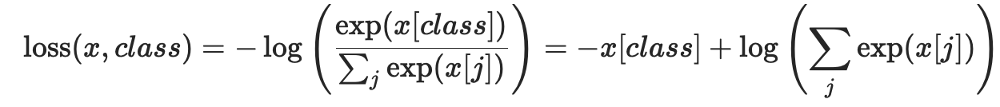，如果带了weight参数为：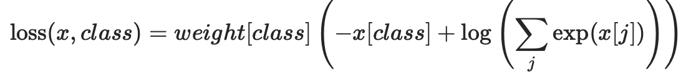，每一个小batch的观测值都返回平均后的损失。这也是经过交叉熵代价函数推导之后的形式。

12. 此部分内容具体参考：[pytorch中常用的损失函数以及原理(最详细的推导)](https://www.cnblogs.com/wanghui-garcia/p/10862733.html)

13. 由 交叉熵损失函数 到 nLLLoss的损失函数 的具体推导：首先，交叉熵作损失函数的公式为：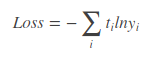.其中，ti表示真实值，yi表示求出的softmax值。当预测第i个时，可以认为ti=1，其他项的t自然就为0了，为0的项相乘就没有了。此时损失函数变成了: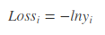 .由于yi是softmax值，根据定义: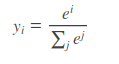.所以，在进行NLLLoss之前，进行一次nn.LogSoftmax(dim=1)的操作，就可以把loss变成。

14. 由 交叉熵损失函数 到 CrossEntropyLoss的损失函数 的具体推导：首先，交叉熵作损失函数的公式为：.其中，ti表示真实值，yi表示求出的softmax值。当预测第i个时，可以认为ti=1，其他项的t自然就为0了，为0的项相乘就没有了。此时损失函数变成了:。由于yi是softmax值，则将的公式带入之中，则得到公式：。这便是CrossEntropyLoss的损失函数。

15. 在pytorch代码中，如果模型的output是直接卷积出来的，可以直接用CrossEntropyLoss(output,target),这样的话，就可以用predictions = outputs.data.max(1)[1].squeeze_(1).squeeze_(0).cpu().numpy()来得到分割中每一个像素点的结果。其中max(1)表示对第一维度，max(1)[1]表示要的是下标，而不是value。

16. SVM为什么用hinge不用logloss(对数损失函数)？
	参考[SVM之hinge loss解释](https://www.cnblogs.com/guoyaohua/p/9436237.html)