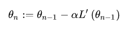
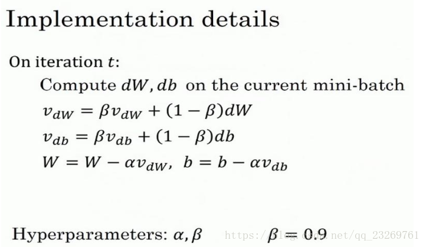
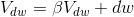
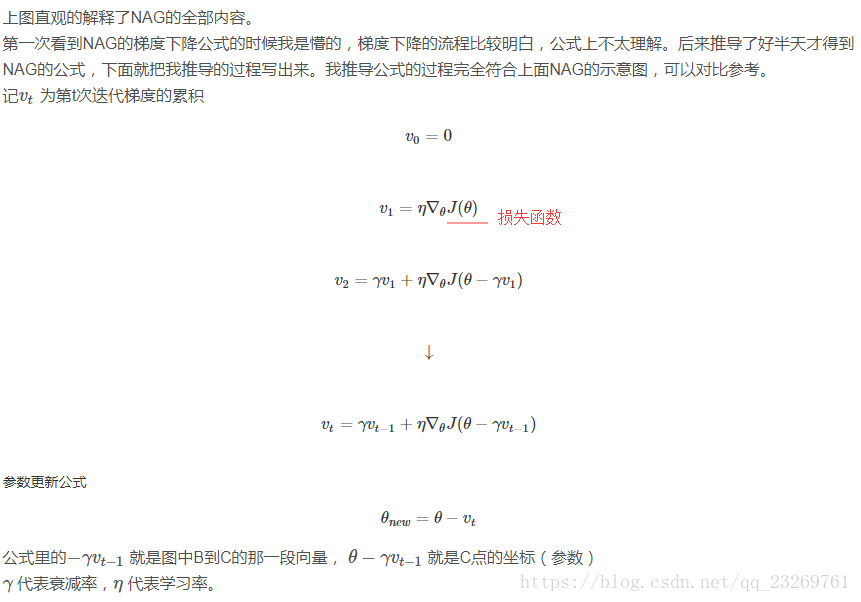
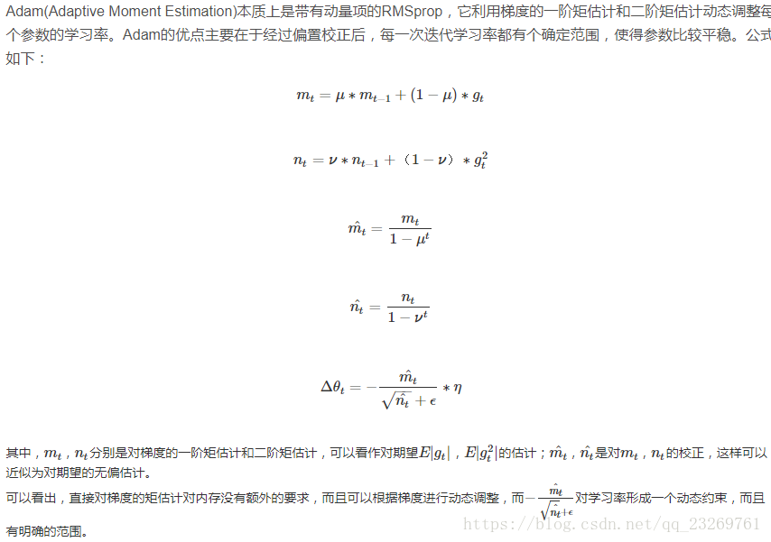
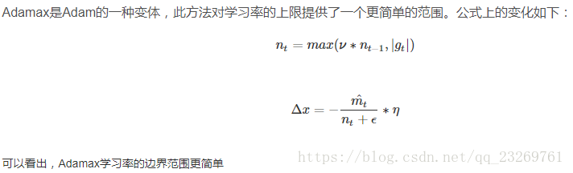
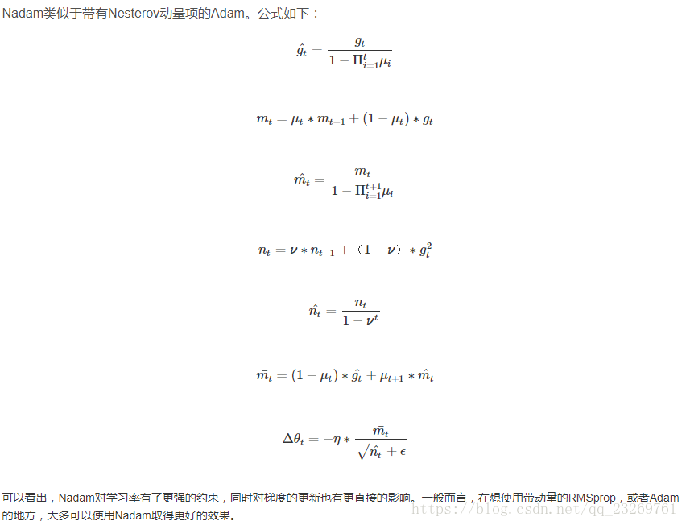

##Sep_17_常用优化算法的理解与总结
-------

1. 深度学习优化算法经历了 SGD -> SGDM -> NAG ->AdaGrad -> AdaDelta -> Adam -> Nadam这样的发展历程.

2. 一阶优化算法：SGD，梯度下降法本质是一种迭代方法，随机梯度下降法是每次使用一批数据进行梯度的计算，而非计算全部数据的梯度。随机梯度下降法的更新公式为：
	
	其中α为梯度上每次逼近的步长，前边的“-”表示搜索方向为负梯度的方向，L为损失函数。算法更新终止的条件是梯度向量接近于0即可。此外需要特别注意的是，梯度下降法不一定能够找到全局的最优解，很有可能找到的是一个局部最优解。（α也为学习率）
    有时候要将MSGD和SGD区分开，有时候MSGD说的就是SGD，这里指的MSGD就是SGD。（minibatch-SGD）

3. 二阶优化算法：牛顿下降法，拟牛顿下降法等。虽然牛顿法相较于梯度下降法等优化算法收敛速度更快，但每一步都需要求解复杂的Hessian矩阵，计算非常不易。

4. 共轭梯度法。

5. 启发式优化方法：在解决问题时所采取的一种根据经验规则进行发现的方法。其特点是在解决问题时,利用过去的经验,选择已经行之有效的方法，而不是系统地、以确定的步骤去寻求答案。启发式优化方法种类繁多，包括经典的模拟退火方法、遗传算法、蚁群算法以及粒子群算法等等。

6. 为什么神经网络的训练不采用二阶优化方法 (如Newton, Quasi Newton)：
	- 最主要原因还是计算量太大。由于牛顿法使用了二阶导数，每次迭代式都要求海森矩阵的逆，计算复杂度太高，高维问题中几乎不可行。
	- 考虑cost 和样本数量的关系。实际中，在相同的时间内使用更多的样本信息所得的效果比使用较少样本更好。二阶会使用更少的样本达到最优点。
	- 稳定性。对于优化算法，梯度下降等一阶算法只要步长不选太大基本都不会出问题，但二阶方法遍地是坑，例如二阶导数不存在，数值稳定性等等。

7. SGDM：Momentum是在随机梯度下降法的基础上，增加了动量（Momentum）的技术。SGD方法的一个缺点是，其更新方向完全依赖于当前的batch，因而其更新十分不稳定。解决这一问题的一个简单的做法便是引入momentum。momentum即动量，它模拟的是物体运动时的惯性，即更新的时候在一定程度上保留之前更新的方向，同时利用当前batch的梯度微调最终的更新方向。这样一来，可以在一定程度上增加稳定性，从而学习地更快，并且还有一定摆脱局部最优的能力。
	
    上面公式很正确，看懂很重要。有时候是另一种版本，即去掉了（1-β）：
    
    其中dw为当前的梯度。β的常用值为0.9，即一定程度长平均了前x次的梯度。

8. Nesterov accelerated gradient (NAG)：Nesterov Momentum是基于Momentum的加速算法，相比于传统的动量算法，最大的优化是计算经过动量更新之后的位置梯度。
	
    首先，按照原来的更新方向更新一步（棕色线），然后在该位置计算梯度值（红色线），（则在计算梯度时，不是在当前位置，而是未来的位置上）然后用这个梯度值修正最终的更新方向（绿色线）。上图中描述了两步的更新示意图，其中蓝色线是标准momentum更新路径。
    
    NAG的优点：这种基于预测的更新方法，使我们避免过快地前进，并提高了算法地响应能力，大大改进了 RNN 在一些任务上的表现。NAG方法收敛速度明显加快。波动也小了很多。实际上NAG方法用到了二阶信息，所以才会有这么好的结果。先按照原来的梯度走一步的时候已经求了一次梯度，后面再修正的时候又求了一次梯度，所以是二阶信息。

9. momentum项和nesterov项都是为了使梯度更新更加灵活，对不同情况有针对性。但是，人工设置一些学习率总还是有些生硬，接下来介绍几种自适应学习率的方法。

10. Adagrad即adaptive gradient，是一种自适应学习率的梯度法。它通过记录并调整每次迭代过程中的前进方向和距离，使得针对不同问题都有一套自适应学习率的方法。Adagrad最大的优势是不需要手动来调整学习率，但与此同时会降低学习率。
	优点：
    - 前期Gt较小的时候， regularizer较大，能够放大梯度
	- 后期Gt较大的时候，regularizer较小，能够约束梯度
	- 适合处理稀疏梯度:相当于为每一维参数设定了不同的学习率：压制常常变化的参数，突出稀缺的更新。能够更有效地利用少量有意义样本
	缺点：
    计算时要在分母上计算梯度平方的和，由于所有的参数平方必为正数，这样就造成在训练的过程中，分母累积的和会越来越大。学习到后阶段，网络的更新能力会越来越弱，学习率会变得极其小，所以经常需要提前停止学习。

11. Adadelta：Adadelta可以解决Adagrad在后期学习能力不强的缺点，Adagrad会累加之前所有的梯度平方，而Adadelta只累加固定大小的项，其实就是相当于指数滑动平均，只用了前多少步的梯度平方平均值，并且也不直接存储这些项，仅仅是近似计算对应的平均值，这也是指数滑动平均的优点。
	缺点：训练后期，反复在局部最小值附近抖动

12. RMSprop：RMSprop 是 Geoff Hinton 提出的一种自适应学习率方法。	RMSprop 和 Adadelta 都是为了解决 Adagrad 后期学习率急剧下降问题的。RMSprop算是Adagrad的一种发展，和Adadelta的变体，效果趋于二者之间，适合处理非平稳目标（也就是与时间有关的）。

13. Adam即Adaptive Momentem Estimation，Adam = Adaptive + Momentum。是能够自适应时刻的估计方法，能够针对每个参数，计算自适应学习率。这是一种综合性的优化方法，在机器学习实际训练中，往往能够取得不错的效果。
	

14. Adamax：
	

15. Nadam
	

16. 提速可以归纳为以下几个方面：
	- 使用momentum来保持前进方向(velocity)；
	- 为每一维参数设定不同的学习率：在梯度连续性强的方向上加速前进；
	- 用历史迭代的平均值归一化学习率：突出稀有的梯度；（不知道是谁）

17. 关于优化算法选择的经验之谈
	- Adam在实际应用中效果良好，超过了其他的自适应技术。
	- 如果输入数据集比较稀疏，SGD、NAG和动量项等方法可能效果不好。因此对于稀疏数据集，应该使用某种自适应学习率的方法，且另一好处为不需要人为调整学习率，使用默认参数就可能获得最优值。
	- 如果想使训练深层网络模型快速收敛或所构建的神经网络较为复杂，则应该使用Adam或其他自适应学习速率的方法，因为这些方法的实际效果更优。
	- SGD通常训练时间更长，但是在好的初始化和学习率调度方案的情况下，结果更可靠。
	- Adadelta，RMSprop，Adam是比较相近的算法，在相似的情况下表现差不多。在想使用带动量的RMSprop，或者Adam的地方，大多可以使用Nadam取得更好的效果。

18. 动态图比较：
	 
	 

19. pytorch中的默认参数：

`optim.SGD([
                {'params': model.base.parameters()},
                {'params': model.classifier.parameters(), 'lr': 1e-3}
            ], lr=1e-2, momentum=0.9)`

`torch.optim.Adadelta(params, lr=1.0, rho=0.9, eps=1e-06, weight_decay=0)`
	其中，weight_decay 一般是用于L2正则化的，防止weight的参数过大，所以有weight penalty。
    eps：为了增加数值计算的稳定性而加到分母里的项。默认就好。
    rho：用于计算平方梯度的运行平均值的系数。
    betas：用于计算梯度以及梯度平方的运行平均值的系数。默认[0.9,0.999]

20. 具体的还是在这个网址查看[torch.optim](https://pytorch.org/docs/stable/optim.html)