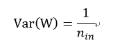

##Sep_19_神经网络中的权重初始化

1. 参数初始化必要条件一：各层激活值不会出现饱和现象

2. 参数初始化必要条件二：各层激活值不为0

3. Gaussian：
	Weights are randomly drawn from Gaussian distributions with fixed mean (e.g., 0) and fixed standard deviation (e.g., 0.01).
	This is the most common initialization method in deep learning.

4. 一般的权重初始化：采用的高斯权重初始化。公式：
		W=np.random.randn(fan_in,fan_out)*0.01
	当权重初始化太小，这样在前向网络中，第一层的output可能分布正常，但是之后的layer中逐渐趋于0。这很好理解（0.9^30 = 0.04）(因为累乘，前向传递), 这样在前向网络中，会导致深层的部分神经元不被激活。
    但是如果把0.01变成1，就是初始化权重太大了，这样神经元可能过早饱和。
    如果把W初始化的更大，例如W=100，可能会在反向传播的时候有梯度爆炸的情况。
    总结：采用高斯权重初始化的时候，如果权重初始化太小，后面的神经元容易不被激活；如果权重初始化太大，后面神经元容易过饱和；如果权重初始化再大一点，容易在反向传播的时候有梯度爆炸。(这些应该是在没有加BN层的情况下讨论的)。参数初始值不能取得太小，因为小的参数在反向传播时也会导致小的梯度，对于深度网络来说，也会产生梯度弥散问题，降低参数的收敛速度。

5. 标准初始化：
	权重参数初始化从区间均匀随机取值。即从(-1/√d,1/√d)均匀分布中生成当前神经元的权重，其中d为每个神经元的输入数量。
	为什么要除以d？
	这样可以确保神经元的输出有相同的分布，提高训练的收敛速度。

6. 标准初始化的优点： 隐层的状态的均值为0，方差为常量1/3，和网络的层数无关，这意味着对于sigmoid函数来说，自变量落在有梯度的范围内。

7. Xavier：
	This method proposes to adopt a properly scaled uniform or Gaussian distribution for initialization.

	In Caffe (an openframework for deep learning) [2], It initializes the weights in network by drawing them from a distribution with zero mean and a specific variance,
	Where W  is the initialization distribution for the neuron in question, and   n_in is the number of neurons feeding into it. The distribution used is typically Gaussian or uniform.
	In Glorot & Bengio’s paper [1], itoriginally recommended using,
	Where n_out is the number of neurons the result is fed to.

8. Xavier的更多解释：
	

9. MSRA:
	This method is proposed to solve the training of extremely deep rectified models directly from scratch [1].
	In this method,weights are initialized with a zero-mean Gaussian distribution whose std is:
    
where is the spatial filter size in layer l and d_l−1 is the number of filters in layer l−1.

