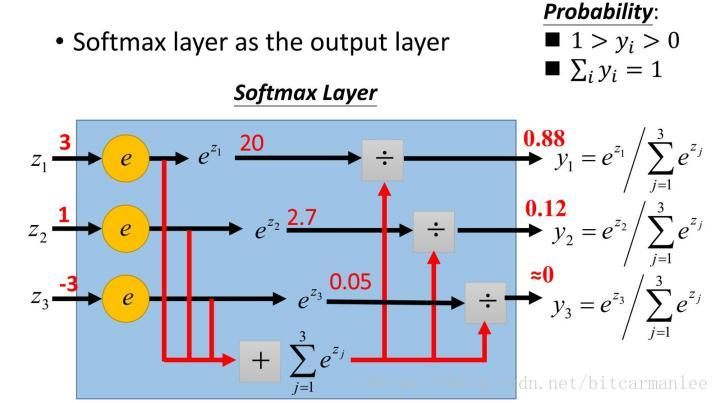
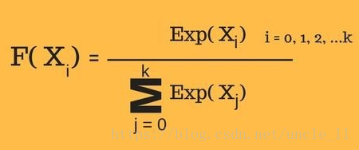
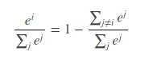
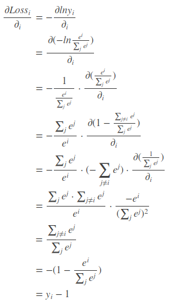
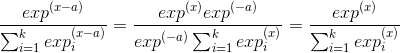
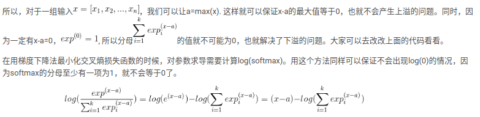

Sep_24_sigmoid和softmax的理解和推导

-----------
###sigmoid
1. sigmoid的代码实现：

```
import numpy as np

def sigmoid(inputs):
    """
    Calculate the sigmoid for the give inputs (array)
    :param inputs:
    :return:
    """
    sigmoid_scores = [1 / float(1 + np.exp(- x)) for x in inputs]
    return sigmoid_scores


sigmoid_inputs = [2, 3, 5, 6]
print "Sigmoid Function Output :: {}".format(sigmoid(sigmoid_inputs))
```
`Sigmoid Function Output :: [0.8807970779778823, 0.9525741268224334, 0.9933071490757153, 0.9975273768433653]`
sigmoid的理论这部分参考之前写的激活函数部分。

###softmax
2. softmax把一些输入 映射为0-1之间的实数，并且归一化保证和为1，因此多分类的概率之和也刚好为1。顾名思义，softmax由两个单词组成，其中一个是max。一个是soft，将max看成一个分类问题，就是非黑即白，最后的输出是一个确定的变量。更多的时候，我们希望输出的是取到某个分类的概率，所以我们就应用到了soft的概念，即最后的输出是每个分类被取到的概率。

3. softmax的计算公式原理：指数公式计算给定输入值的指数和输入中所有值的指数值之和。那么输入值的指数与指数值之和的比值就是softmax函数的输出。

4. softmax的计算公式：

5. softmax的代码实现：
```
import numpy as np
def softmax(inputs):
    """
    Calculate the softmax for the give inputs (array)
    :param inputs:
    :return:
    """
    return np.exp(inputs) / float(sum(np.exp(inputs)))
softmax_inputs = [2, 3, 5, 6]
print "Softmax Function Output :: {}".format(softmax(softmax_inputs))
```
Softmax Function Output :: [ 0.01275478  0.03467109  0.25618664  0.69638749]，可以看到，之和为1。

6. sigmoid一般用于二分类，softmax一般用于多分类。

7. 这个讲的很不错：[https://blog.csdn.net/bitcarmanlee/article/details/82320853](https://blog.csdn.net/bitcarmanlee/article/details/82320853)

##(交叉熵损失函数+softmax)的求导，非常important

7. softmax的求导：前面提到，在多分类问题中，我们经常使用交叉熵作为损失函数.(其实，最原始应该是这样的：)其中，ti表示真实值，yi表示求出的softmax值。当预测第i个时，可以认为ti=1(所以才会只有一项，这个点很重要)。此时损失函数变成了: .接下来对Loss求导。根据定义:.我们已经将数值映射到了0-1之间，并且和为1，则有:.接下来开始求导:（倒数第三行少了一个“-”号）。上面的结果表示，我们只需要正向求出yi，将结果减1就是反向更新的梯度，导数的计算非常简单。

## softmax求导的上溢和下溢问题

1. softmax公式里面因为存在指数函数，所以有可能会出现上溢或下溢的问题.
2. 当指数函数里面传入的值很大时，就会出现上溢;当指数函数里面传入的值是很小的负数时，就会出现下溢，输出结果就是0， 这样就有可能导致分母的值为0。比如，inp=[-1000,-1000,-1000]。
3. 解决这个问题的方法就是利用softmax的冗余性。我们可以看到对于任意一个数a, x-a和x在softmax中的结果都是一样的:


4. 在用梯度下降法最小化交叉熵损失函数的时候，对参数求导需要计算log(softmax)。用这个方法同样可以保证不会出现log(0)的情况，因为softmax的分母至少有一项为1，就不会等于0了。

## sigmoid 和 softmax 联系

1. 虽然二分类中常用的是 BCEWithLogitsLoss，交叉熵系列：将sigmoid函数和BCELoss方法结合到一个类中。多分类中常用的是CrossEntropyLoss(多分类），交叉熵系列：将nn.LogSoftmax()和nn.NLLLoss()方法结合到一个类中。

2. 但是sigmoid 和softmax 的公式其实差很多.

3. softmax 不仅可以把值映射到[0,1]之间,而且还能保证值的和为1.

4. sigmoid只能把值映射到[0,1]之间,不可以确保和为1.
