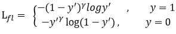
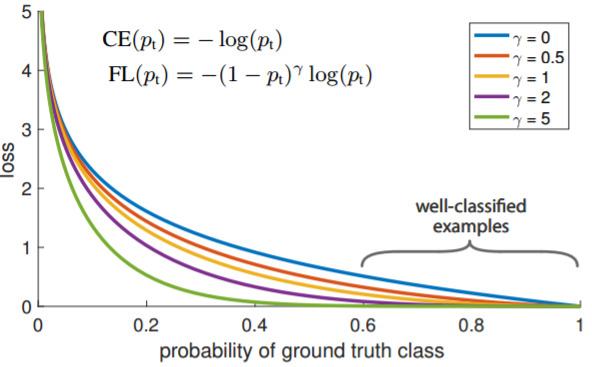
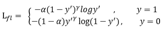

Sep_25_关于focal_loss

------------

1. focal_loss的代码实现（这里实现的是多分类focal loss，下面讲的是二分类focal loss）：
    ```
def FocalLoss(self, logit, target, gamma=2, alpha=0.5):
        n, c, h, w = logit.size()
        criterion = nn.CrossEntropyLoss(weight=self.weight, ignore_index=self.ignore_index,
                                        size_average=self.size_average)
        if self.cuda:
            criterion = criterion.cuda()

        logpt = -criterion(logit, target.long())
        pt = torch.exp(logpt)    ##很机智这里，exp和ln是可逆操作
        if alpha is not None:
            logpt *= alpha
        loss = -((1 - pt) ** gamma) * logpt

        if self.batch_average:
            loss /= n

        return loss
```
(也不是说二分类loss和多分类loss不一样，其实是一样的，对于一个样本而言，其loss通过计算一定是只有一项，二分类看起来像是两项，但是实际上只有一项，因为(1-1)等于0，乘上0就消失了我们以为多的那一项)

2. Focal loss主要是为了解决one-stage目标检测中正负样本比例严重失衡的问题。该损失函数降低了大量简单负样本在训练中所占的权重，也可理解为一种困难样本挖掘。

3. Focal loss是在交叉熵损失函数基础上进行的修改，首先回顾二分类交叉熵损失:.其中y'是经过激活函数的输出，所以在0-1之间。可见普通的交叉熵,对于正样本而言，输出概率越大损失越小。对于负样本而言，输出概率越小则损失越小。

4. 传统交叉熵损失函数的缺点：此时的损失函数在大量简单样本的迭代过程中比较缓慢且可能无法优化至最优。那么Focal loss是怎么改进的呢？

4. Focal loss的公式：，对于正负样本而言，会有不同的公式呈现。首先在原有的基础上加了一个因子，其中gamma>0使得减少易分类样本的损失。使得更关注于困难的、错分的样本。

5. gamma的取值：例如gamma为2，对于正类样本而言，预测结果为0.95肯定是简单样本，所以（1-0.95）的gamma次方就会很小，这时损失函数值就变得更小。而预测概率为0.3的样本其损失相对很大。对于负类样本而言同样，预测0.1的结果应当远比预测0.7的样本损失值要小得多。对于预测概率为0.5时，损失只减少了0.25倍，所以更加关注于这种难以区分的样本。这样减少了简单样本的影响，大量预测概率很小的样本叠加起来后的效应才可能比较有效。
	
    可见，gamma的加入，使得loss下降更快。

6. 此外，加入平衡因子alpha，用来平衡正负样本本身的比例不均：文中alpha取0.25，即正样本要比负样本占比小，这是因为负例易分。只添加alpha虽然可以平衡正负样本的重要性，但是无法解决简单与困难样本的问题。

7. gamma调节简单样本权重降低的速率，当gamma为0时即为交叉熵损失函数，当gamma增加时，调整因子的影响也在增加。实验发现gamma为2是最优，aplha取0.25的时候最优，这个时候反而负样本的权重在增加，这说明gama次方已经把负样本整体的loss衰减到需要加权重的地步(paper中alpha取0.25，gama取2效果最好)。

8. 自己总结：focal loss通过gamma参数，对困难样本(容易分错的样本)加大了损失，对简单样本(容易分正确的样本)降低了损失，以此来加快loss的下降。

9. focal loss主要是解决难例挖掘问题，并没有完全解决正负样本不平衡的问题，只解决了一点点,通过alpha，alpha可以给不同类别给不同的权重。

10. 负样本主导loss(在多分类中，是某一类数量很多的主导loss)：在onestage的网络中，正负样本达到1:1000，这就会出现两个问题：1.样本不平衡   2.负样本主导loss。虽然负样本的loss小(因为大量的负样本是easy example，大量负样本是准确率很高的第0类)，但个数众多，加起来的loss甚至大于了正样本的loss。但是实际上，ssd训练的时候通过hard mining（难例挖掘）选负样本，实现了正负样本1:3。而不是这里提到的1:1000，focal loss做的工作如下：

11. focal loss主旨是：ssd按照ohem选出了loss较大的，但忽略了那些loss较小的easy的负样本，虽然这些easy负样本loss很小，但数量多，加起来的loss较大，对最终loss有一定贡献。作者想把这些loss较小的也融入到loss计算中。但如果直接计算所有的loss，loss会被那些easy的负样本主导，因为数量太多，加起来的loss就大了。也就是说，作者是想融入一些easy example，希望他们能有助于训练，但又不希望他们主导loss。这个时候就用了公式进行衰减那些easy example，让他们对loss做贡献，但又不至于主导loss，并且通过balanced crossentropy平衡类别。

12. one-stage和two-stage的表现差异主要原因是大量前景背景类别不平衡导致，在two-stage算法中，在候选框阶段，通过得分和nms筛选(rpn阶段)过滤掉了大量的负样本，然后在分类回归阶段又固定了正负样本比例，或者通过OHEM在线困难挖掘使得前景和背景相对平衡。而one-stage阶段需要产生约100k的候选位置，虽然有类似的采样，但是训练仍然被大量负样本所主导（在不同ohem的情况下），用了ohem，大概正负样本比例在(1:3)。

13. ohem算法(online hard example mining)：是属于目标检测领域的。

14. OHEM算法的核心是选择一些hard example作为训练的样本从而改善网络参数效果，hard example指的是有多样性和高损失的样本，而丢弃了easy example(不像focal loss，focal loss没有丢弃)。例如。通过ohem，将正负样本的比例控制在1:3。这些选中的负样本，都是比较有价值的负样本。

15. foacl loss 通过gamma实现难例样本挖掘,但是保留了easy example.有通过alpha控制easy example的loss占总loss的比重.

16. ohem通过丢弃easy example 实现难例样本挖掘,将比例控制在1:3,留下来的3的负样本都是难例样本了,也可以理解为比较有代表性的样本.

参考链接1：[Focal Loss理解](https://www.cnblogs.com/king-lps/p/9497836.html)
参考链接2：[focal loss和ohem](https://www.cnblogs.com/ymjyqsx/p/9508664.html)