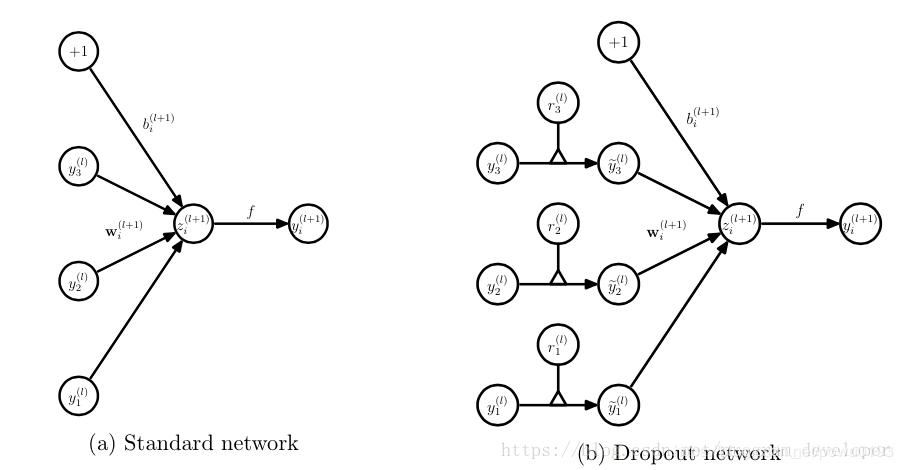
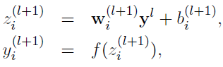
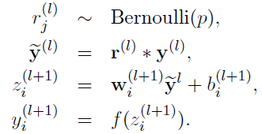
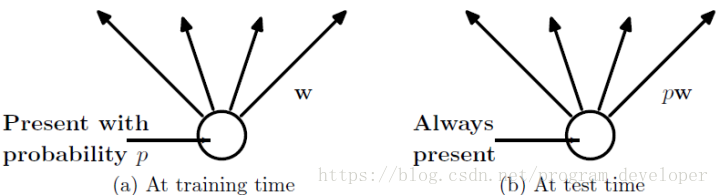
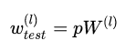
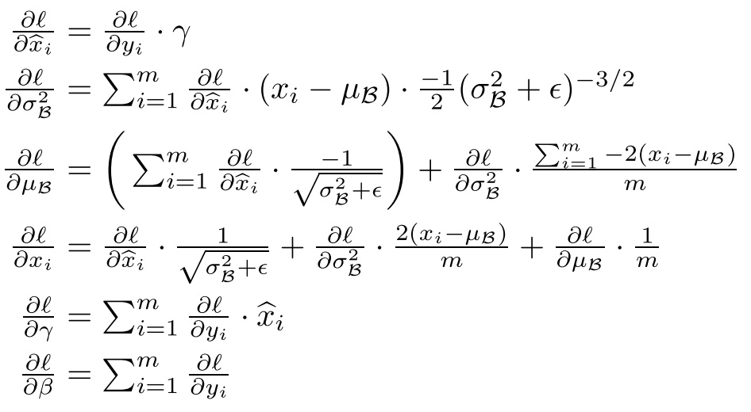
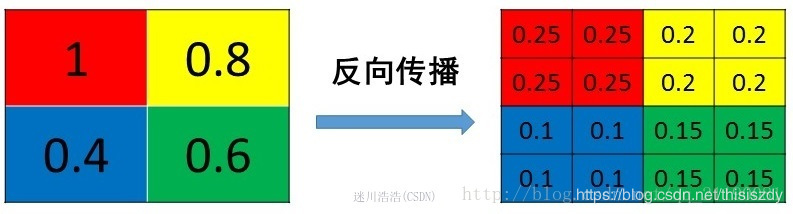
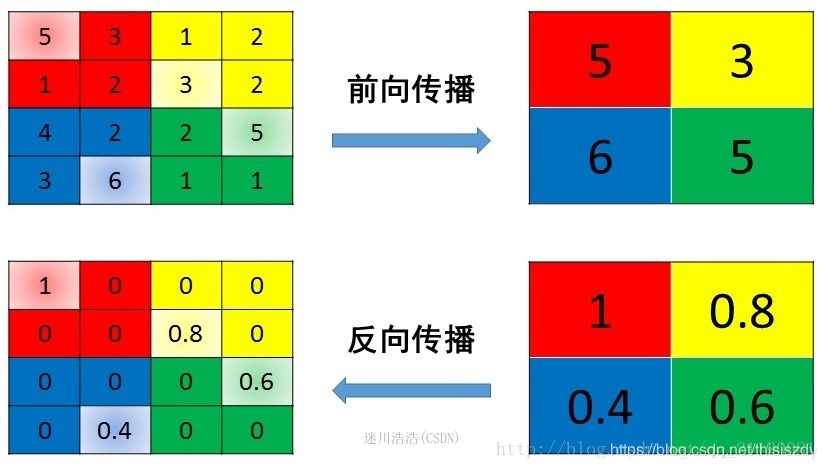

##Sep_26_Dropout和BN和pool的反向传播

----------
##Dropout
1. dropout的过程：
	- 首先随机（临时）删掉网络中一半的隐藏神经元，输入输出神经元保持不变
	- 然后把输入x通过修改后的网络前向传播，然后把得到的损失结果通过修改的网络反向传播。一小批训练样本执行完这个过程后，在没有被删除的神经元上按照随机梯度下降法更新对应的参数（w，b）
	- 恢复被删掉的神经元（此时被删除的神经元保持原样，而没有被删除的神经元已经有所更新）
	- 然后继续重复这一过程。

2. 从上面可以看出，dropout其实没有严格反传播过程，或者说是和(没有dropout)一样的反向传播。因为其中的参数也不会被学习。

3. pytorch中dropout的调用，torch.nn.Dropout(0.4)，0.4为随机丢弃神经元的概率。

4. dropout的代码实现思路：
	- 训练阶段：无可避免的，在训练网络的每个单元都要添加一道概率流程。
	- 没有Dropout的网络计算公式
	- 采用Dropout的网络计算公式
	- 上面公式中Bernoulli函数是为了生成概率r向量，也就是随机生成一个0、1的向量。

5. dropout经过上面屏蔽掉某些神经元，使其激活值为0，我们还需要对向量y1……y1000进行缩放，也就是乘以1/(1-p)。如果在训练的时候，经过置0后，没有对y1……y1000进行缩放（rescale），那么在测试的时候，就需要对权重进行缩放。

6. dropout的测试模型阶段：预测模型的时候，每一个神经单元的权重参数要乘以概率p。.测试阶段Dropout公式：.

7. pytorch中的dropout的代码实现：
```
	def dropout(input, p=0.5, training=True, inplace=False):
    	    if p < 0. or p > 1.:
        raise ValueError("dropout probability has to be between 0 and 1, "
                         "but got {}".format(p))
    return (_VF.dropout_(input, p, training)
            if inplace
            else _VF.dropout(input, p, training))
```
	不能再往下进 ，可能只是开源到这个层面。
	我感觉pytorch应该是在训练是进行缩放了，在训练时对yi的输出数据除以（1-p）之后再传给输出层神经元，作为神经元失活的补偿，以使得在训练时和测试时每一层输入有大致相同的期望。(以使得在训练时和测试时每一层输入有大致相同的期望。)(以使得在训练时和测试时每一层输入有大致相同的期望。)

8. 总结：在测试和训练过程中，dropout的区别？：
	在训练阶段，模型会开启dropout层，即以概率p的大小随机失活某些神经元，以防止过拟合，而在测试阶段，则会关闭这个随机失活神经元的功能。如果在训练阶段，dropout有对输出的y1，...y1000进行缩放的话，在测试阶段则没有额外的工作。如果没有进行缩放，则在测试阶段需要对测试的权重进行缩放，即乘上概率p。

9. Dropout的理解参考博客：[深度学习中Dropout原理解析](https://blog.csdn.net/program_developer/article/details/80737724)

##BN

9. BN层在训练和测试的区别？：
	对于BN，在训练时，是对每一批的训练数据进行归一化，用的是每一批数据的均值和方差，且有两个需要学习的参数：gamma和beta。
	而在测试时，比如进行一个样本的预测，就并没有batch的概念，因此，这个时候用的均值和方差是全量训练数据的均值和方差，这个可以通过移动平均法求得。
	对于BN，当一个模型训练完成之后，它的所有参数都确定了，包括均值和方差，gamma和beta。

10. BN训练时为什么不用全量训练集的均值和方差呢？
	答案：用全量训练集的均值和方差容易过拟合。

11. BN和dropout同时使用可能会出现的问题：
	BN和Dropout单独使用都能减少过拟合并加速训练速度，但如果一起使用的话并不会产生1+1>2的效果，相反可能会得到比单独使用更差的效果。具体的参考[BN和Dropout共同使用时会出现的问题](https://blog.csdn.net/songyunli1111/article/details/89071021)

12. BN层的反向传播公式推导：.BN层的反向传播相比于普通层要略微复杂一些，首先给出论文中的公式。具体的公式和代码实现步骤，还是要看：[BN原理 & 其前向传播、反向传播代码](https://zhuanlan.zhihu.com/p/26138673)

## pooling

13. Pooling池化操作的反向梯度传播:CNN网络中另外一个不可导的环节就是Pooling池化操作，因为Pooling操作使得feature map的尺寸变化，假如做2×2的池化，假设那么第l+1层的feature map有16个梯度，那么第l层就会有64个梯度，这使得梯度无法对位的进行传播下去。其实解决这个问题的思想也很简单，就是把1个像素的梯度传递给4个像素，但是需要保证传递的loss（或者梯度）总和不变。根据这条原则，mean pooling和max pooling的反向传播也是不同的。

14. mean pooling 反向传播:mean pooling的前向传播就是把一个patch中的值求取平均来做pooling，那么反向传播的过程也就是把某个元素的梯度等分为n份分配给前一层，这样就保证池化前后的梯度（残差）之和保持不变。

15. max pooling 反向传播:max pooling也要满足梯度之和不变的原则，max pooling的前向传播是把patch中最大的值传递给后一层，而其他像素的值直接被舍弃掉。那么反向传播也就是把梯度直接传给前一层某一个像素，而其他像素不接受梯度，也就是为0。所以max pooling操作和mean pooling操作不同点在于需要记录下池化操作时到底哪个像素的值是最大，也就是max id，这个变量就是记录最大值所在位置的，因为在反向传播中要用到，那么假设前向传播和反向传播的过程就如上图所示。

16. pooling层的反向传播的具体，看：[池化层(Pooling)的反向传播](https://blog.csdn.net/thisiszdy/article/details/88819728)