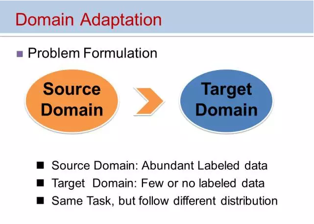

##Sep_28_迁移学习(transfer learning)和域自适应(domain adaptation)

---------------
#transfer learning
## fine-tune
1. 首先，模型的训练分为从头开始训练(train from scratch)，和使用预训练模型，使用预训练模型分为三种，如下图所示：
	- 1）Transfer Learning：冻结预训练模型的全部卷积层，只训练自己定制的全连接层。
	- 2）Extract Feature Vector：先计算出预训练模型的卷积层对所有训练和测试数据的特征向量，然后抛开预训练模型，只训练自己定制的简配版全连接网络。(和第一种没有本质区别)
	- 3）Fine-tune：冻结预训练模型的部分卷积层（通常是靠近输入的多数卷积层），训练剩下的卷积层（通常是靠近输出的部分卷积层）和全连接层。

2. Fine-tune 不能代表迁移学习(transfer leraning)。迁移学习中有很多策略,而fine-tune只是其中的一种手段，更常用于形容迁移学习的后期微调中。

3. 除了是冻结 pre-trained model 卷积层的操作之外，还有一种策略是只用预训练模型的参数作为初始值，对模型进行完整训练。这种一般是在source domain和target domain 之间分布差很大的情况下。

4. 卷积神经网络的核心是：
（1）浅层卷积层提取基础特征，比如边缘，轮廓等基础特征。
（2）深层卷积层提取抽象特征，比如整个脸型。
（3）全连接层根据特征组合进行评分分类。

5. 以上内容参考：[什么是迁移学习？](https://blog.csdn.net/u013841196/article/details/80919857)

## domain adaptation

1. domain adaptation的问题背景：在经典的机器学习问题中，我们往往假设训练集和测试集分布一致，在训练集上训练模型，在测试集上测试。然而在实际问题中，测试场景往往非可控，测试集和训练集分布有很大差异，这时候就会出现所谓过拟合问题：模型在测试集上效果不理想。（以人脸识别为例，如果用东方人人脸数据训练，用于识别西方人，相比东方人识别性能会明显下降。）(这里说的分布不仅仅是说的均值和方差，是包含挺多的，可用KL散度等来度量)

2. 当 训练集 和 测试集 分布不一致的情况下，通过在训练数据上按经验误差最小准则训练的模型在测试上性能不好，因此出现了 迁移学习(transfer learning)技术。

3. 领域自适应（Domain Adaptation）是迁移学习中的一种代表性方法，指的是利用信息丰富的源域样本来提升目标域模型的性能。

4. 领域自适应问题中两个至关重要的概念：
	- 源域（source domain）表示与测试样本不同的领域，但是有丰富的监督信息
	- 目标域（target domain）表示测试样本所在的领域，无标签或者只有少量标签。
	- 源域和目标域往往属于同一类任务，但是分布不同。

5. 根据目标域和源域的不同类型，领域自适应问题有四类不同的场景：无监督的，有监督的，异构分布和多个源域问题。

6. 研究者提出了三种不同的领域自适应方法：
  1）样本自适应，对源域样本进行加权重采样，从而逼近目标域的分布。(其基本思想是对源域样本进行重采样，从而使得重采样后的源域样本和目标域样本分布基本一致，在重采样的样本集合上重新学习分类器。)
  2）特征自适应，将源域和目标域投影到公共特征子空间。(其基本思想是学习公共的特征表示，在公共特征空间，源域和目标域的分布要尽可能相同。上图中所示为Long等人基于DL的迁移学习框架，其网络结构和标准CNN基本一致，不同之处在于对最后的全连接层特征增加了一个MMD约束，使得源域和目标域要具有尽可能相同的分布。将输入的样本投影到公共子空间，通过计算源域的经验误差，逼近目标域的经验误差。)
  3）模型自适应，对源域误差函数进行修改，考虑目标域的误差。(其基本思想是直接在模型层面进行自适应。模型自适应的方法有两种思路，一是直接建模模型，但是在模型中加入“domain间距离近”的约束，二是采用迭代的方法，渐进的对目标域的样本进行分类，将信度高的样本加入训练集，并更新模型。)

7. 对于前面三类方法，一个重要的方面是度量两个域分布的差异。代表性的工作有：KL散度，Bregman散度，MMD和低秩。

8. 前面所介绍的三类方法中，样本自适应作用于最前端，适合于源域和目标域分布差异小的情况。特征自适应适用于于源域和目标域有一定差异的情况。模型自适应的适用范围最广，能够应用于源域和目标域差异比较大的场景。

9. domain adaptation 的一个试用场景例如：亚洲的人脸识别模型迁移到非洲的人脸识别。

10. 以上内容参考：[领域自适应及其在人脸识别中的应用](https://zhuanlan.zhihu.com/p/21441807)

11. 更多资料：[领域自适应(Domain Adaptation)的理论分析](https://zhuanlan.zhihu.com/p/50710267)

## transfer learning

1. 迁移学习的准确定义：给定由特征空间 X 和边缘概率分布 P(X) 组成的源域（source domain）D_s 和学习任务 T_s ，和同样由特征空间和边缘概率分布组成的目标域（target domain） D_t 和学习任务 T_t ，迁移学习的目的在于利用 D_s 和 T_s 中的知识来帮助学习在目标域 D_t 的目标函数 f_T(·) 的过程，注意 D_s 与 D_t 不相等、 T_s 与 T_t 不相等。

2. 迁移学习在深度学习上的应用有两种策略，但目前这两种策略的命名还没有统一。
	- 一种策略是微调（finetuning）——其中包括使用基础数据集上的预训练网络以及在目标数据集中训练所有层；
	- 另一种则是冻结与训练（freeze and train）——其中包括冻结除最后一层的所有层（权重不更新）并训练最后一层。
	（命名还没有统一，知道意思就行了，参考 fine-tune 那部分）

###difference between transfer learning and domain adaptation

1. 迁移学习 应该是包括了 域自适应 和 fine-tune。

2. 自适应是迁移学习里面的一种特殊情况。自适应的一个基本假设就是源域与目标域的输入空间、输出空间均一致，但域之间的联合分布P(X,Y)不一样。而迁移学习中并没有要求域间的输入输出空间一致。

3. github上一个比较好的仓库：[transferlearning ](https://github.com/jindongwang/transferlearning),自己说可能是目前最全的迁移学习资料库。