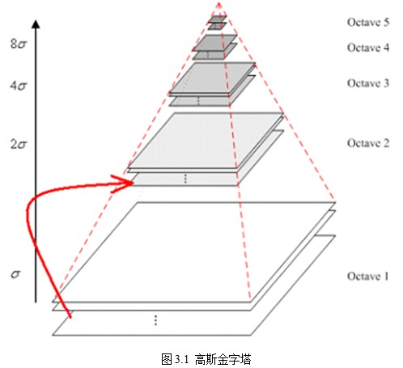

## sift特征描述子

### 1、SIFT综述

尺度不变特征转换(Scale-invariant feature transform或SIFT)是一种电脑视觉的算法用来侦测与描述影像中的局部性特征，它在空间尺度中寻找极值点，并提取出其位置、尺度、旋转不变量，此算法由 David Lowe在1999年所发表，2004年完善总结。

SIFT算法的特点有：

1. SIFT特征是图像的局部特征，其对旋转、尺度缩放、亮度变化保持不变性，对视角变化、仿射变换、噪声也保持一定程度的稳定性
2. SIFT是一种图像的特征；类似的图像特征还有hog特征等；

## 2、SIFT算法可以解决的问题：

目标的自身状态、场景所处的环境和成像器材的成像特性等因素影响图像配准/目标识别跟踪的性能。而SIFT算法在一定程度上可解决：

1. 目标的旋转、缩放、平移（RST）

2. 图像仿射/投影变换（视点viewpoint）

3. 光照影响（illumination）

4. 目标遮挡（occlusion）

5. 杂物场景（clutter）

6. 噪声

SIFT算法的实质是在不同的尺度空间上查找关键点(特征点)，并计算出关键点的方向。SIFT所查找到的关键点是一些十分突出，不会因光照，仿射变换和噪音等因素而变化的点，如角点、边缘点、暗区的亮点及亮区的暗点等。 

## 3、Lowe将SIFT算法分解为如下四步：

1. 尺度空间极值检测：搜索所有尺度上的图像位置。通过高斯微分函数来识别潜在的对于尺度和旋转不变的兴趣点。

2. 关键点定位：在每个候选的位置上，通过一个拟合精细的模型来确定位置和尺度。关键点的选择依据于它们的稳定程度。

3. 方向确定：基于图像局部的梯度方向，分配给每个关键点位置一个或多个方向。所有后面的对图像数据的操作都相对于关键点的方向、尺度和位置进行变换，从而提供对于这些变换的不变性。

4. 关键点描述：在每个关键点周围的邻域内，在选定的尺度上测量图像局部的梯度。这些梯度被变换成一种表示，这种表示允许比较大的局部形状的变形和光照变化。

### 4、高斯模糊

SIFT算法是在不同的尺度空间上查找关键点，而尺度空间的获取需要使用高斯模糊来实现，Lindeberg等人已证明高斯卷积核是实现尺度变换的唯一变换核，并且是唯一的线性核。

<u>模糊处理比其它的均衡模糊滤波器更高地保留了边缘效果。</u>

理论上来讲，图像中每点的分布都不为零，这也就是说每个像素的计算都需要包含整幅图像。在实际应用中，在计算高斯函数的离散近似时，在大概3σ距离之外的像素都可以看作不起作用，这些像素的计算也就可以忽略。

## 5、**高斯金字塔的构建**

尺度空间再实现时使用高斯金字塔表示，高斯金字塔的构建分为两部分：

1. 对图像做不同尺度的高斯模糊；

2. 对图像做降采样(隔点采样)；

图像的金字塔模型是指，将原始图像不断降阶采样，得到一系列大小不一的图像，由大到小，从下到上构成的塔状模型。

原图像为金子塔的第一层，每次降采样所得到的新图像为金字塔的一层(每层一张图像)，每个金字塔共n层。

### 6、空间极值点检测(关键点的初步探查)

关键点是由DOG空间的局部极值点组成的，关键点的初步探查是通过同一组内各DoG相邻两层图像之间比较完成的。