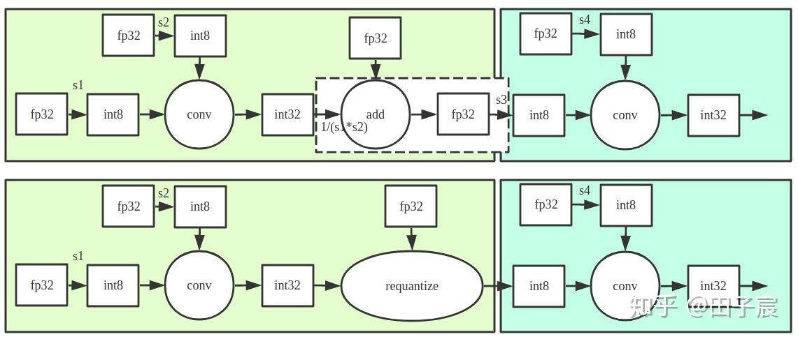
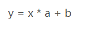
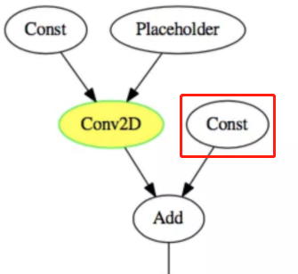
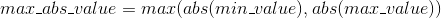
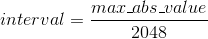

## 模型量化的理解

1. 必看参考资料：https://blog.csdn.net/sinat_31425585/article/details/101607785

2. 模型量化（这里指int8量化），英伟达有TensorRT（基于交叉熵最小化两个分布的差异进行量化），腾讯有NCNN，intel有VNNI，Tensorflow Lite也支持训练后再量化；

3. 有量化，也有反量化：（下图的量化只存在于conv运算当中，VNNI的量化输入输出都是uint8）

4. 上图中：input_blob使用同一个scale进行量化；权重的每个kernel的scale不同，输出反量化的scale也是不同的，每个output_channel有独立的scale参数；

5. 感知量化：量化感知训练，在量化的过程中，对网络进行训练，从而让网络参数能更好地适应量化带来的信息损失。

6. 删除影响量化的节点，主要包含：

   1. op=identity，用来复制tensor，eg：y=tf.identity(x)
   2. op=CheckNumerics(数值检查)

7. 不支持量化的节点：（输入需要反量化）

   1. reshape（量化没有意义）；
   2. 输入包含负数的层，VNNI量化是uint8，不支持包含负数的输入；
   3. leakyrelu含有负数的输出，leakyrelu后面的层就不支持量化；

8. flod_bn(折叠BN层)的原理：推理计算时 BN 输入参数均为常数，那么经过 constant folding， BN 可在算数上简化为，进一步，当 x 为卷积输出，对卷积权值直接乘上 a，就可以在前向计算时直接得到 x * a 的结果，这一步称为 BN folding。经过两步简化后的计算图为：

9. 简历上应该是：量化后动态产生校准数据min_max_log.txt，这可能是VNNI量化方式特有的，产生的fp32校准数据（fp32）用于替代反量化的op：RequantizationRangeOp;

10. 动态选择阶段的范围T的方法是KL散度：

    1. 计算fp类型数据的最大绝对值，即最大值和最小值绝对值的最大值:

    2. 将原始的fp类型数据离散化，并计算对应统计直方图，这里ncnn默认将fp类型数据划分为2048个bin，每个bin宽度为

    3. 穷举所有截断阈值T，并选取量化前后KL散度最小时对应的截断阈值T:

       ```python
       for num_bins from 128 to 2048:
          （a）current_T = interval * num_bins, 计算截断后fp32数据对应统计直方图；
          （b）将P映射到Q，Q的bins为128；
          （c）将Q拓展到P一样长度，得到分布Q_expand；
          （d）计算P和Q_expand的KL散度，并判断当前KL散度是否为最小；
       ```

       ps：有一个步骤是要将Q拓展到P一样的长度，因为P的长度是随着截断阈值T变化而变化的，而计算两个分布的KL散度时，要求二者具有相同数目的bins;

11. VNNI赛道，通过量化，精度从0.23MAP下降到0.22MAP，速度从2500s降低到1046s（200张大图）；

    

    