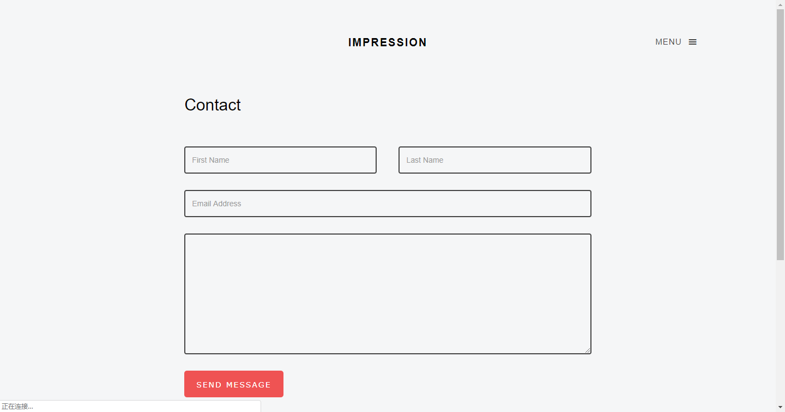

##django内实现发送邮件功能（contact界面的功能实现）
我的个人博客中有一个contact页面，如下所示：



页面做的挺简洁大方有排面，但之前是空有其表，只是一个html页面，并不能实现真正的contact me，这怎么能忍？
###创建 contact 应用
   
首先，在django内创建一个应用，起名为contact。（contact算是一个比较独立的功能，Django 提倡，如果功能相对比较独立，最好创建一个应用，把相应的功能代码写到这个应用里。）

```
python manage.py startapp contact
```
创建新的应用后一定要记得在 **settings.py** 里注册这个应用，Django 才知道这是一个应用。


###设计 contact 的数据库模型
我的想法是，将 **contact** 的数据存储到数据库中，以便我之后能够汇总所有人contact我时的欣喜，因此需要为 **contact** 应用设计数据库模型。根据自己的 contact 界面设计，下面是我的模型设计（此段代码写在 contact\models.py 中）：

```
from django.db import models
from django.utils.six import python_2_unicode_compatible

# python_2_unicode_compatible 装饰器用于兼容 Python2
@python_2_unicode_compatible
class Contact(models.Model):
    first_name = models.CharField(max_length=15)
    last_name = models.CharField(max_length=15)
    email = models.EmailField(max_length=255)
    text = models.TextField()
    created_time = models.DateTimeField(auto_now_add=True)

    def __str__(self):
        return self.text[:20]
```
为contact类共创建了5个属性，前四个属性是根据contact界面的表格设计，最后一个 created_time 是为了让这些信息更容易整理，自己在后台查看的时候也能知道对方 contact 我的时间。  
创建了数据库模型就要迁移数据库，迁移数据库的命令只要在终端下分别运行下面两条命令：

```
python manage.py makemigrations  
python manage.py migrate
```
###评论表单设计
因为 contact 界面的存储是一个表格，所以需要为它设计一个 Django 内的表单，下面开始编写评论表单代码。在 contacts\ 目录下（和 models.py 同级）新建一个 forms.py 文件，用来存放表单代码，我的表单代码如下：

```
from django import forms
from .models import Contact

class ContactForm(forms.ModelForm):
    class Meta:
        model = Contact
        fields = ['first_name','last_name', 'email', 'text']
```
解释一下上面的代码，首先导入 forms 模块。Django 的表单类必须继承自 forms.Form 类或者 forms.ModelForm 类。如果表单对应有一个数据库模型（例如这里的 contact 表单对应着 contact 模型），那么使用 ModelForm 类会简单很多，这是 Django 为我们提供的方便。之后便在表单的内部类 Meta 里指定一些和表单相关的东西。model = Contact 表明这个表单对应的数据库模型是 Contact 类。fields = ['first_name','last_name', 'email', 'text'] 指定了表单需要显示的字段。（对于怎么从 form.py 到数据库中真正的表单，感兴趣的可以查一下 Django 的 ORM 系统）
### contact 视图函数
当用户提交表单中的数据后，Django 需要调用相应的视图函数来处理这些数据，下面开始写视图函数处理逻辑（在contact/views.py中写上下面的代码）：

```
from django.shortcuts import render, get_object_or_404, redirect

from .models import Contact
from .forms import ContactForm
from django.core.mail import send_mail

def contact(request):

    # HTTP 请求有 get 和 post 两种，一般用户通过表单提交数据都是通过 post 请求，
    # 因此只有当用户的请求为 post 时才需要处理表单数据。
    if request.method == 'POST':
        # 用户提交的数据存在 request.POST 中，这是一个类字典对象。
        # 我们利用这些数据构造了 ContactForm 的实例，这样 Django 的表单就生成了。
        form = ContactForm(request.POST)
        form.first_name = request.POST.get("first_name")
        form.last_name = request.POST.get("last_name")
        form.email = request.POST.get("email")
        form.text = request.POST.get("text")

        # 当调用 form.is_valid() 方法时，Django 自动帮我们检查表单的数据是否符合格式要求。
        if form.is_valid():
            # 检查到数据是合法的，调用表单的 save 方法保存数据到数据库.
            contact = form.save(commit=False)

            # 最终将 contact 数据保存进数据库，调用模型实例的 save 方法
            contact.save()

            form_empty = ContactForm()
            context = {'form': form_empty,
                       }
            return render(request, 'hydrogen/contact.html', context=context)

        else:
            # 检查到数据不合法，重新渲染详情页，并且渲染表单的错误。
            context = {'form': form,
                       }
            return render(request, 'hydrogen/contact.html', context=context)
    # 不是 post 请求，说明用户没有提交数据，重定向到文章详情页。
    form_empty = ContactForm()
    context = {'form': form_empty,
               }
    return render(request, 'hydrogen/contact.html', context=context)
```
看到这里这么多代码，我真的是感觉这篇博客又臭又长。。。不过，我还是要继续下去，有本事你来 diss 我呀！
###绑定 URL
视图函数需要和 URL 绑定，所以继续在 contact 应用中新建一个 urls.py 文件，写上下面的代码：

```
from django.conf.urls import url
from . import views

app_name = 'contact'
urlpatterns = [
    url(r'^contact/ok/$', views.contact, name='contact'),
]
```
Django自己会主动查询的 url 文件只有总项目中的 urls.py，所以要在其中包含contact\urls.py 这个文件


###更新 contact 页面的视图函数
contact 页面的视图函数在我的 hydrogen 应用下的 view.py 中，目的是要让它生成表单和从数据库获取文章对应的 contact 列表数据，然后传递给模板显示，不这样做的话，还是不能将 html 页面与 数据库连接起来，代码如下（我是修改hydrogen/view.py,找准自己的修改位置）：
```
def contact(request):
    form = ContactForm()
    context = {'form': form,}
    return render(request, 'hydrogen/contact.html',context=context)
```
上面是需要修改的主题函数的部分，不过记得要在顶部添加上这样一句话，确保不会出错：**from contact.forms import ContacttForm**
###在前端 html 文件中渲染表单
上一步在contact 页面的视图函数中传递了一个 form 变量给模板，这个变量就包含了自动生成 HTML 表单的全部数据。下一步需要在 contact.html 中通过 form 来自动生成表单。代码如下：

```
<form action="" method="post" class="contact-form" >
	
	<div class="row">
		<div class="col-md-6">
			<div class="form-group">
				<input id="{{form.first_name.id_for_input}}" type="text" class="form-control" placeholder="First Name" name="first_name">
				{{ form.first_name.errors }}
			</div>
		</div>
		<div class="col-md-6">
			<div class="form-group">
				<input id="{{form.last_name.id_for_input}}" type="text" class="form-control" placeholder="Last Name" name="last_name">
				{{ form.last_name.errors }}
			</div>
		</div>
		<div class="col-md-12">
			<div class="form-group">
				<input id="{{form.email.id_for_input}}" type="text" class="form-control" placeholder="Email Address" name="email">
				{{ form.email.errors }}
			</div>
			<div class="form-group">
				<textarea name="text" id="{{ form.text.id_for_label }}" cols="30" class="form-control" rows="10"></textarea>
				{{ form.text.errors }}
			</div>
			<div class="form-group">
				<input type="submit" class="btn btn-primary" value="Send Message" onclick="display_alert()">
			</div>
		</div>

	</div>
</form>
```
解释一下上面的代码，通过 input 框得到用户的输入数据，每一个 input 框有一个 name ，根据 input 框的 name 属性可以在后台获得它的值。在 contact/views.py 中就是通过 request.POST.get("first_name") 获得用户填入表单中的数据。  
{{ form.name.errors }}、{{ form.email.errors }} 等将渲染表单对应字段的错误（如果有的话），例如用户 email 格式填错了，那么 Django 会检查用户提交的 email 的格式，然后将格式错误信息保存到 errors 中，模板便将错误信息渲染显示。

这篇博客真是又臭又长，做到这一步，已经能够将用户在 contact 界面输入的数据保存在数据库中，我现在可以经常登录django后台，来看有谁 contact 过我，我好给他回邮件。
###邮箱申请开通stmp服务
这篇博客真是又臭又长，写博客的目的是实现在django内发送邮件，一是给用户自动回复邮件，告诉 他/她 我已经受到了邮件，二是当有人 contact 我的时候，系统能够发一封邮件给我，我能够及时回复。  
那下一步就是在 Django 内s实现发邮件，首先是去自己的邮箱中申请开通stmp服务，在设置里面找，申请开通smtp服务，我用的是qq邮箱。

之后申请生成授权码待会用。
###Django内配置自己的邮箱
在 settings.py 中添加下面的代码配置自己的邮箱账号和授权码：

```
#这一项是固定的
EMAIL_BACKEND = 'django.core.mail.backends.smtp.EmailBackend'
# smtp服务的邮箱服务器 我用的是qq
EMAIL_HOST = 'smtp.qq.com'
# smtp服务固定的端口是25
EMAIL_PORT = 25
#发送邮件的邮箱
EMAIL_HOST_USER = 'XXX@qq.com'
#在邮箱中设置的客户端授权密码
EMAIL_HOST_PASSWORD = 'yourpasswd'
#收件人看到的发件人 <此处要和发送邮件的邮箱相同>
EMAIL_FROM = 'fuweifu<XXX@qq.com>'
```
其中 **EMAIL_HOST_PASSWORD** 这一项填入刚刚申请到的授权码，有了授权码，就可以通过你的邮箱发送邮件，都不需要邮箱的账户和密码，所以千万不能泄露出去。
###在视图函数 contact/view.py 中写上发送邮件的函数
视图函数 contact/view.py 在之前已经写过一次了，现在只需要在其中加上发送邮件的函数即可， django 给我们提供了一个 send_mail 函数，专门用来发送邮件，在进入了第一个判断条件之后，即 form.is_valid() 为 True 之后，添加下面的代码：

```
try:
    message = 'First_name: %s\nLast_name: %s\nEmail Address: %s\nMessage:\n      %s' % (form.first_name, form.last_name, form.email,form.text)
    send_mail('有人通过vtoo.pro联系你哦',message,'XXX@qq.com',['XXX@qq.com'],fail_silently=False)
except BaseException:
    pass
try:
    message_to_client = '\n    %s,你好!我是XXX，表示已经收到了你的信息(σ･ω･)σYO♪，我会尽快查看并给你回复邮件的～笔芯hhh\n\n\n下面是你的信息:\n\n%s' % (form.last_name,message) 
    send_mail('这是一封来自vtoo.pro的自动回复',message_to_client,'XXX@qq.com',[form.email],fail_silently=False)
except BaseException:
    pass
```
发送信息的格式可以自己定，其中XXX@qq.com填上自己的邮箱。  
到这一步，这篇又臭又长的博客就结束了。
###测试功能
在 contact 页面输入自己的邮箱 XXX@qq.com ，立刻邮箱会收到两封来信，一封是把我当成用户，给我的自动回复，另一封是把我当作真正的我，提醒我有人给我发送邮件。

<center>
by [fuweifu](http://www.vtoo.pro)  

</center>

填坑，这篇博客是在本地实现了功能，但是当我部署到服务器上，怎么都不发送邮件。如果你在本地调试成功了，但在服务器上部署不了，转这一篇博客：[关于限制云服务器 TCP 25 端口的通知](http://www.vtoo.pro/post/9/)
